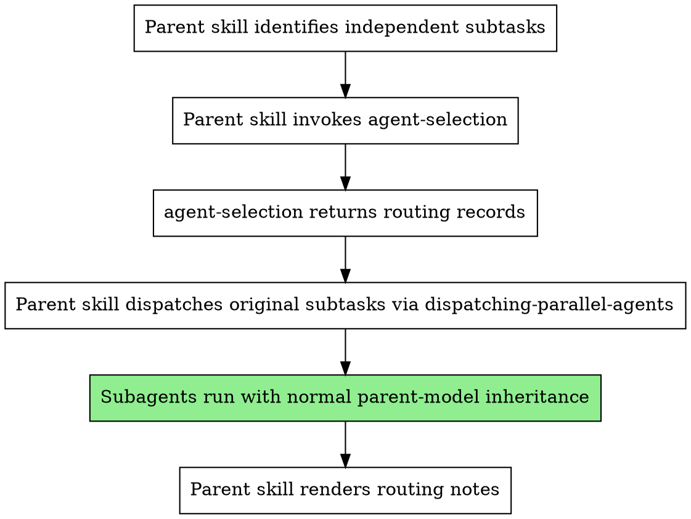

# Agent Selection

## Overview

Use this skill to classify each subtask in a parent-managed subtask list, recommend a model label for that subtask, and return structured routing records.

**Core principle:** `agent-selection` decides recommendation-only routing. It does not decompose work, choose subagent type, dispatch subagents, or change parent-model inheritance.

This skill exists to prevent the baseline failures that happen without explicit guidance:
- vague routing categories like "small/fast" or "large/high-reasoning"
- inconsistent single-item vs batch output shapes
- underspecified invalid-input behavior
- unclear ownership between parent skill and dispatcher

Discovery terms: subagent routing, model recommendation, subtask classification, tiering, recommendation-only dispatch, `dispatching-parallel-agents`.

This skill is opt-in. Existing parent skills keep current behavior unless they explicitly invoke `agent-selection`.

## When to Use

Use this skill when:
- a parent skill has already decided subagent dispatch is appropriate
- the parent skill already has an array of independent subtasks
- the parent skill wants per-subtask model recommendations before dispatch
- the parent skill needs stable routing records for later rendering or auditing

Do not use this skill when:
- the parent skill has not split work into subtasks yet
- you need subagent decomposition or dispatch strategy guidance
- you need runtime model override; this repo supports recommendations only
- you are inside a dispatched subagent; routing belongs to the parent skill

## Fixed Boundaries

`agent-selection` owns:
- semantic complexity classification
- tier-to-model recommendation
- stable routing-record output
- explicit non-happy-path handling

The parent skill owns:
- deciding whether to invoke this skill
- deciding the subtasks
- choosing `subagentType`
- rendering caller-visible routing notes
- passing original subtasks to the dispatcher unchanged

`dispatching-parallel-agents` owns:
- whether tasks should run in parallel
- the dispatch structure itself

## Integration



## Approved Tiers

Use only these five tiers and labels:

| Tier | Model Label | Use When |
| --- | --- | --- |
| `basic` | `Clause Haiku 4.5` | tiny, bounded, low-risk work |
| `standard` | `GPT-5.3 Codex` | routine coding or focused exploration |
| `advanced` | `GPT-5.4` | multi-file reasoning or non-trivial ambiguity |
| `expert` | `Claude Opus 4.6` | architecture, tricky debugging, high-risk reasoning |
| `specialized` | `GPT-5.4` | workflow, domain, or tool sensitivity dominates |

`advanced` and `specialized` intentionally share `GPT-5.4`. The difference is routing intent, not model strength.
For output records, the canonical `basic` model label is `Clause Haiku 4.5`. The spec also contains shorthand narrative references to `haikku`, but output records in this repo must emit `Clause Haiku 4.5`.

## Classification Method

Classify implicitly from the `subtask` description. Do not require a manual complexity tag.

Inspect these signals:
- `scope`: how many files, components, or moving parts the task likely spans
- `ambiguity`: how much interpretation is required before acting
- `risk`: how costly a wrong answer would be
- `reasoning depth`: direct execution vs deeper synthesis
- `workflow sensitivity`: whether success depends on strict process, domain framing, or tool ordering

### Tier Rules

#### `basic`

Choose `basic` when the task is narrow, concrete, low-risk, and easy to complete without broader repo context.

Typical examples:
- quick summaries
- one-file inspection
- narrow transformations
- simple lookups

#### `standard`

Choose `standard` when the task is routine, coding-capable but not especially ambiguous, and focused on ordinary implementation or exploration.

Typical examples:
- focused code edits
- ordinary repo exploration
- straightforward bugfix support
- normal coding assistance

#### `advanced`

Choose `advanced` when the task clearly involves multi-file reasoning, non-trivial refactors, meaningful ambiguity, or stronger synthesis than normal focused work.

Typical examples:
- multi-file reasoning
- non-trivial refactors
- ambiguous implementation work
- richer code analysis

#### `expert`

Choose `expert` only when the task clearly requires architecture-level judgment, difficult debugging with unclear root cause, high-stakes reasoning, or analysis where mistakes are unusually costly.

Typical examples:
- architecture tradeoffs
- tricky debugging with unclear causes
- high-risk decisions
- subtle cross-system analysis

Keep `expert` rare.

#### `specialized`

Choose `specialized` when the main challenge is domain sensitivity, workflow sensitivity, tool-orchestration sensitivity, or process adherence that matters more than general reasoning strength.

Typical examples:
- domain-constrained prompts
- workflow-heavy tasks
- tool-sensitive orchestration
- process-sensitive execution

Treat `specialized` as an execution-profile label, not a prestige label.

### Tie-Break Rules

When classification is uncertain:
- prefer the lower adjacent tier unless failure cost is high
- do not choose `expert` just because the task sounds important
- do not choose `specialized` merely because it sounds advanced
- use `specialized` only when workflow, domain, or tool sensitivity is the main reason for routing
- if a task is both workflow-sensitive and high-risk, choose `expert` when reasoning difficulty and failure cost dominate; choose `specialized` when process adherence is the primary challenge

## Input Contract

Input is always an array of subtask objects, even for a single subtask.

If the caller does not have an array yet, normalize to an array before invoking this skill. Top-level scalar, object, or wrapper-shape normalization is caller responsibility, not `agent-selection` responsibility.
Top-level non-array input is out-of-contract misuse for this skill.

Each input item may contain:
- `index` - optional non-negative integer
- `subtask` - expected string; this is the only field required for normal classification
- `subagentType` - optional string chosen by the parent skill
- `dispatchConstraints` - optional object chosen by the parent skill
- additional unknown fields - allowed and ignored

If an input array item is not an object, or if an object omits `subtask`, treat it as an invalid task description and still return a valid fallback routing record.

### Index Handling

- If no explicit `index` is provided, synthesize a 0-based positional `index` in output.
- If all provided indexes are non-negative integers with no duplicates, preserve them as-is.
- If some items provide valid indexes and others omit `index`, preserve the valid explicit indexes and synthesize 0-based positional indexes only for the items that omitted `index`.
- If any provided index is malformed or duplicated, ignore all provided indexes and synthesize 0-based positional indexes for the whole output.
- Output order must exactly match input order.

## Output Contract

Output is always an array of routing records, even for a single subtask.

Return a raw JSON array of routing records only. Do not wrap the array in prose, status messages, or extra envelope objects.

Each routing record must contain:
- `index`
- `subtask`
- `tier`
- `modelLabel`
- `reason`
- `dispatchMode`

Routing records contain exactly those six fields. Do not add `status`, `route`, `error`, ranking metadata, or alternative schema fields.
If the input `subtask` is a valid string, echo it verbatim in the output record. Only invalid non-string inputs may be replaced with placeholders.
The `reason` field is required, but exact wording is only fixed for the invalid-or-empty fallback case. For all other routes, validation should check that the rationale semantically matches the chosen tier.

Required values:
- `dispatchMode` must always be `recommendation-only`
- `modelLabel` must always be one of the approved labels in this skill

### Output Schema

```json
[
  {
    "index": 0,
    "subtask": "trace behavior across several modules and propose a refactor",
    "tier": "advanced",
    "modelLabel": "GPT-5.4",
    "reason": "task spans multiple files and needs synthesis",
    "dispatchMode": "recommendation-only"
  }
]
```

## Non-Happy-Path Rules

- If the parent provides no subtasks, return `[]`.
- If `subtask` is `null`, a number, an object, an array, or any non-string value, emit a placeholder string such as `"<null>"`, `"<number>"`, `"<object>"`, or `"<array>"`.
- For other non-string values, emit the matching type-name placeholder such as `"<boolean>"`.
- If an input item is not an object, derive the placeholder from that raw item type.
- If an input object omits `subtask`, treat the missing value as `null` and emit `"<null>"`.
- If `subtask` is a string but empty or whitespace-only, preserve it exactly as provided.
- For invalid or empty task descriptions, emit:
  - `tier: "standard"`
  - `modelLabel: "GPT-5.3 Codex"`
  - `reason: "invalid or empty task description defaults to routine handling"`
  - `dispatchMode: "recommendation-only"`
- If optional fields are malformed, ignore them and classify from `subtask` only.
- Never fail just because runtime model availability cannot be inspected. Availability is not checked in this repo.

## Parent Skill Workflow

Use this sequence:

1. Parent skill identifies independent subtasks.
2. Parent skill invokes `agent-selection` with the subtask array.
3. `agent-selection` returns routing records only.
4. Parent skill passes the original subtasks to `dispatching-parallel-agents` unchanged.
5. Subagents run with normal parent-model inheritance.
6. Parent skill renders routing notes if it wants caller-visible output.

If the parent skill does not invoke `agent-selection`, nothing about the existing dispatch flow changes.

Preferred parent-rendered note format:
- `<tier> -> <modelLabel> because <reason> (recommendation only)`

### Parent Integration Example

Input subtasks:

```json
[
  {
    "index": 0,
    "subtask": "Summarize the config-loading helper and list its key branches.",
    "subagentType": "explore"
  },
  {
    "index": 1,
    "subtask": "Trace validation behavior across UI form, API handler, and DB constraints; propose a refactor.",
    "subagentType": "general"
  }
]
```

Routing records returned by `agent-selection`:

```json
[
  {
    "index": 0,
    "subtask": "Summarize the config-loading helper and list its key branches.",
    "tier": "basic",
    "modelLabel": "Clause Haiku 4.5",
    "reason": "task is narrow and low-risk",
    "dispatchMode": "recommendation-only"
  },
  {
    "index": 1,
    "subtask": "Trace validation behavior across UI form, API handler, and DB constraints; propose a refactor.",
    "tier": "advanced",
    "modelLabel": "GPT-5.4",
    "reason": "task spans multiple components and requires stronger synthesis",
    "dispatchMode": "recommendation-only"
  }
]
```

Parent-rendered notes:
- `basic -> Clause Haiku 4.5 because task is narrow and low-risk (recommendation only)`
- `advanced -> GPT-5.4 because task spans multiple components and requires stronger synthesis (recommendation only)`

Dispatcher handoff:
- pass the original subtasks to `dispatching-parallel-agents`
- do not replace the subtasks with routing records
- do not rewrite `subagentType`
- do not change parent-model inheritance

Note: the design spec uses the shorthand `haikku` in some narrative examples, while the approved literal routing label for this repo is `Clause Haiku 4.5`.

## Quick Examples

`basic`
- Task: `Summarize these two files and list the key differences.`
- Route: `basic -> Clause Haiku 4.5`

`standard`
- Task: `Update a helper function and adjust one caller to match the new signature.`
- Route: `standard -> GPT-5.3 Codex`

`advanced`
- Task: `Trace behavior across several modules and propose a moderate refactor.`
- Route: `advanced -> GPT-5.4`

`expert`
- Task: `Investigate an intermittent architectural bug with unclear cause and propose a safe fix strategy.`
- Route: `expert -> Claude Opus 4.6`

`specialized`
- Task: `Execute a workflow-heavy domain-specific process with strict tool-ordering rules.`
- Route: `specialized -> GPT-5.4`

## Common Mistakes

- Returning a single object for one item instead of always returning an array.
- Inventing new routing labels such as `small/fast` or `balanced-orchestrator`.
- Treating `specialized` as a stronger `advanced` instead of a different routing reason.
- Letting the skill choose subagent type or dispatch strategy.
- Dropping invalid inputs instead of returning a valid fallback record.
- Changing parent-model inheritance. This skill never does that.
- Adding extra fields to routing records beyond the six approved fields.
- Passing rewritten or normalized subtasks to the dispatcher instead of the original subtasks from the parent skill.

## Reference

Source of truth: `docs/superpowers/specs/2026-03-28-agent-selection-design.md`
Validation scenarios: `.opencode/skills/agent-selection/VALIDATION.md`
