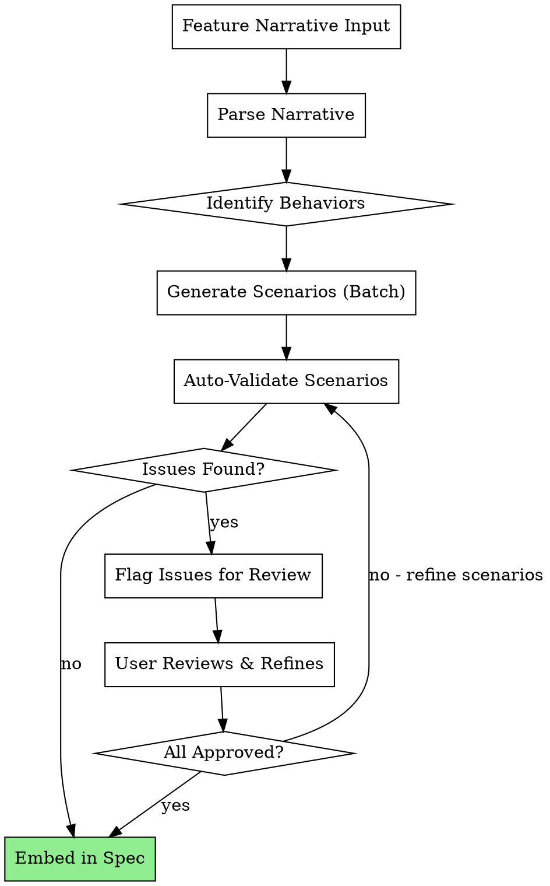

# Gherkin Spec Creation

## Overview

**Gherkin Spec Creation** transforms feature narratives into comprehensive, validated Gherkin scenarios that become part of the OpenSpec design specification. This skill guides you through creating Given/When/Then scenarios that are syntactically correct, domain-language consistent, and fully cover happy paths, edge cases, and error conditions.

**Core principle:** Well-written Gherkin scenarios act as executable specifications—they describe WHAT the feature should do from a user perspective, before you write HOW it works in code.

## When to Use

Use this skill when:
- Creating a new feature spec in `openspec-new-change` workflow
- You have a feature narrative (user story + acceptance criteria)
- You need to generate comprehensive BDD scenarios
- Scenarios will be integrated into the spec artifact (not as separate `.feature` files yet)
- You want to validate scenarios against Gherkin quality standards

**Do NOT use this skill if:**
- You already have well-formed Gherkin scenarios (use for validation only, not generation)
- The feature is so simple it doesn't need multiple scenarios
- You're writing implementation tests (those follow TDD separately)

## Workflow



## Input Format

Accept feature narratives structured as:

```
Feature Title: [Clear, user-focused title]

Description: [1-2 sentences about what users can do]

Actors/Personas: [Who uses this feature]

Key Behaviors: [Bulleted list of primary actions/outcomes]

Edge Cases: [Situations to handle]

Error Scenarios: [Failures to address]
```

**Example Input:**

```
Feature Title: Export Configuration to JSON

Description: Users can export their current configuration settings to a JSON file for backup and sharing purposes.

Actors: Administrator, Team Lead

Key Behaviors:
- Click "Export Configuration" button
- Select export location
- JSON file is created with current config
- Success notification shown

Edge Cases:
- Export directory doesn't exist
- User lacks write permissions
- Configuration contains special characters

Error Scenarios:
- Disk is full
- File already exists (overwrite prompt)
- Permission denied
```

## Scenario Generation Process

### Step 1: Parse Feature Narrative

Extract:
- **Primary Actor** — Who is performing the action
- **Main Goal** — What they're trying to accomplish
- **Success Outcome** — What indicates success
- **Edge Cases** — Variations and special situations
- **Error Conditions** — Failures that must be handled

### Step 2: Identify Behaviors

Map each behavior from the narrative to a scenario:
- Happy path (successful execution)
- Each edge case → separate scenario
- Each error condition → separate scenario

### Step 3: Generate Scenarios (Batch)

Create ALL scenarios at once following the template:

```gherkin
Scenario: [Clear description of what happens]
  Given [Initial context - preconditions]
  When [Action taken - what user does]
  Then [Expected outcome - what happens as result]
```

**Key principles:**
- One behavior per scenario (one primary assertion)
- Use domain language (user perspective, not technical)
- Given sets up state, When triggers action, Then checks result
- No conjunctions in When clause (one action only)
- Avoid "and" in Then when possible (separate assertions = separate scenarios)

### Step 4: Auto-Validate Against Quality Checklist

Check each scenario:
- ✅ **Syntax** — Proper Given/When/Then format
- ✅ **Consistency** — Same terms used for same concepts
- ✅ **Coverage** — Happy path, edge cases, errors all present
- ✅ **Clarity** — No technical jargon, domain language only
- ✅ **Atomicity** — One behavior per scenario

See `gherkin-quality-checklist.md` for complete validation rules.

### Step 5: Flag Issues and Present for Review

If validation finds issues:
- **Syntax errors** (missing Given/When/Then, multiple actions in When)
- **Consistency gaps** (different terms for same concept across scenarios)
- **Coverage gaps** (missing edge cases or error scenarios)
- **Clarity issues** (technical language, ambiguous terms)

Present issues clearly with specific recommendations.

### Step 6: User Review and Refinement

User reviews flagged issues and decides:
- **Refine the scenario** (use generated suggestion or custom fix)
- **Accept as-is** (if issue is acceptable)
- **Request regeneration** (if entire scenario needs rewriting)

Re-validate after refinement.

### Step 7: Embed in Spec

Once all scenarios approved:

```markdown
## Gherkin Scenarios

[List all scenarios in `.gherkin` block or markdown format]
```

## Scenario Template

Every scenario follows this structure:

```gherkin
Scenario: [Specific outcome description]
  Given [What must be true before action]
    And [Additional precondition if needed]
  When [The user action that triggers behavior]
  Then [Expected result after action]
    And [Additional verification if needed]
```

**Valid patterns:**
- ✅ `Given X, When Y, Then Z`
- ✅ `Given X and A, When Y, Then Z`
- ✅ `Given X, When Y, Then Z and B`

**Invalid patterns:**
- ❌ `When Y and Z` (multiple actions in When)
- ❌ `Then Z and A and B and C` (too many assertions - split into scenarios)
- ❌ Missing Given (no context)
- ❌ Missing When (no action)

## Domain Language Consistency

All scenarios must use consistent terminology:

**Define key terms once:**
- Configuration = system settings
- Export = save to file
- Administrator = user with full permissions

**Apply consistently across all scenarios:**
- Don't mix "Config" and "Configuration"
- Don't mix "Save" and "Export" for same action
- Don't mix "Admin" and "Administrator"

**Create terminology table if feature has many terms:**

```
Term          | Definition
Configuration | System settings (all config files combined)
Export        | Save configuration to file
Administrator | User with full permissions to modify settings
```

## Coverage Requirements

Every feature spec must cover:

1. **Happy Path** — Normal successful execution
   ```gherkin
   Scenario: User successfully exports configuration
     Given configuration is loaded
     When user clicks Export button
     Then JSON file is created in selected location
   ```

2. **Edge Cases** — Special situations that work
   ```gherkin
   Scenario: Export with special characters in values
     Given configuration contains special characters
     When user exports
     Then JSON escapes characters correctly
   ```

3. **Error Conditions** — Failures that must be handled
   ```gherkin
   Scenario: Export fails when disk is full
     Given disk is full
     When user attempts export
     Then error message "Insufficient disk space" is shown
   ```

**Red flags (coverage gaps):**
- Only happy path scenarios
- Edge cases mentioned in narrative but no scenarios
- Error conditions not addressed
- "And" chains in Then clause suggesting multiple behaviors

## Common Mistakes

| Mistake | Issue | Fix |
|---------|-------|-----|
| `When user clicks button and enters text` | Multiple actions | Split into two scenarios OR use When/And only for data |
| `Then user sees message and file is created and notification appears` | Multiple assertions | Create separate scenario for each outcome |
| `Given configuration that has been loaded and validated and exported` | Over-specified context | Keep Given minimal - only what's needed for scenario |
| `When user does something` | Vague action | Specific: "clicks Export button" or "enters filename" |
| `Then something happens` | Vague outcome | Specific: "JSON file is created in ~/Downloads" |
| Mixing terms: "save" vs "export" in different scenarios | Inconsistent language | Define term once, use consistently |
| `Given valid configuration and user is logged in and permissions are set` | Too many conditions | Use And, but consider if scenario is too complex |
| Missing Given | No context | Always establish state before When |
| Scenario has no action (missing When) | Incomplete | Every scenario needs Given → When → Then |

## Example Output

**Input Feature:**
```
Feature: Export Configuration to JSON
Actors: Administrator
Key Behaviors:
- Export to JSON file
- Choose export location
- Success notification

Edge Cases:
- Special characters in config values
- Export directory doesn't exist

Error Scenarios:
- Disk full
- Permission denied
```

**Generated Scenarios:**

```gherkin
Scenario: Administrator successfully exports configuration
  Given configuration is loaded
  When administrator clicks Export Configuration button
  Then JSON file is created in selected location
    And success notification "Configuration exported" appears

Scenario: Export creates directory if it doesn't exist
  Given configuration is loaded
    And selected export directory does not exist
  When administrator clicks Export Configuration button
  Then export directory is created
    And JSON file is saved in new directory

Scenario: Export escapes special characters in values
  Given configuration contains special characters (quotes, newlines, unicode)
  When administrator exports to JSON
  Then special characters are properly escaped
    And JSON file is valid and parseable

Scenario: Export fails when disk is full
  Given configuration is loaded
    And disk has no free space
  When administrator attempts export
  Then error message "Insufficient disk space" is shown
    And no file is created

Scenario: Export blocked when directory has no write permissions
  Given configuration is loaded
    And selected export directory is read-only
  When administrator attempts export
  Then error message "Permission denied: cannot write to directory" appears
```

**Validation Results:**
- ✅ Syntax: All scenarios follow Given/When/Then
- ✅ Consistency: "configuration", "administrator", "export" used consistently
- ✅ Coverage: Happy path + 2 edge cases + 2 error scenarios
- ✅ Clarity: Domain language, no technical jargon
- ✅ Atomicity: Each scenario addresses one behavior

## Integration with OpenSpec

This skill is used during `openspec-new-change` workflow:

```
openspec-new-change (start)
  ↓
[Create Problem Statement]
  ↓
[Create Design]
  ↓
**→ USE GHERKIN-SPEC-CREATION ← ** Generate Gherkin scenarios
  ↓
[Create Implementation Tasks]
  ↓
[Ready for Implementation]
```

**Handoff:**
- Designer completes design artifact
- Pass design to this skill for scenario generation
- Gherkin scenarios become part of design artifact
- Implementation tasks reference scenarios as acceptance criteria

## Quick Reference

| Element | Purpose | Example |
|---------|---------|---------|
| **Feature** | User-facing capability | Export Configuration to JSON |
| **Scenario** | Specific behavior | User successfully exports with special characters |
| **Given** | Precondition/context | Configuration is loaded and contains special chars |
| **When** | User action/trigger | Administrator clicks Export button |
| **Then** | Expected outcome | JSON file is created with escaped values |
| **And** | Additional Given/When/Then | Extends previous clause |
| **Edge Case** | Special valid situation | Non-ASCII characters, unusual paths |
| **Error** | Failure to handle | Disk full, permission denied |

## Red Flags (Stop and Fix)

These indicate scenarios need refinement:

- ❌ Scenario has multiple "Then" assertions without "And"
- ❌ "When" clause has "and" (multiple actions)
- ❌ "Given" is more than 2-3 lines (over-specified)
- ❌ Scenario description is vague ("user does something")
- ❌ Same word used inconsistently across scenarios
- ❌ Missing error scenarios for mentioned failure modes
- ❌ Missing edge cases from narrative
- ❌ Only happy path, no edge cases or errors
- ❌ Given/When/Then are technical instead of domain language

**If any red flag present:** Flag for user review and refinement.

## REQUIRED SUB-SKILL

When implementing this skill as a process:
- **REQUIRED:** Follow superpowers:test-driven-development principles for validating scenarios
- All scenarios must be testable (not over-specified or too abstract)
- Use the quality checklist systematically, not as optional guidelines
