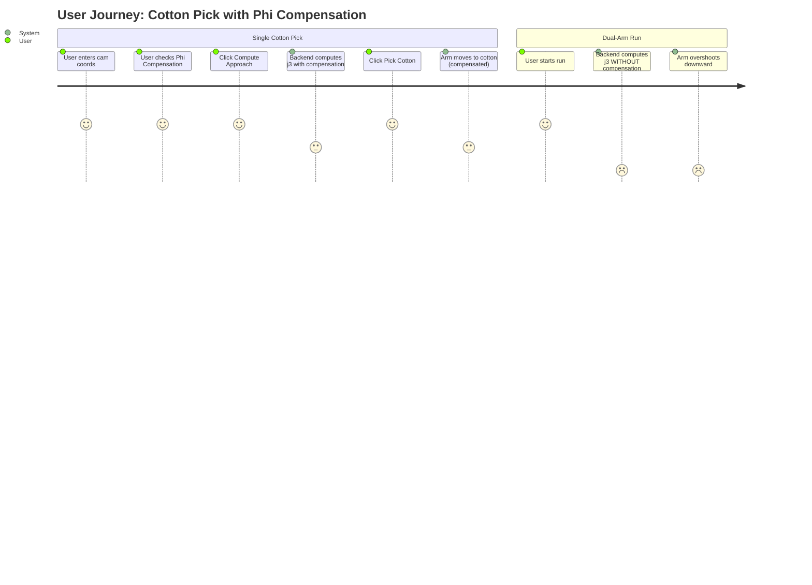

## Context

The web UI testing tool uses `fk_chain.py:phi_compensation()` to correct J3 (tilt)
commands. The C++ trajectory planner (`trajectory_planner.cpp`) uses a richer formula
with slope + offset per zone, loaded from YAML config. The Python implementation is
missing the slope term and uses hardcoded constants. Additionally, the dual-arm run
path (`arm_runtime.py` → `run_controller.py`) never calls phi compensation at all.

## Goals / Non-Goals

**Goals:**
- Align `fk_chain.py:phi_compensation()` formula with `trajectory_planner.cpp`
- Use production.yaml tuning values as constants
- Wire phi compensation into the dual-arm run path
- Default `enable_phi_compensation` to `true` everywhere
- Default the UI checkbox to checked

**Non-Goals:**
- Runtime YAML loading in the Python web UI
- Changing zone boundaries or tuning values
- Modifying the C++ trajectory planner
- Adding slope-based tuning UI controls

## Decisions

### D1: Add slope term to `phi_compensation()` in `fk_chain.py`

**Choice:** Add `PHI_ZONE{1,2,3}_SLOPE` constants and compute
`base = slope * (phi_deg / 90) + offset` matching `trajectory_planner.cpp:378`.

**Alternative:** Keep offset-only formula. Rejected because it diverges from the
C++ implementation and prevents future slope-based tuning.

**Rationale:** Even though all slopes are currently 0.0, the formula must match
so that when slopes are tuned on hardware, the web UI produces identical results.
The subsequent L5 scaling step (`compensation = base * (1 + l5_scale * (j5 / JOINT5_MAX))`)
and rotation-to-radian conversion remain unchanged.

### D2: Apply compensation in `ArmRuntime.compute_candidate_joints()`

**Choice:** Add `enable_phi_compensation` parameter to `compute_candidate_joints()`.
When true, call `phi_compensation(j3, j5)` on the result before returning.

**Alternative:** Apply compensation in `RunController.run()` after receiving
candidates. Rejected because `compute_candidate_joints()` is the single point
where joints are computed — compensation belongs with computation, not orchestration.

### D3: Thread `enable_phi_compensation` through RunStartRequest

**Choice:** Add `enable_phi_compensation: bool = True` to `RunStartRequest`.
Pass it to `RunController.__init__()` which stores it and forwards to
`ArmRuntime.compute_candidate_joints()` at each step.

**Alternative:** Hardcode compensation as always-on in the run path. Rejected
because the single-pick path already supports toggling, and consistency matters
for debugging.

### D4: Default to `true` for all endpoints

**Choice:** Change all Pydantic model defaults from `False` to `True`. Change
the HTML checkbox `cotton-phi-comp` to `checked` by default.

**Rationale:** Production YAML has `phi_compensation/enable: true`. The testing
UI should match production behavior by default.

## Risks / Trade-offs

**[Risk] Existing tests expect `enable_phi_compensation=False` default**
→ Mitigation: Update test assertions. Tests that explicitly pass the flag are unaffected.
  Tests relying on default behavior will need updated expected J3 values.

**[Risk] Dual-arm run J3 values change when compensation is wired in**
→ Mitigation: This is the intended fix. The current uncompensated values cause the
  arm to go too low. Compensation brings values in line with single-pick behavior.

**[Risk] Zone 2 still applies zero compensation for typical cotton positions**
→ Mitigation: Out of scope for this change. The zone values match production.yaml.
  Tuning compensation values is a separate task.
