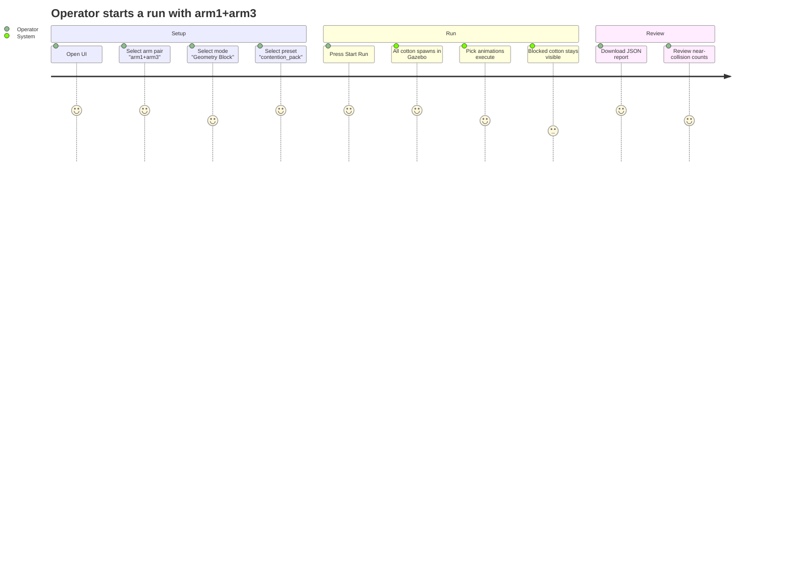

## Context

The dual-arm collision avoidance simulation runs arm1 vs arm2 only, hardcoded throughout
`RunController`, `scenario_json.py`, and `arm_runtime_registry.py`. arm3 exists fully in
`ARM_CONFIGS` with its own FK parameters and Gazebo topics but is unreachable from the
run pipeline.

Cotton spawning happens inside the per-step executor, meaning only one cotton ball exists
in Gazebo at any time. Blocked or skipped steps produce no visible cotton at all, so the
operator cannot tell where all targets were placed before the run begins.

Current flow:
```
RunController.run()
  for each step_id:
    executor.execute()         ← spawns cotton HERE
      pick animation (~5.5s)
      remove cotton            ← cotton gone before next step
```

## Goals / Non-Goals

**Goals:**
- Allow any 2 of {arm1, arm2, arm3} to be selected as the run pair via UI dropdown.
- Spawn all cotton balls at run start so the full field is visible from the beginning.
- Remove each cotton ball only when its pick completes; blocked/skipped cotton stays.
- Keep all 365 existing tests passing; API change is backward compatible (default pair = arm1+arm2).

**Non-Goals:**
- Running 3 arms simultaneously in a single run.
- Running a solo arm (no collision partner).
- Cleaning up unremoved (blocked/skipped) cotton at run end.
- Adding arm4 or beyond.

## Decisions

### D1: Arm pair remapping in RunController.load_scenario() (not in scenario files)

**Decision**: Remap scenario `arm_id` values inside `load_scenario()` using a dict
`{"arm1": primary_id, "arm2": secondary_id}` applied to each raw step before
constructing `ScenarioStep` objects.

**Alternatives considered**:
- Edit scenario JSON files to use the actual arm IDs → rejected: requires maintaining
  multiple copies of scenario files, breaks backward compatibility.
- Remap in `ArmRuntime.load_scenario()` → rejected: ArmRuntime shouldn't need to know
  about the selected pair; the controller owns that decision.

**Why this**: Single point of remapping, zero scenario file changes, fully backward
compatible (default pair = arm1+arm2 produces identical behavior).

### D2: Upfront cotton via spawn_fn passed to RunController (not via executor internals)

**Decision**: Pass `spawn_fn` and `remove_fn` directly to `RunController.__init__()` as
separate callables. The controller calls `spawn_fn` for all steps upfront, then passes
pre-spawned model names to `executor.execute(cotton_model=...)`.

**Alternatives considered**:
- Expose `executor.spawn_fn` as a public attribute the controller reads → rejected: creates
  tight coupling between controller and executor internals.
- Move all cotton logic into the controller entirely → rejected: executor already owns
  remove-on-completion semantics; splitting that creates a logic gap.

**Why this**: Controller owns lifecycle (when to spawn), executor owns animation and
removal (what to do on success/failure). Clean separation.

### D3: cotton_model="" as backward-compat sentinel in execute()

**Decision**: `execute(cotton_model="")` — empty string means "spawn yourself" (legacy
path). Non-empty string means "use this pre-spawned model, skip spawn call".

**Why this**: Zero breaking changes to existing tests that call `execute()` directly
without `cotton_model`.

### D4: arm_pair validated against ARM_CONFIGS keys, not a hardcoded list

**Decision**: Backend validation checks `arm_pair` values against `ARM_CONFIGS.keys()`
rather than a hardcoded set. Adding arm4 in the future requires only an ARM_CONFIGS entry.

## User Journey



## C4 Architecture (ASCII)

```
[Operator]
    |
    | selects arm pair, mode, scenario → clicks Start Run
    v
[testing_ui.html + testing_ui.js]     (Browser)
    |
    | POST /api/run/start { mode, scenario, arm_pair }
    v
[testing_backend.py]                  (FastAPI, port 8081)
    | validates arm_pair ∈ ARM_CONFIGS
    | creates RunStepExecutor(publish_fn, spawn_fn, remove_fn, sleep_fn)
    | passes spawn_fn + remove_fn to RunController
    v
[RunController]                       (in-process)
    | remaps scenario arm_ids → selected pair
    | spawns ALL cotton upfront via spawn_fn
    | for each step: executor.execute(cotton_model=pre_spawned_name)
    v
[RunStepExecutor]                     (in-process)
    | skip spawn (cotton_model provided)
    | run pick animation → publish to Gazebo topics (ARM_CONFIGS lookup)
    | remove cotton on success; leave on blocked/skipped
    v
[Gazebo]                              (simulation)
    arm1: /joint3_cmd, /joint4_cmd, /joint5_cmd
    arm2: /joint3_copy_cmd, /joint4_copy_cmd, /joint5_copy_cmd
    arm3: /arm_joint3_copy1_cmd, /arm_joint4_copy1_cmd, /arm_joint5_copy1_cmd
```

## Risks / Trade-offs

- **Cotton count in Gazebo during long runs**: All N cotton balls exist simultaneously in
  Gazebo. For the current scenarios (8–10 steps max) this is fine. For very large
  scenarios (100+ steps), Gazebo may slow down. Mitigation: not a concern at current
  scale; can add batching later.
- **arm3 FK accuracy**: arm3's `ARM_CONFIGS` entry (`base_xyz`, `base_rpy`) was added
  when arm3 was wired up for manual control. If the FK parameters drift from the real
  Gazebo model, cotton will spawn at slightly wrong positions. Mitigation: this is an
  existing calibration concern, not introduced by this change.
- **Remap silently passes through unrecognized arm_ids**: If a custom scenario JSON uses
  `arm_id="arm3"` and `_VALID_ARM_IDS` now includes arm3, it bypasses remapping. This is
  correct behavior (direct addressing) and the remap dict only maps "arm1"/"arm2".

## Migration Plan

Deployment is in-process (single server). No migration steps needed:
- Default `arm_pair=["arm1","arm2"]` means existing clients need no changes.
- Existing scenario files are unmodified.
- All 365 tests must pass before commit.

Rollback: revert commit. No database or persistent state is affected.

## Open Questions

None. All decisions made above.
