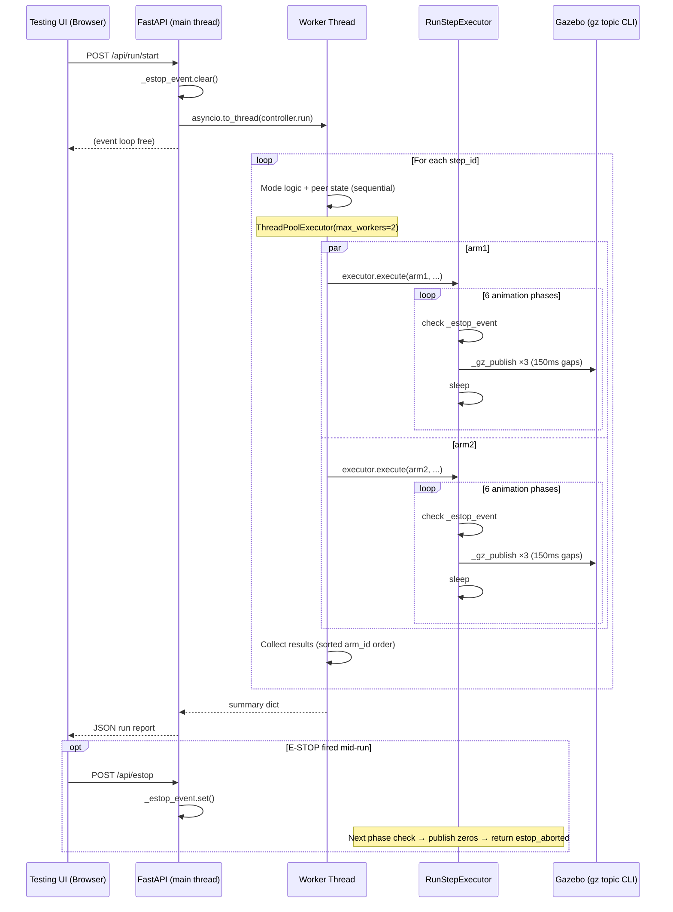

## Context

The backend scenario-run path (`/api/run/start`) currently calls `controller.run()` synchronously on the FastAPI event loop. Each joint command is published once via a fire-and-forget `subprocess.Popen`. Dual-arm steps execute one arm at a time (~11 s per paired step). There is no server-side E-STOP flag, so `/api/estop` posts sent during a run are queued by the OS and never processed until the blocking `run()` call returns.

The frontend manual-pick path already solves the reliability problem with triple-publish (3× with 500 ms gaps via ROSLIB.js) and parallel animation (`Promise.all`). This design brings the backend run path to parity.

**Current state:**

| Property | Before |
|---|---|
| Publish per joint command | 1× (fire-and-forget) |
| Dual-arm step duration | ~11 s (sequential) |
| Event loop during run | blocked |
| E-STOP during run | not receivable |

## Goals / Non-Goals

**Goals:**
- Triple-publish joint commands in the run path (reliability parity with frontend)
- Run both arms' animations concurrently within a step (latency parity with frontend)
- Add a server-side `threading.Event` E-STOP flag checked between animation phases
- Unblock the FastAPI event loop during `controller.run()` via `asyncio.to_thread()`

**Non-Goals:**
- Changing the frontend publish path (already reliable)
- Closed-loop joint-position feedback
- Sim-clock or hardware-synchronized timing
- Parallelizing mode logic or peer-state exchange

## MoSCoW Prioritization

| Priority | Item |
|---|---|
| **Must Have** | Triple-publish in `_gz_publish` — without this, commands drop under Gazebo load |
| **Must Have** | `asyncio.to_thread()` wrapping `controller.run()` — without this E-STOP is never received |
| **Must Have** | Server-side `threading.Event` — without this `/api/estop` has no effect during a run |
| **Should Have** | Parallel dual-arm animation via `ThreadPoolExecutor` — improves dual-arm throughput ~35% |
| **Should Have** | E-STOP check between animation phases in executor — enables sub-step abort |
| **Could Have** | E-STOP check between steps in controller — coarser-grained but simpler |
| **Won't Have** | Retry-on-failure (Gazebo does not expose publish acknowledgement) |
| **Won't Have** | Per-arm executor instances (shared executor with per-call arm_id is sufficient) |

## Decisions

### D1: Triple-publish with 150 ms inter-publish gap

**Decision:** In `_gz_publish`, loop 3 times: publish → `time.sleep(0.150)` → publish → `time.sleep(0.150)` → publish.

**Rationale:** The frontend uses 500 ms gaps over ROSLIB.js/rosbridge. The `gz topic` CLI bypasses rosbridge and lands directly in Gazebo's message bus, so a shorter gap (150 ms) is safe and keeps single-arm step time at ~7.3 s (vs 5.5 s before). Using `subprocess.run()` (blocking) instead of `Popen` is required so that each publish call completes before the sleep; `Popen` would create three orphaned processes competing on the same topic.

**Alternatives considered:**
- 500 ms gaps: safe but adds ~2.4 s overhead per step — rejected as unnecessary
- rclpy publish: requires a live ROS2 node, unsuitable for unit test injection — rejected

### D2: Parallel animation via `ThreadPoolExecutor` (2 workers) per paired step

**Decision:** In `RunController.run()`, for paired steps, submit both `executor.execute()` calls to a `ThreadPoolExecutor(max_workers=2)` and use `futures.result()` to collect outcomes in sorted arm-id order. Mode logic, peer-state exchange, truth monitor, and step reporting remain sequential.

**Rationale:** Only `executor.execute()` (5.5 s of sleeps + publishes) is safe to parallelize — it has no shared mutable state per arm (topics are arm-specific, `prev_joints` keyed by arm_id). The mode logic loop has data dependencies (`peer_state` requires both arms to have already published). Parallelizing only the animation drops dual-arm step time from ~11 s to ~7.3 s.

**Alternatives considered:**
- Parallelize the full per-arm loop: introduces read/write races on `prev_joints`, `self._transport`, `self._baseline` — rejected
- `threading.Thread` directly: `ThreadPoolExecutor` provides cleaner exception propagation via `future.result()` — preferred

### D3: `threading.Event` for server-side E-STOP

**Decision:** A module-level `_estop_event = threading.Event()` in `testing_backend.py`. `/api/estop` calls `_estop_event.set()`. Before each `controller.run()` call, `_estop_event.clear()`. The event is passed as an `estop_check` callable (`lambda: _estop_event.is_set()`) into `RunStepExecutor` and `RunController`.

**Rationale:** `threading.Event` is the simplest thread-safe flag. Since `controller.run()` runs in a worker thread (via `asyncio.to_thread`), we need a thread-safe primitive. A plain `bool` would work in CPython due to the GIL, but `threading.Event` makes the intent explicit and is portable.

**Check points:**
1. `RunStepExecutor.execute()`: after each `_sleep_fn()` call (6 check points per arm-step). On E-STOP: publish zeros to all three joints, return `{"terminal_status": "estop_aborted", "pick_completed": False, "executed_in_gazebo": False}`.
2. `RunController.run()`: at the top of the step loop, before computing candidates. On E-STOP: break, return partial summary.

**Alternatives considered:**
- Global bool: works in CPython, but `threading.Event` is idiomatic — preferred
- Asyncio event: not usable from the worker thread without `loop.call_soon_threadsafe` — rejected

### D4: `asyncio.to_thread()` for non-blocking run

**Decision:** Replace `summary = controller.run()` with `summary = await asyncio.to_thread(controller.run)` in the `/api/run/start` handler.

**Rationale:** `asyncio.to_thread()` (Python 3.9+, available on Ubuntu 24.04) runs the callable in the default `ThreadPoolExecutor` managed by the event loop. The event loop remains free to handle `/api/estop`, `/api/run/status`, and other requests during the run.

**Alternatives considered:**
- `loop.run_in_executor(None, controller.run)`: equivalent but more verbose — rejected
- Background task (`asyncio.create_task` with a coroutine wrapper): adds complexity without benefit — rejected

## Risks / Trade-offs

| Risk | Likelihood | Mitigation |
|---|---|---|
| Thread pool exhaustion under concurrent run requests | Low (UI sends one run at a time) | Guard with `_run_state` check; reject if already `"running"` |
| `gz topic` subprocess blocks longer than 150 ms | Low (local socket IPC) | If observed in practice, switch to `subprocess.run(timeout=1.0)` |
| E-STOP races: event set between E-STOP check and publish | Negligible (CPython GIL, single E-STOP call) | Accepted |
| Parallel futures suppress one arm's exception | Low | `future.result()` re-raises; wrap in try/except and surface in step report |
| Step report determinism broken by parallel execution | None | Results collected via sorted arm-id order after both futures complete |
| Triple-publish increases sim wall-clock time ~33% | Accepted | Per proposal: single-arm 5.5 s → 7.3 s; dual-arm 11 s → 7.3 s (net improvement) |

## Migration Plan

1. All changes are backward-compatible — no API contract changes for the `/api/run/start` request shape.
2. `/api/run/start` response gains a possible `estop_aborted` `terminal_status` value in step entries. Existing consumers that filter for `completed` are unaffected; new consumers can handle `estop_aborted`.
3. No database, config file, or launch file changes. Roll back by reverting the three modified Python files.
4. No ROS2 topic or service name changes.

## Open Questions

None at artifact creation time. All design decisions are resolved.

---

## User Journey

