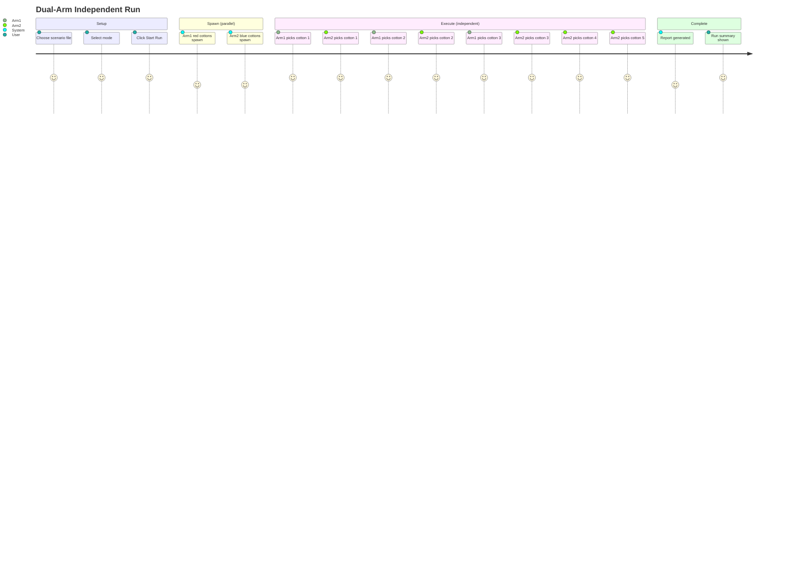

## Context

Currently `RunController.run()` processes both arms in a single step-synchronized
loop: for each step_id, it waits until both arms complete before advancing. This
forces arm1 to idle if arm2 is slower, and vice versa. All cottons spawn
sequentially before motion starts (one blocking `gz service` call after another),
and cotton balls are uniformly white making it impossible to identify which arm
owns which cotton in Gazebo.

This design introduces fully independent arm threads, parallel cotton spawn,
per-arm cotton colouring, and halved animation timing.

## Goals / Non-Goals

**Goals:**
- Each arm processes its own step list in its own thread with no peer synchronisation
- Cotton ball colour identifies arm ownership (arm1=red, arm2=blue) at spawn time
- All run cottons spawn concurrently, eliminating sequential spawn latency
- Pick animation timing halved (~2.75 s per pick, down from 5.5 s)
- All thread-shared state (transport, reporter, truth monitor) is protected by Locks

**Non-Goals:**
- Real-time kinematic safety guarantees (unchanged — mode logic is best-effort)
- MQTT or network peer transport (still in-process LocalPeerTransport)
- Changing the public HTTP API surface (`/api/run/start`, `/api/run/stop`)
- Changing URDF, joint limits, or Gazebo world physics
- Changing the `arm_pair` or `mode` selection mechanisms

## Decisions

### D1 — Per-arm thread model (not event loop or coroutines)

**Choice:** `threading.Thread` per arm inside a `ThreadPoolExecutor(max_workers=2)`.

**Rationale:** The existing `RunStepExecutor` uses `time.sleep()` (blocking I/O),
which makes it unsuitable for asyncio coroutines without deep restructuring. Threads
match the existing sleep-and-publish idiom with minimal refactoring. The number of
arms is small (2–3) so thread overhead is negligible.

**Alternatives considered:**
- `asyncio` with `asyncio.sleep`: requires converting all publish/sleep calls to
  async — too invasive. Rejected.
- Single thread with interleaved step dispatch: adds complexity for tracking each
  arm's step index. Rejected.

### D2 — Thread safety via Lock in LocalPeerTransport and JsonReporter

**Choice:** Add `threading.Lock` to `LocalPeerTransport.publish()/receive()` and
`JsonReporter.add_step()`.

**Rationale:** Both objects are shared across arm threads. Unprotected dict/list
mutations are not guaranteed atomic in CPython under thread scheduling. A simple
Lock is sufficient — these operations are short-lived (O(1) dict access) so
contention is negligible.

**Alternatives considered:**
- `threading.RLock`: unnecessary — no recursive locking occurs. Rejected.
- Queue-based message passing: more correct but overhauled architecture. Deferred.

### D3 — Peer state: latest-published rather than same-step guaranteed

**Choice:** Each arm publishes its candidate state before executing its step. Mode
logic reads the peer's **latest** published state, which may be from a different
step index.

**Rationale:** In independent mode, step_ids between arms may not align in time.
Requiring same-step_id synchronisation would reintroduce the old blocking behaviour.
Using the latest available state is a conservative approximation — it may be one
step stale, but the peer's lateral position (j4) changes slowly between consecutive
steps, so the collision avoidance decision remains valid.

**Alternatives considered:**
- Timestamp-based staleness check: more correct but adds complexity. Deferred.
- Disable collision avoidance in independent mode: too unsafe. Rejected.

### D4 — Truth monitoring: observe when peer state is present at step start

**Choice:** Each arm calls `truth_monitor.observe()` at the start of each step if
and only if the peer transport has a non-None state. A monotonically incrementing
`_obs_counter` (shared, Lock-protected) is used as the observation key instead of
step_id, since step_ids no longer align between arms.

**Rationale:** Step_id-keyed observations break when arm1 is at step 2 and arm2 is
at step 4. A sequential counter preserves all observations without requiring
step_id alignment.

### D5 — Cotton colour via SDF template parameterisation

**Choice:** Extend `_COTTON_SDF_TEMPLATE` with `{ambient}` and `{diffuse}`
placeholders. `_run_spawn_cotton()` passes arm-specific colour tuples at call time.
A `_ARM_COTTON_COLOURS` dict maps arm_id → colour string.

**Rationale:** Zero change to the `gz service` spawn protocol. Colour is embedded
in the SDF, which Gazebo's renderer picks up immediately at spawn. No Gazebo plugin
or post-spawn material service required.

### D6 — Parallel spawn via ThreadPoolExecutor

**Choice:** Replace the sequential spawn loop in `RunController.run()` with:
```python
with ThreadPoolExecutor(max_workers=len(all_items)) as pool:
    futures = {key: pool.submit(spawn_fn, ...) for key, step in all_items}
    cotton_models = {key: f.result() for key, f in futures.items()}
```

**Rationale:** Each `gz service` spawn call blocks for up to 5 s waiting for Gazebo
to respond. Running 8 spawns sequentially wastes up to 40 s. Parallel spawn brings
this to approximately the time of a single spawn call (~0.5–1 s in practice).

### D7 — Halved timing constants, no URDF change

**Choice:** Halve the 6 sleep constants in `run_step_executor.py`. Do not change
PID gains or URDF velocity limits.

**Rationale:** The PID controller drives joints fast enough — the existing sleeps
were set conservatively. Halving them still gives sufficient time for the joint to
reach its target within the physics simulation at real_time_factor=1.0. Changing
URDF gains requires a re-launch and risks physics instability.

## Risks / Trade-offs

| Risk | Likelihood | Mitigation |
|------|-----------|------------|
| Halved sleeps cause arm to miss target before next command | Low | J4 and J5 use p_gain=500 with cmd_max=500 N — 0.4 s is ample for typical 0.1–0.3 m movements |
| Thread race on `_cotton_counter` global in testing_backend.py | Medium | Wrap counter increment with a Lock; or use `itertools.count()` per-run |
| Peer state read is stale by one step causing incorrect mode decision | Low | Conservative: stale j4 from last step is close enough; only ~0.01–0.05 m change per step |
| Truth monitor observations not aligned with actual simultaneous execution | Medium | Acceptable for demo purposes; exact timing alignment deferred to future timestamp-based monitor |
| Reduced publish retry delay (50 ms) causes dropped commands in noisy environments | Low | Triple publish still sends 3 copies; 50 ms is still well above `gz topic` round-trip |

## Migration Plan

1. All changes are confined to Python files and JSON scenario files — no URDF, no launch files, no ROS2 parameter changes.
2. The `/api/run/start` HTTP endpoint signature is unchanged — no frontend changes needed.
3. Existing tests that assert step synchronisation behaviour (e.g., "arm1 before arm2") will need updating to reflect independent ordering.
4. Rollback: revert `run_controller.py` to the previous step-map loop. All other changes (colours, timing) are independently reversible.

## Open Questions

- Should truth monitor adopt timestamp-based windowing (e.g., observe if peer published within last 3 s) instead of latest-available? Deferred — not required for demo correctness.
- Should arm3 support be extended with a third thread? Out of scope for this change.

---

## User Journey


