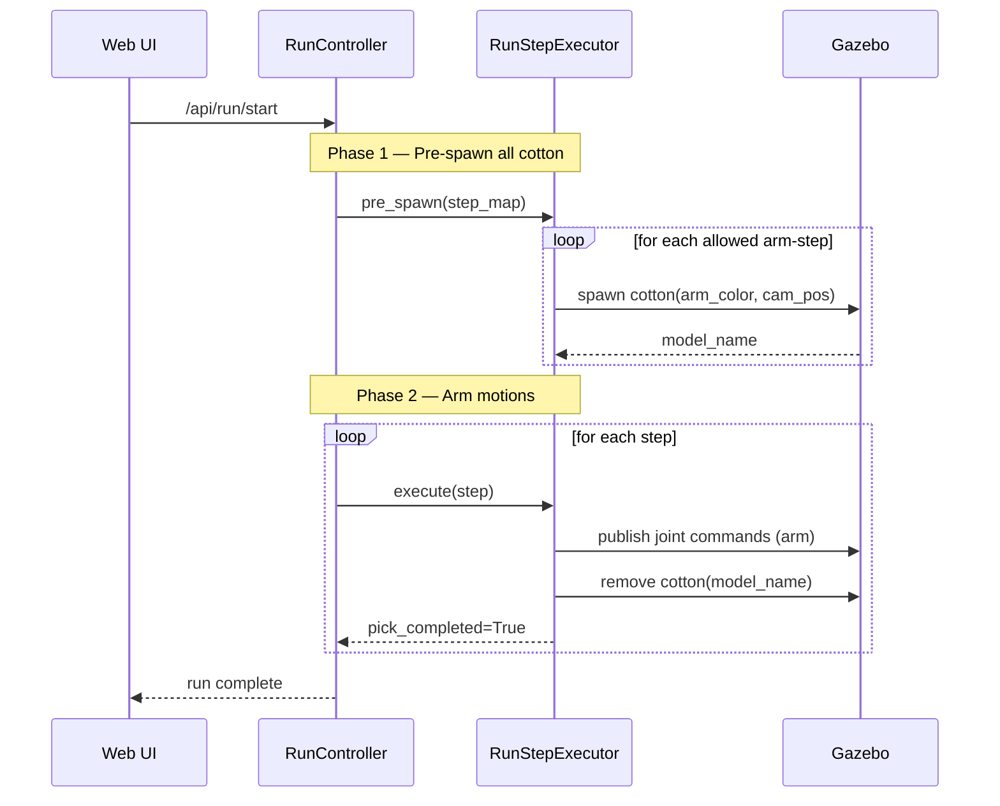

## Context

During run replay, `RunStepExecutor.execute()` currently processes each arm-step sequentially:
spawn cotton → run pick animation → remove cotton → next step. This means at most one cotton bowl
is ever visible in Gazebo at a time, and the field looks empty between steps.

Additionally, all cotton bowls share a single SDF template with no color differentiation, so
there is no visual way to tell which bowl belongs to which arm.

**Current state:**
- `_COTTON_SDF_TEMPLATE` in `testing_backend.py` — static, no color parameter
- `RunStepExecutor.execute()` in `run_step_executor.py` — single-phase: spawn/animate/remove in one loop
- `RunController` in `run_controller.py` — iterates steps sequentially, no pre-spawn phase

## Goals / Non-Goals

**Goals:**
- Spawn all cotton bowls for all allowed arm-steps before any arm motion begins
- Remove each cotton bowl only after its own pick animation completes
- Differentiate cotton bowl color by arm: `arm1` → white (default), `arm2` → yellow
- Keep the existing pick animation sequence and timing unchanged

**Non-Goals:**
- Fixing arm joint motion visibility in Gazebo (separate investigation)
- Changing the pick animation sequence (j4 → j3 → j5 → retract → home)
- Supporting more than two arm color variants

## Decisions

### Decision 1: Two-phase executor design

**Choice**: Split `RunStepExecutor.execute()` into a pre-spawn phase and a motion phase.

Pre-spawn phase iterates all steps, spawns cotton for each allowed arm-step, and stores a
`model_name_map: dict[(step_id, arm_id), str]`. Motion phase iterates steps again, runs
animations, and calls remove with the model name from the map.

**Alternatives considered:**
- *Spawn in RunController before calling executor*: Would require RunController to know about
  cotton SDF details — leaks responsibility. Executor already owns spawn/remove.
- *Parallel goroutines for all spawns*: Overkill; Gazebo spawn is fast and sequential pre-spawn
  is simpler to reason about.

**Rationale**: Executor already owns the spawn/remove API. A two-phase split within execute()
is the minimal change that keeps responsibility in one place.

### Decision 2: Color parameterized via SDF template f-string

**Choice**: Add a `{color_rgba}` (or `{diffuse}`) placeholder to `_COTTON_SDF_TEMPLATE` and
pass per-arm values when spawning.

- `arm1` → `"1 1 1 1"` (white, existing default)
- `arm2` → `"1 1 0 1"` (yellow)

**Alternatives considered:**
- *Two separate SDF template constants*: More duplication.
- *Passing a color name*: Requires a lookup table; RGBA is simpler.

**Rationale**: Minimal diff to the existing f-string template pattern.

### Decision 3: Only pre-spawn cotton for allowed arm-steps

**Choice**: Blocked and skipped arm-steps do not get pre-spawned cotton, matching the existing
requirement that blocked/skipped steps do not spawn cotton.

**Rationale**: Pre-spawning blocked-step cotton would mislead the operator into thinking a pick
will happen at that location.

## Risks / Trade-offs

- **Gazebo model name collisions**: Pre-spawning all bowls at once means multiple models exist
  simultaneously. Each model name must be unique. Current naming uses `cotton_{arm_id}_{step_id}`
  which is already unique per (arm, step). [Risk] → No mitigation needed; names are already unique.

- **Executor interface change**: `execute()` will need the full step list (not just one step) to
  do the pre-spawn. [Risk] → Pass the full step map at construction time (already available via
  `RunController`).

- **Test surface increase**: More test cases needed for the pre-spawn phase. [Risk] → Manageable;
  existing mock infrastructure in `test_run_step_executor.py` supports this.

## Migration Plan

No migration needed — this is a behavioral improvement with no data model changes. Existing tests
will be updated in place as the two-phase logic replaces the current single-phase loop.

## Open Questions

- None. Design is sufficiently resolved to proceed to tasks.

---

## User Journey

