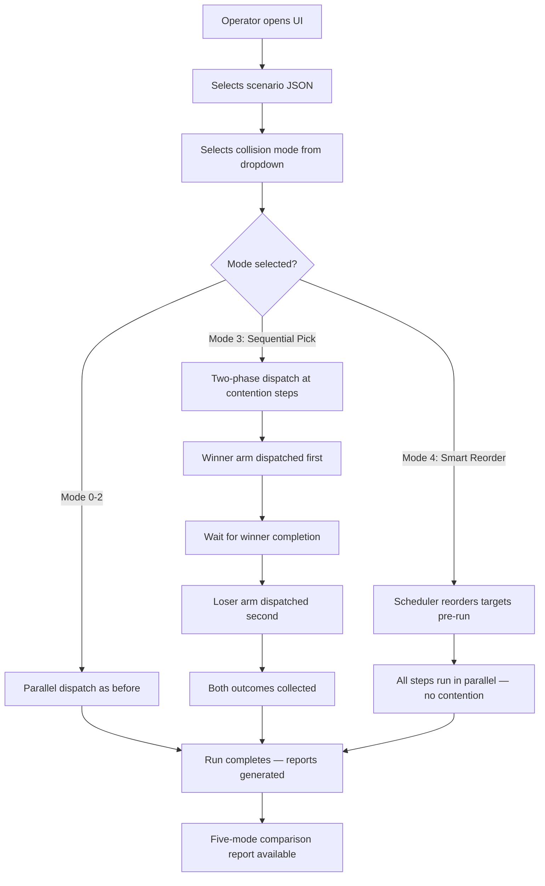

## Context

The collision avoidance simulation has four modes (0-3) for dual-arm cotton picking. Mode 3 (`overlap_zone_wait`) was designed to resolve contention via turn-based arbitration with a configurable timeout, but in production (timeout=0), it immediately skips the loser arm at every contention step — effectively wasting picks. The `WaitModePolicy` and `OverlapZoneState` classes implement this behavior, with `RunController` dispatching both arms in parallel via `ThreadPoolExecutor(max_workers=2)` regardless of mode.

The contention threshold is 0.10 m (j4 gap), reused from `OverlapZoneState.OVERLAP_THRESHOLD`. The executor animation pipeline (~2.75 s per pick cycle) is unchanged.

### User Journey



## Goals / Non-Goals

**Goals:**

- Replace Mode 3 with Sequential Pick — recover wasted picks by dispatching winner then loser at contention steps
- Add Mode 4 (Smart Reorder) — eliminate contention entirely via pre-run target reordering
- Extend reporting to five-mode comparison
- Maintain backward compatibility for Modes 0, 1, 2
- Keep the same contention threshold (0.10 m j4 gap)

**Non-Goals:**

- Changing Modes 0, 1, or 2 behavior
- Modifying executor animation timing or pipeline
- Adding new API endpoints (only extending existing validation)
- Changing `OverlapZoneState` detection logic
- Real-time dynamic reordering during execution

## Decisions

### Decision 1: Replace Mode 3 in-place (not add Mode 5)

**Choice:** `SEQUENTIAL_PICK = 3` replaces `OVERLAP_ZONE_WAIT = 3`. `SMART_REORDER = 4` is new.

**Rationale:** The old Mode 3 is broken by design (timeout=0 always skips). There is no value preserving it. Reusing the constant value 3 avoids gaps in the mode numbering and keeps the UI dropdown sequential.

**Alternative considered:** Keep old Mode 3 as-is, add Sequential Pick as Mode 4 and Smart Reorder as Mode 5. Rejected because old Mode 3 serves no purpose and would confuse operators.

### Decision 2: Two-phase dispatch in RunController (not executor changes)

**Choice:** `RunController.run()` detects contention (j4 gap < 0.10 m) for Mode 3 and dispatches winner arm via `executor.execute()`, waits for result, then dispatches loser arm. The executor itself is unchanged.

**Rationale:** The executor is a stateless animation driver — it doesn't know about contention. Keeping sequential logic in RunController (the orchestrator) follows the existing separation of concerns. No executor API changes needed.

**Alternative considered:** Add a "wait for peer" mechanism inside the executor. Rejected because it would couple the executor to mode-specific logic and complicate testing.

### Decision 3: Contention detection reuses OverlapZoneState

**Choice:** Keep `overlap_zone_state.py` and its `is_in_overlap_zone()` method (j4 gap < 0.10 m) as the contention detector for both new Mode 3 and as the threshold reference.

**Rationale:** The 0.10 m threshold is well-tested and consistent with existing collision thresholds. No reason to duplicate.

### Decision 4: Smart Reorder uses max-min gap optimization

**Choice:** Mode 4 scheduler rearranges cotton step order for both arms to maximize the minimum j4 gap across all paired steps. This is computed once before execution starts.

**Rationale:** Maximizing the minimum gap spreads contention as far apart as possible. If the optimal min gap exceeds 0.10 m, all steps are contention-free and run fully in parallel. This is a static optimization — no runtime overhead during execution.

**Algorithm:** For N paired steps, compute j4 values from FK for all combinations of arm1 and arm2 step orderings. Use greedy or brute-force assignment (N is small, typically 4-5 steps per arm) to find the pairing that maximizes the minimum |j4_arm1 - j4_arm2| across all paired step positions.

### Decision 5: Replace WaitModePolicy with SequentialPickPolicy

**Choice:** Delete `wait_mode_policy.py` contents and replace with `SequentialPickPolicy` class in a renamed file `sequential_pick_policy.py`.

**Rationale:** The old `WaitModePolicy` tracks wait counts and timeout — concepts that don't apply to Sequential Pick. A clean replacement is simpler than refactoring. The file is only 83 lines.

### Decision 6: Markdown reporter uses run count, not mode IDs, for heading

**Choice:** The heading ("Three-Mode", "Four-Mode", "Five-Mode") is derived from `len(runs)`. The table format includes the Blocked+Skipped column whenever `len(runs) >= 4`.

**Rationale:** This is already how the reporter works (line 53: `four_mode = len(runs) >= 4`). Extending to five modes requires no structural change to the table — just updating the heading text.

## Risks / Trade-offs

### Risk 1: Sequential dispatch doubles contention step time

Two-phase dispatch means contention steps take ~5.5 s (2 x 2.75 s) instead of ~2.75 s in parallel. **Mitigation:** This is inherent to the Sequential Pick design — the user explicitly chose serialized safety over speed. Non-contention steps remain parallel. Mode 4 (Smart Reorder) eliminates this entirely.

### Risk 2: Smart Reorder may not eliminate all contention

If the scenario has more cotton targets than available j4 positions with sufficient spread, the optimizer may not achieve a min gap > 0.10 m. **Mitigation:** When contention remains after reordering, Mode 4 falls back to parallel dispatch (no sequential phase). The optimizer still minimizes contention even if it can't eliminate it.

### Risk 3: Breaking change for test suites

~16 test files reference `overlap_zone_wait` / `OVERLAP_ZONE_WAIT`. **Mitigation:** Systematic rename in Phase 1 (rename-only, no behavior change) followed by behavior changes in Phase 2. This isolates rename failures from logic failures.

### Risk 4: Brute-force reorder algorithm scaling

With N steps per arm, the assignment space is N!. For typical scenarios (4-5 steps), this is 24-120 combinations — trivial. **Mitigation:** For N > 8, fall back to greedy assignment. Document the threshold.

## C4 Architecture

```
+------------------------------------------------------------------+
|                        System Context                             |
|                                                                   |
|  [Operator] ---> [Web UI (testing_ui.html)]                      |
|                       |                                           |
|                       | POST /api/run/start {mode: 0-4}          |
|                       v                                           |
|              [Testing Backend (FastAPI)]                          |
|                       |                                           |
|                       v                                           |
|              [RunController]                                      |
|                  |         |                                      |
|                  v         v                                      |
|          [BaselineMode]  [RunStepExecutor]                        |
|           |    |    |        |                                    |
|           v    v    v        v                                    |
|     [Mode0] [Mode1-2] [Mode3: SequentialPickPolicy]  [Gazebo]    |
|                        [Mode4: SmartReorderScheduler]             |
|                                                                   |
+------------------------------------------------------------------+

Container: RunController (run_controller.py)
+-------------------------------------------------------+
|                                                       |
|  step_map = group steps by step_id                    |
|                                                       |
|  IF mode == 4:                                        |
|    step_map = SmartReorderScheduler.reorder(step_map) |
|                                                       |
|  FOR each step_id:                                    |
|    compute candidates, apply mode logic               |
|                                                       |
|    IF mode == 3 AND contention detected:              |
|      dispatch winner arm -> wait -> dispatch loser    |
|    ELSE:                                              |
|      dispatch both arms in parallel (ThreadPool)      |
|                                                       |
|    collect outcomes, build StepReports                 |
+-------------------------------------------------------+

Component: SequentialPickPolicy (sequential_pick_policy.py)
+-------------------------------------------------------+
|  apply(step_id, arm_id, own_joints, peer_joints)      |
|    -> (applied_joints, skipped=False)                  |
|                                                       |
|  - Detects contention: |j4_own - j4_peer| < 0.10     |
|  - Alternates turn: arm1 -> arm2 -> arm1 -> ...      |
|  - Winner: joints pass through unchanged              |
|  - Loser: joints pass through (dispatch is deferred   |
|           by RunController, not blocked here)         |
+-------------------------------------------------------+

Component: SmartReorderScheduler (smart_reorder_scheduler.py)
+-------------------------------------------------------+
|  reorder(step_map, arm1_id, arm2_id) -> new_step_map  |
|                                                       |
|  - Computes j4 from FK for all cotton targets         |
|  - Tries all pairings of arm1/arm2 step orderings     |
|  - Selects pairing that maximizes min |j4 gap|        |
|  - Returns reordered step_map with new step_ids       |
+-------------------------------------------------------+
```

## Open Questions

None — all design decisions confirmed by the user prior to artifact creation.
