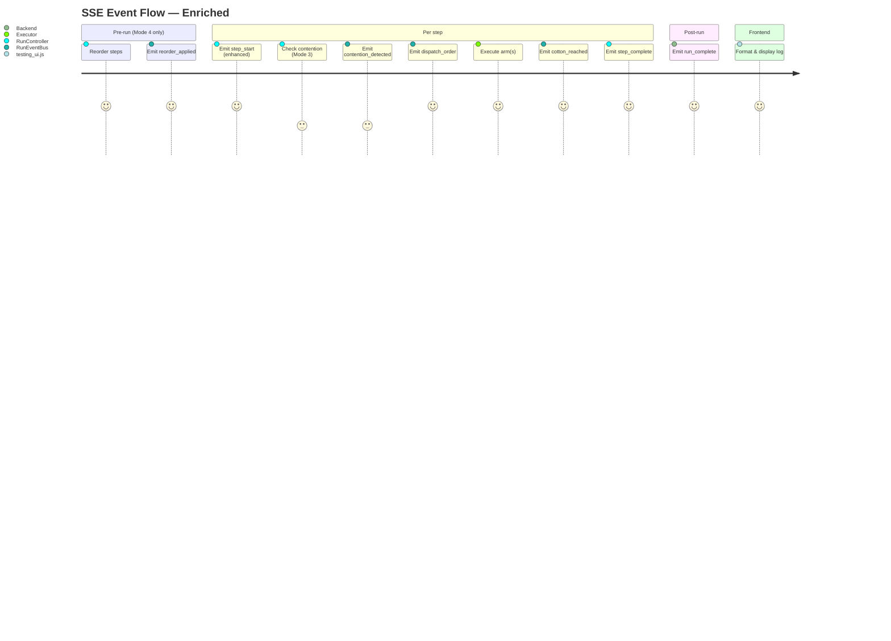

## Context

The RunController orchestrates dual-arm pick cycles, dispatching executor calls either in parallel (ThreadPoolExecutor) or sequentially (Mode 3 contention). Currently, the SSE event stream has only 4 event types: `cotton_spawn`, `step_start`, `step_complete`, and `run_complete`. These carry no information about collision avoidance mode behavior — Playwright tests cannot verify that Mode 3 uses sequential dispatch or that Mode 4 reordered steps.

**Current SSE pipeline:** RunController emits events via `self._emit(dict)` → `RunEventBus.emit()` → SSE endpoint `/api/run/events` → frontend `EventSource.onmessage` → formatted log lines in `#log-area`.

**Injection points identified in run_controller.py:**
- After `step_has_contention` check (line 382) — for `contention_detected` and `dispatch_order`
- After each `executor.execute()` return — for `cotton_reached`
- After Mode 4 step_map rebuild (line 228) — for `reorder_applied`
- Existing `step_start` emit (line 364) — enhance with cam fields

## Goals / Non-Goals

**Goals:**
- Make mode-specific dispatch behavior observable via SSE events
- Enable Playwright E2E verification of all 5 modes (0–4)
- Show cotton reach positions in the UI log for operator visibility
- Zero changes to executor, policy, or scheduler code

**Non-Goals:**
- Changing dispatch behavior or collision avoidance logic
- Adding new API endpoints
- Persisting enriched events to disk or database
- Modifying existing `cotton_spawn`, `step_complete`, or `run_complete` events

## Decisions

### D1: Recompute j4 gap in RunController (not modify policy return type)

The j4 gap is computed in `SequentialPickPolicy.apply()` as a local variable and discarded. Two options:
- **A (chosen):** Recompute in RunController from `candidates[arm_id]["j4"]` values already available at line 378.
- **B (rejected):** Add `last_gap` attribute to SequentialPickPolicy or change to 5-tuple return.

**Rationale:** Option A requires zero changes to the policy (which is tested and committed). The candidate joints are already in scope at the dispatch decision point.

### D2: Compute min_j4_gap for reorder_applied from rebuilt step_map

After `SmartReorderScheduler.reorder()`, compute min gap from the new step_map by iterating paired steps and applying FK formula `j4 = 0.1005 - cam_z`.

**Rationale:** The scheduler's internal gap computation is not exposed. Computing from the rebuilt step_map is straightforward and uses the same FK formula.

### D3: Emit cotton_reached only when pick_completed is True

Not emitted for blocked, skipped, unreachable, or e-stopped steps — only when the arm actually reached the cotton.

**Rationale:** The event name implies physical arrival. Emitting it for non-executed steps would be misleading.

### D4: Emit dispatch_order for all modes (not just Mode 3)

All modes emit `dispatch_order` with `order: "parallel"` or `order: "sequential"`. This lets Playwright assert absence of sequential dispatch in Modes 0/1/2/4.

**Rationale:** Uniform event emission simplifies frontend handling and makes assertions symmetrical.

### D5: cotton_reached emitted inside dispatch loop (not after)

For sequential dispatch (Mode 3), `cotton_reached` is emitted after each arm's `execute()` returns — so the winner's `cotton_reached` event always precedes the loser's. This ordering is verifiable by Playwright.

For parallel dispatch, both arms execute concurrently, so the order of `cotton_reached` events is non-deterministic.

## Risks / Trade-offs

| Risk | Impact | Mitigation |
|------|--------|------------|
| SSE event volume increases ~2x per step | Negligible — events are small JSON dicts, EventBus is a deque | No mitigation needed; the extra events add <1KB per step |
| Frontend log grows faster with more event lines | Minor UX — more log lines to scroll | Existing 200-line cap in `log()` function handles this |
| j4 gap recomputation may differ slightly from policy | Would never happen — both use the same `candidates[arm_id]["j4"]` values | No mitigation needed; identical source data |
| Parallel dispatch cotton_reached order is non-deterministic | Cannot assert arm order for non-contention parallel steps | Playwright tests only assert arm order for Mode 3 sequential steps |

## Open Questions

None — all design decisions are resolved.
