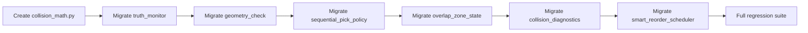

## Context

The vehicle has two robot arms mounted facing opposite directions. Each arm has a J4 prismatic joint for lateral sliding. Because the arms face opposite directions, a positive J4 displacement on arm1 moves it in the opposite world-frame direction compared to a positive J4 on arm2.

Currently, all 7 collision avoidance call sites compute lateral gap as `abs(j4_arm1 - j4_arm2)`. This is incorrect — it underestimates gap when arms converge (both sliding toward center) and overestimates when they diverge. The correct formula is `abs(j4_arm1 + j4_arm2)`, which accounts for the mirrored orientation: `abs(j4_arm1 - (-j4_arm2))`.

The 7 affected call sites span: truth monitoring, geometry checks (stages 1 & 2), sequential pick policy, overlap zone detection, collision diagnostics, and smart reorder scheduling.

## Goals / Non-Goals

**Goals:**
- **MUST**: Fix the J4 gap formula in all 7 call sites to use `abs(j4_a + j4_b)`
- **MUST**: Centralize the formula in a single helper to prevent future drift
- **MUST**: Update all unit tests to use physically-correct opposite-sign J4 pairs
- **SHOULD**: Maintain identical test coverage and assertion structure

**Non-Goals:**
- Changing the FK pipeline or joint limits
- Modifying arm configuration data structures
- Changing collision threshold values
- Altering UI display logic

## Decisions

### Decision 1: Centralized helper vs inline fix

**Chosen:** Centralized helper `j4_collision_gap(j4_a, j4_b)` in new `collision_math.py`.

**Rationale:** The formula appears in 7 places. A centralized helper:
- Prevents future drift if one site is missed or reverted
- Documents the physics reason (opposite-facing arms) in one place
- Makes the formula unit-testable in isolation

**Alternatives considered:**
- Inline `abs(a + b)` at each site — simpler but no drift protection, no documentation anchor

### Decision 2: Test value migration strategy

**Chosen:** Negate peer/arm2 J4 values in all test fixtures. This preserves identical expected gap values because `abs(a + (-b)) = abs(a - b)`.

**Rationale:** Minimizes test churn. Every existing assertion value stays the same — only the input J4 signs change.

**Alternatives considered:**
- Keep same-sign inputs and recalculate expected gaps — more churn, harder to review
- Use a test helper to auto-negate — adds indirection, obscures what the test actually sends

### Decision 3: Migration order

**Chosen:** Create helper first, then migrate each call site one at a time with its own commit.

**Rationale:** Each commit is independently testable and revertable. If a regression appears, `git bisect` points to the exact module.

## User Journey

## Risks / Trade-offs

- **[Risk] Missed call site** -- Mitigated by grep audit in Task 8 confirming zero remaining `abs(.*j4.*-.*j4)` patterns
- **[Risk] BDD/E2E tests use same-sign J4 values** -- Mitigated by running full BDD and E2E suites in Task 8, fixing any failures
- **[Risk] smart_reorder_scheduler uses FK-derived J4 values** -- The FK formula `j4 = 0.1005 - cam_z` produces negative values for typical cam_z. With `abs(a+b)` the expected gaps change. Mitigated by recalculating expected values from the formula.
- **[Risk] collision_diagnostics uses real FK pipeline** -- J4 values come from FK computation on camera coords. Test impact needs case-by-case investigation.

## Open Questions

None — all design decisions confirmed with the user.
