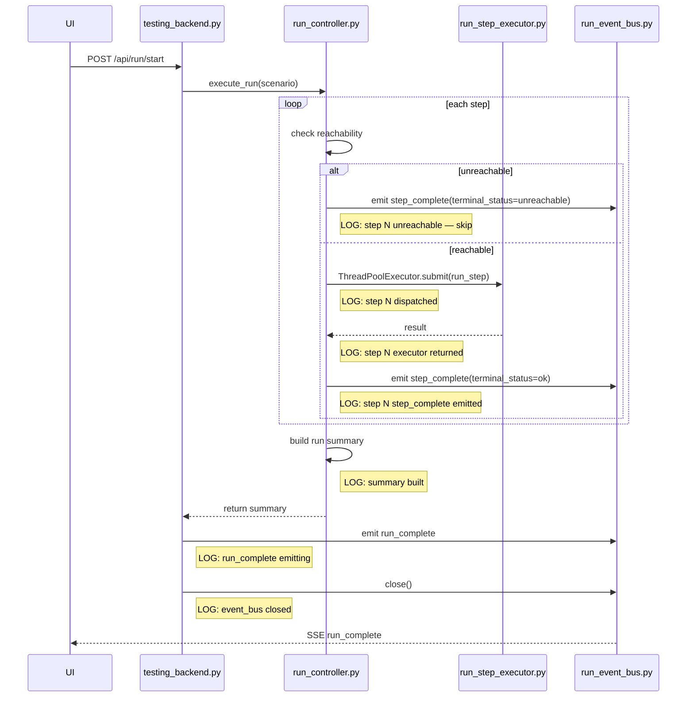

## Context

The dual-arm cotton-picking simulation run controller (`run_controller.py`) emits `step_complete` and `run_complete` SSE events after each step and at end-of-run. On the third consecutive rerun of the same scenario, the run stalls permanently after logging `parallel dispatch` — neither event is ever emitted, leaving the UI frozen.

A secondary issue: steps that are unreachable (j4 joint target exceeds FK limit) skip Gazebo execution entirely but still report "complete" in the UI. Cotton assigned to those steps is never removed.

Current state:
- No logger calls exist between the `ThreadPoolExecutor.submit()` at `run_controller.py:473` and the `step_complete` emit at line 561
- `testing_backend.py:1285` emits `run_complete` then immediately calls `_event_bus.close()` — no logging around either
- `testing_ui.js:1566` always renders "complete" regardless of `terminal_status` in the SSE payload

## Goals / Non-Goals

**Goals (MoSCoW):**

*Must:*
- Add structured logger calls at every critical transition in the emit path (dispatch → executor result → step_complete → summary → run_complete → event_bus close)
- Add regression test: an unreachable tail step must still emit `step_complete` (currently untested)
- Add regression test: three consecutive reruns of the same scenario must all complete (i.e., receive `run_complete`) within a timeout

*Should:*
- Add logger calls to `testing_backend.py` around `run_complete` emit and `_event_bus.close()`
- Fix the UI `step_complete` handler to display actual `terminal_status` instead of static "complete"

*Could:*
- Fix cotton cleanup for unreachable/skipped steps (spawned cotton not removed)

*Won't (this change):*
- Fix the root cause of j4 cumulative drift (separate FK baseline reset change)
- Change arm orchestration, scheduling, or topic wiring

**Non-Goals:**
- Modifying reachability logic in `fk_chain.py`
- Any change to Gazebo topic names or arm wiring
- Performance optimisation of the executor or event bus

## Decisions

### D1: Instrumentation-first, then tests
**Decision:** Add logger calls before writing regression tests, so failing tests have observable log output to validate against.
**Rationale:** The stall is intermittent (third rerun only). Without logs, a passing regression test gives false confidence. Logs provide the signal the test asserts on.
**Alternative considered:** Write tests first (TDD). Rejected because the stall location is unknown — we can't write a meaningful assertion without first knowing what observable signal to check.

### D2: Use existing `logger` (Python `logging`) — no new dependency
**Decision:** Use the module-level `logger = logging.getLogger(__name__)` already present in both files.
**Rationale:** No new dependency, consistent with existing log format, immediately visible in the server console.

### D3: Regression test uses a real in-process event bus, no Gazebo
**Decision:** Tests mock Gazebo execution (executor returns immediately) and test only the controller emit path end-to-end.
**Rationale:** The stall is in Python (between dispatch and emit), not in Gazebo. Mocking Gazebo makes the test deterministic and fast.

### D4: UI fix is a one-line change to `testing_ui.js`
**Decision:** Change `testing_ui.js:1566` to read `data.terminal_status` (or fallback to "complete") from the SSE payload.
**Rationale:** Minimal risk. The `terminal_status` field is already present in every `step_complete` payload.

## Risks / Trade-offs

- **[Risk] Logger calls add noise to production logs** → Mitigation: use `logger.debug()` for high-frequency per-step calls; `logger.info()` only for run-level events.
- **[Risk] Regression test for third-rerun stall may be flaky** → Mitigation: use a generous timeout (30 s) and assert on receipt of `run_complete` event, not wall-clock timing.
- **[Risk] Cotton cleanup fix may affect other tests** → Mitigation: scope this as a "could" item; implement only after instrumentation and emit tests are green.
- **[Risk] `_event_bus.close()` called before all SSE clients consume `run_complete`** → Mitigation: log the close call; this is a known race to investigate separately.

## Migration Plan

1. Add logger instrumentation to `run_controller.py` (no behaviour change)
2. Add logger instrumentation to `testing_backend.py` (no behaviour change)
3. Run existing test suite → must stay green
4. Add regression tests (red → green)
5. Fix UI `terminal_status` display (one-line change)
6. Optionally fix cotton cleanup
7. Commit when all tests green

Rollback: revert logger and UI line individually; no schema or API changes.

## Open Questions

- Is the third-rerun stall caused by a thread leak in `ThreadPoolExecutor` (executor not shut down between runs), a deadlock in the event bus, or a missed `await`/callback? — to be answered by instrumentation output.
- Should `_event_bus.close()` be called after a flush/drain rather than immediately? — defer to separate change.

---

## User Journey (Mermaid)

