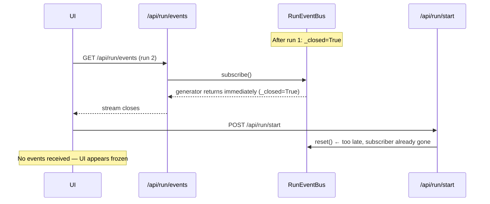
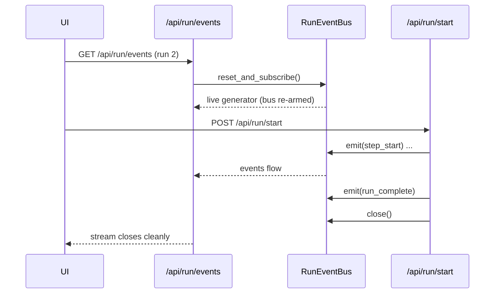

## Context

The testing UI streams run events over SSE (`/api/run/events`). A global `RunEventBus`
instance (`_event_bus`) mediates between the run controller (producer) and the SSE
handler (consumer). After the first run completes, `run_start` calls `_event_bus.close()`.
On the second run, the browser opens a new `EventSource` — this hits `/api/run/events`,
which calls `_event_bus.subscribe()` on the already-closed bus. `subscribe()` yields any
queued events and returns immediately (because `_closed=True`), so the SSE stream ends
before `/api/run/start` even calls `_event_bus.reset()`. The UI receives no events and
appears frozen.

**User Journey (happy path after fix):**

---

## Goals / Non-Goals

**Goals (MoSCoW):**

- **M** — Fix second-run freeze: SSE subscriber on run 2+ MUST receive all events.
- **M** — Regression test: a test that fails before the fix and passes after.
- **S** — Keep `RunEventBus` API minimal; avoid adding new public methods beyond what is
  necessary.
- **C** — Preserve existing single-run and E-STOP behavior unchanged.
- **W** — Detailed SSE reconnect metrics/logging (not required for correctness).

**Non-Goals:**

- No UI changes.
- No changes to event payload schemas.
- No multi-client SSE fan-out (single subscriber per run is sufficient).
- No persistent run history or event replay across server restarts.

---

## Decisions

### Decision 1 — Reset the bus inside `/api/run/events`, not inside `subscribe()`

**Options considered:**

| Option | Description | Verdict |
|--------|-------------|---------|
| A (chosen) | `GET /api/run/events` calls `_event_bus.reset()` before subscribing | Simple, no `RunEventBus` API change |
| B | Add `RunEventBus.reset_and_subscribe()` that atomically resets + subscribes | Cleaner encapsulation, but complicates `RunEventBus` contract |
| C | Remove `close()` entirely; rely only on `run_complete` sentinel | Would break E-STOP path that needs to abort mid-run |

**Rationale for A:** The reset happens at the SSE boundary where the intent is clear
("start fresh"). `/api/run/start` already calls `reset()` as a safety measure — we move
the canonical reset to the SSE open instead, and keep the `/api/run/start` reset as a
no-op guard for the case where start fires before the SSE is opened.

### Decision 2 — Keep `_event_bus.close()` in `/api/run/start`

`close()` signals the subscriber to stop after `run_complete`. Removing it would require
the SSE handler to poll or timeout. Keeping it is correct — the bus closes only after the
run completes and the subscriber has received `run_complete`.

### Decision 3 — Test at integration level, not unit level only

The freeze is a **lifecycle** bug (ordering of calls across two endpoints). A unit test of
`RunEventBus` alone cannot reproduce it. The regression test MUST call both
`GET /api/run/events` and `POST /api/run/start` for two consecutive runs.

---

## Risks / Trade-offs

| Risk | Mitigation |
|------|------------|
| `reset()` inside `/api/run/events` wipes events from a previous run that haven't been read yet | Acceptable — SSE consumers always complete reading before the browser reconnects; old events are consumed or irrelevant |
| Race: two concurrent `GET /api/run/events` calls could both reset then subscribe | Mitigated by single-subscriber design; UI only opens one SSE at a time |
| Moving `reset()` to SSE open means if no SSE is opened, bus is never reset | `/api/run/start` still calls `reset()` as a guard, so this is safe |

---

## C4 Diagram (ASCII)

See `docs/fix-second-run-freeze-c4.md` for the standalone C4 context/container diagram.

---

## Migration Plan

1. Edit `testing_backend.py`: move `_event_bus.reset()` call from `/api/run/start` to
   `/api/run/events` SSE handler (before `subscribe()`).
2. Keep `_event_bus.reset()` in `/api/run/start` as a defensive no-op.
3. Add regression test in `test_ui_run_flow_integration.py`.
4. Add `RunEventBus` unit test for subscribe-after-close behaviour.
5. Run full test suite — verify GREEN.
6. No rollback required; change is backward-compatible (single-subscriber, same API).

## Open Questions

- None. Root cause and fix are fully understood.
