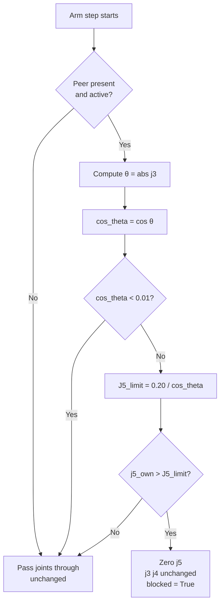

## Context

Mode 1 (`BASELINE_J5_BLOCK_SKIP`) currently blocks j5 when `|j4_own − j4_peer| < 0.05 m`.
This threshold is peer-position-dependent and tilt-blind — two arms at the same lateral
position but tilted away from each other are blocked unnecessarily, while an arm tilted
toward the peer can collide even when the j4 gap is large. The fix is to express the
blocking criterion in terms of horizontal reach, which is the physically meaningful quantity.

The formula `J5_limit = adj / cos(|J3|)` is already proven in the **Arm Cosine Test** UI
panel, which commands the arm to exactly `J5 = 0.25 / cos(θ)` to maintain constant
horizontal reach. The blocking logic inverts the same identity to produce a safe-reach limit.

## Goals / Non-Goals

**Goals:**
- Replace Mode 1's j4 gap threshold with `j5_own > 0.20 / cos(|j3_own|)`
- Keep the peer-presence guard (no peer or idle peer → always safe)
- Keep the blocking action (zero j5, leave j3 and j4 unchanged)
- Update all tests, BDD scenarios, and diagnostics to match

**Non-Goals:**
- No change to Modes 0, 2, 3, or 4
- No change to the Arm Cosine Test panel
- No configuration / parameter exposure for `adj` (hard-coded 0.20 m for now)
- No change to joint limits, FK chain, or scenario JSON format

## Decisions

### D1 — Formula: `J5_limit = 0.20 / cos(|j3_own|)`

**Chosen:** `J5_limit = adj / cos(theta)` where `theta = abs(own_joints["j3"])` and `adj = 0.20`.

**Rationale:** Directly encodes the horizontal reach constraint. At θ=0 (vertical arm), limit
is exactly 0.20 m. As the arm tilts, more extension is permitted because the horizontal
component shrinks. Matches the identity validated by the Arm Cosine Test.

**Alternatives considered:**
- Keep j4 gap: tilt-blind, physically incorrect.
- Use `j5 * cos(|j3|) > adj` directly: equivalent, but less readable at the call site.

### D2 — `adj = 0.20 m` (fixed constant)

**Chosen:** Hard-coded `_MODE1_ADJ = 0.20` in `baseline_mode.py`.

**Rationale:** 0.20 m is tighter than the Arm Cosine Test's default 0.25 m, leaving a 5 cm
safety margin. Configurable `adj` is a later concern (out of scope).

### D3 — Guard for cos(θ) ≈ 0

**Chosen:** If `cos_theta < 0.01` (θ ≥ ~89.4°), set `J5_limit = float('inf')` → always safe.

**Rationale:** At near-vertical tilt the arm has essentially zero horizontal reach; no
blocking is needed. Division-by-zero guard is required for correctness.

### D4 — Boundary: `j5 > J5_limit` (strictly greater than)

**Chosen:** Block when `j5_own > J5_limit`. Equality is safe.

**Rationale:** Consistent with existing boundary conventions in Modes 2 and 3. An arm at
exactly the safe reach limit is not a collision risk.

### D5 — Peer-presence guard unchanged

**Chosen:** No peer → safe; peer with `candidate_joints=None` (idle) → safe.

**Rationale:** Without a peer there is nothing to collide with. This guard is correct and
consistent with all other modes.

## User Journey

## Risks / Trade-offs

| Risk | Mitigation |
|------|-----------|
| Peer j4 position no longer used — arm may extend into a peer that is nearby but at a different tilt | Modes 2–4 continue to cover geometry-based and sequencing checks; Mode 1 is the simplest baseline, not the primary safety net |
| `adj = 0.20 m` may be too conservative or too permissive for some arm configurations | Value chosen with margin from the Arm Cosine Test's 0.25 m; can be exposed as a config parameter in a follow-up change |
| BDD and unit tests extensively reference the old j4 gap threshold — all must be replaced | Tasks explicitly list each test file; RED run confirms failures before GREEN |

## Migration Plan

1. Update tests to fail (RED) — confirms old behaviour is captured
2. Implement `_apply_baseline_j5_block_skip()` (GREEN)
3. Update diagnostics and cross-mode BDD
4. Run full pytest suite — all green
5. Commit

No rollback complexity — Mode 1 is selected by the operator at run-time; other modes are
unaffected.

## Open Questions

- Should `adj` be exposed as a UI parameter in the Scenario Run panel? → Deferred to follow-up change.
- Should the cosine limit also gate the `collision_diagnostics.py` `reachable` flag, or only the blocking verdict? → Currently only the blocking verdict; `reachable` uses joint-limit checks unchanged.
