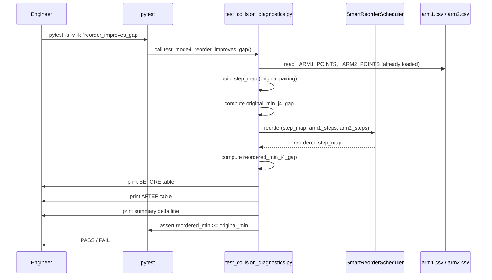

## Context

`test_collision_diagnostics.py` is a parametric diagnostic test that runs all 5 collision
avoidance modes against every cam-point pair loaded from `arm1.csv` / `arm2.csv`. For
mode 4 (Smart Reorder), the existing assertion is a single line:

```python
elif mode == 4:
    assert mr["verdict"] == "REORDER_CANDIDATE"
```

This verifies only the label. It does not exercise `SmartReorderScheduler` at all — the
scheduler is never called during diagnostic testing. The reorder benefit (maximising the
minimum j4 gap across all paired steps) is only tested via hardcoded synthetic data in
`test_smart_reorder_scheduler.py`. Real CSV cam-point data has never been fed through the
end-to-end pipeline.

The goal is to add a single new test that closes this gap without touching production code.

---

## Goals / Non-Goals

**Goals:**
- Run `SmartReorderScheduler.reorder()` against the real `arm1.csv` / `arm2.csv` data
- Assert `reordered_min_j4_gap >= original_min_j4_gap`
- Print a before/after table (visible with `-s`) showing step order, per-arm cam_z, j4,
  gap, and a summary delta line so engineers can see the reorder effect at a glance
- Include solo tail rows in the table (with `---` for the missing arm); exclude them from
  the min-gap assertion

**Non-Goals:**
- Changing `diagnose_collision()` return structure
- Modifying the existing parametric `test_collision_diagnostic` assertions
- Adding Playwright / browser verification
- Testing scheduler correctness against synthetic data (already in `test_smart_reorder_scheduler.py`)

---

## Decisions

### D1 — Add the test to `test_collision_diagnostics.py`, not a new file

**Chosen:** Extend the existing file with a standalone (non-parametric) test function.

**Alternatives considered:**
- *New file `test_mode4_reorder_diagnostic.py`*: cleaner separation but duplicates
  `_load_csv` logic and the already-populated `_ARM1_POINTS` / `_ARM2_POINTS` globals.
- *BDD scenario in `mode4_smart_reorder.feature`*: consistent with project style but BDD
  steps are awkward for CSV file I/O and table printing.

**Rationale:** The existing file already owns the CSV-loading code and the loaded globals.
Adding a module-level function reuses both without duplication. All mode 4 diagnostic
assertions stay in one place.

---

### D2 — Use `_ARM1_POINTS` / `_ARM2_POINTS` globals directly

`_ARM1_POINTS` and `_ARM2_POINTS` are module-level lists of `(cam_x, cam_y, cam_z)`
tuples loaded at import time. The new test reads `cam_z` (index `[2]`) from each tuple to
build the step_map. This avoids re-opening the CSV files.

---

### D3 — FK formula inline, not imported from scheduler

`j4 = 0.1005 - cam_z` is the FK formula (`FK_OFFSET = 0.1005` in `smart_reorder_scheduler.py`).

**Chosen:** Define `FK_OFFSET = 0.1005` as a local constant in the test function (or
import it from `smart_reorder_scheduler`).

**Rationale:** Importing keeps the constant DRY and ensures the test and scheduler always
use the same value. If the FK formula changes, the test automatically picks up the change.

---

### D4 — Table format: fixed-width columns, printed via `print()`

The before/after tables use plain `print()` with f-string formatting (72-char width,
matching the existing diagnostic printer in the same file). No third-party table library.
Solo tail rows show `---` in missing-arm columns. A summary line shows
`min_gap_before → min_gap_after (delta)`.

---

### D5 — Skip when `paired_count < 2`

If `arm1.csv` and `arm2.csv` each have only one row, there is only one possible pairing
and no permutation can improve the gap. The test uses `pytest.skip()` in this case rather
than failing, since the data constraint is external to the code under test.

---

## User Journey



---

## Risks / Trade-offs

| Risk | Mitigation |
|---|---|
| CSV data has only 1 pair → test skips silently | `pytest.skip()` with a clear message; engineer knows to add more rows |
| All cam_z values identical → gap is always 0, reorder cannot improve | Assert `>=` (not `>`) so the test passes; this is a valid degenerate case |
| `_ARM1_POINTS` / `_ARM2_POINTS` are module-level and shared across tests | Read-only access; no mutation; no ordering side-effect |
| FK constant drifts from scheduler | Import `FK_OFFSET` from `smart_reorder_scheduler` to stay DRY |

---

## Migration Plan

1. Add `from smart_reorder_scheduler import SmartReorderScheduler, FK_OFFSET` to imports
   in `test_collision_diagnostics.py`
2. Add `test_mode4_reorder_improves_gap()` function below the existing parametric test
3. Run `python3 -m pytest features/test_collision_diagnostics.py -s -v -k "reorder_improves_gap"`
   to verify GREEN
4. Run full file to verify no regressions: `python3 -m pytest features/test_collision_diagnostics.py -s -v`

No production code changes. No rollback needed — the test can be deleted if the CSV data
becomes invalid.

---

## Open Questions

None. All design decisions are resolved.
