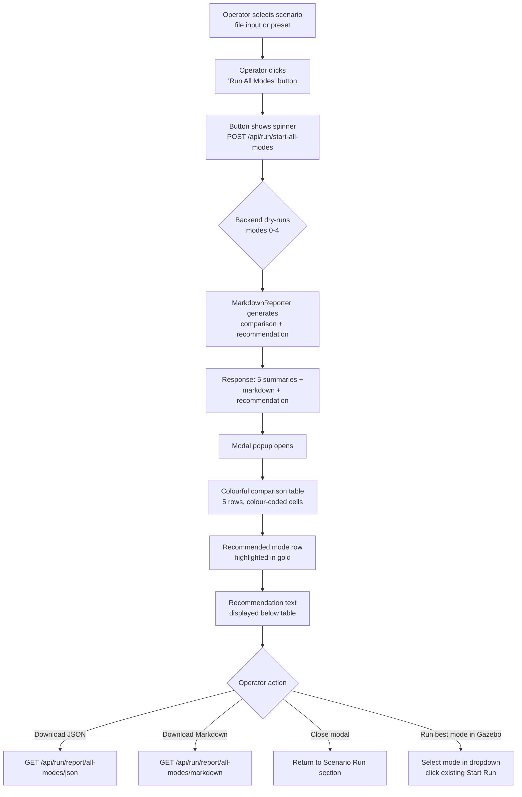

## Context

The testing UI currently supports single-mode scenario runs via `POST /api/run/start` which drives real Gazebo joint motion. Operators must repeat this 5 times (once per mode) and manually compare results to determine the best collision avoidance strategy. The `MarkdownReporter` class (176 lines, fully tested) generates five-mode comparison tables with a recommendation, but no endpoint or UI element calls it. The `RunController` already supports a no-op executor path (`executor=None` creates an internal no-op executor at `run_controller.py:101-106`) that runs full collision logic without Gazebo delays.

## MoSCoW Prioritisation

**Must Have:**
- Backend endpoint that dry-runs all 5 modes and returns comparison + recommendation
- Frontend button to trigger the all-modes run
- Modal popup with colourful comparison table and highlighted best mode
- Report download links (JSON + Markdown)

**Should Have:**
- Colour-coded cells (green/red/amber) for collision metrics
- Progress indication while run executes

**Could Have:**
- Per-mode expandable detail rows in the table
- Ability to re-run a specific mode with Gazebo motion from the comparison view

**Won't Have (this change):**
- Live Gazebo motion for all-modes runs
- New collision avoidance modes
- SSE streaming for dry-run progress (completes in <1s, unnecessary)

## User Journey

## Goals / Non-Goals

**Goals:**

- Expose the existing `MarkdownReporter` comparison logic through a one-click UI workflow
- Run all 5 modes in under 1 second via dry-run (no Gazebo motion)
- Present results in a visually clear colourful table with an actionable recommendation
- Provide downloadable comparison reports in JSON and Markdown formats

**Non-Goals:**

- Modifying existing single-mode run flow or endpoints
- Adding SSE streaming for the all-modes run (synchronous POST is sufficient for <1s runs)
- Driving Gazebo motion during the all-modes comparison

## Decisions

### 1. Dry-run via `RunController(executor=None)`

**Choice:** Create each `RunController` with `executor=None` and no spawn/remove/event_bus functions.

**Rationale:** `RunController.__init__` already creates a no-op `RunStepExecutor` when `executor=None` (lines 101-106). This runs the full collision logic (BaselineMode, TruthMonitor, geometry checks, sequential pick contention, smart reorder scheduling) without any Gazebo publishing or sleep delays. No new code needed for the executor path.

**Alternative considered:** Creating a dedicated `DryRunController` subclass — rejected because the existing no-op path is sufficient and avoids class proliferation.

### 2. Sequential mode loop in endpoint

**Choice:** Loop `for mode in range(5)` synchronously inside the endpoint handler.

**Rationale:** Each dry-run completes in ~5-10ms (no I/O, no sleep). Total time for 5 modes is <50ms. Threading or async parallelism would add complexity for negligible speed gain.

**Alternative considered:** `asyncio.gather` with 5 concurrent `to_thread` calls — rejected because shared `ArmRuntime` / `fk_chain` global state could cause race conditions, and 50ms serial is fast enough.

### 3. Recommendation extraction via regex

**Choice:** Parse `MarkdownReporter.generate()` output for the pattern `` Best mode: `<name>` `` to extract the recommendation.

**Rationale:** `MarkdownReporter._recommend()` is private and outputs a formatted string. Rather than duplicating the decision logic or making `_recommend` public, parse the output. The format is stable (tested in `test_markdown_reporter.py`).

**Alternative considered:** Making `_recommend()` public — rejected to avoid modifying a tested class for one consumer. If the format changes, the regex test will catch it.

### 4. New global `_current_all_modes_result` for report storage

**Choice:** Add a separate global `_current_all_modes_result` alongside existing `_current_run_result`.

**Rationale:** The all-modes result has a different structure (5 summaries + comparison markdown) from the single-mode result (1 summary + steps). Separate globals prevent conflicts when a single-mode run follows an all-modes run.

### 5. Modal popup for results display

**Choice:** Display comparison table in a modal overlay rather than inline.

**Rationale:** The user explicitly chose modal in the brainstorming phase. A modal avoids cluttering the Scenario Run section with a large table and provides a focused comparison view.

### 6. Colour coding scheme

**Choice:**
- Green (`.cell-green`): metric value is 0 (no collisions / no near-collisions)
- Red (`.cell-red`): collision steps > 0
- Amber (`.cell-amber`): near-collision steps > 0 but collision steps = 0
- Gold border (`.row-best`): recommended mode row

**Rationale:** Traffic-light metaphor is instantly recognisable. Green = safe, red = dangerous, amber = caution.

## Risks / Trade-offs

| Risk | Likelihood | Mitigation |
|------|-----------|------------|
| Dry-run collision counts differ from Gazebo-backed run | Low | Collision detection is purely mathematical (J4 gap computation in `BaselineMode`/`TruthMonitor`), not physics-based. Both paths use identical `RunController` logic. |
| `MarkdownReporter` output format changes break regex extraction | Low | `test_markdown_reporter.py` (291 lines) validates the format. A new backend test will also verify extraction. |
| Large scenario with many steps slows dry-run | Very low | Even 100 steps × 5 modes = 500 FK computations at ~0.1ms each = <50ms total. No I/O in the loop. |
| Modal popup blocks interaction with underlying UI | Acceptable | Standard modal UX pattern. Close button and overlay click dismiss the modal. |

## Open Questions

_(none — all design decisions resolved during brainstorming)_
