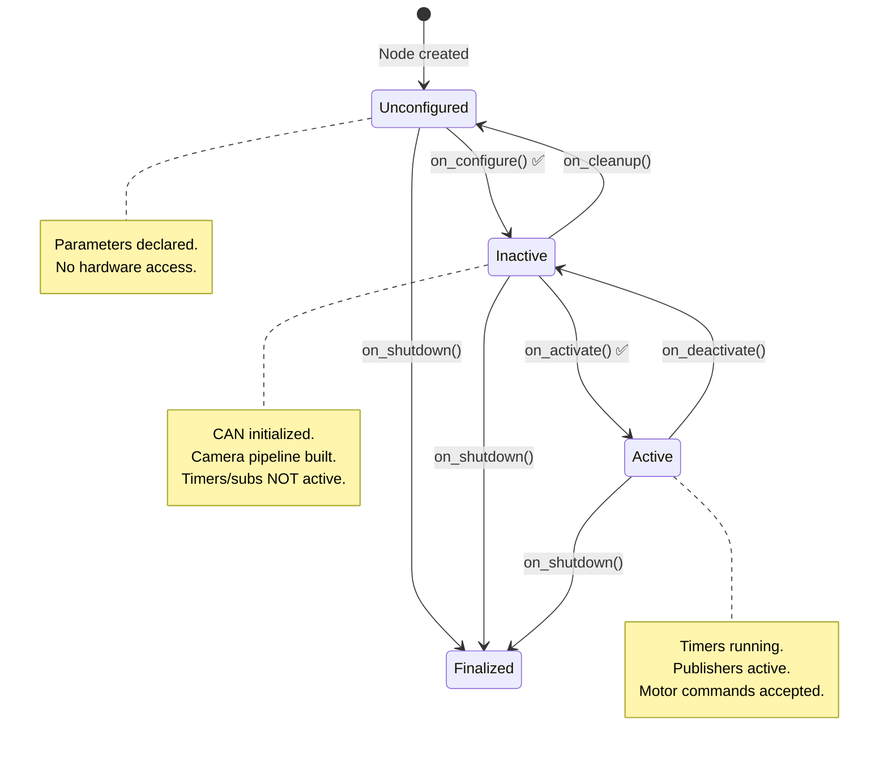
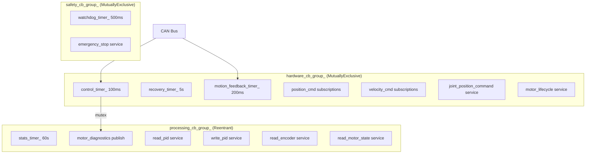
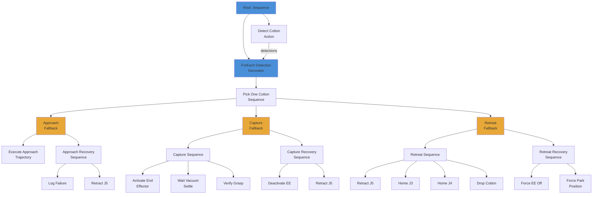
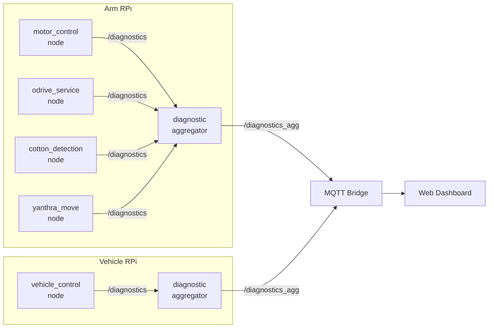
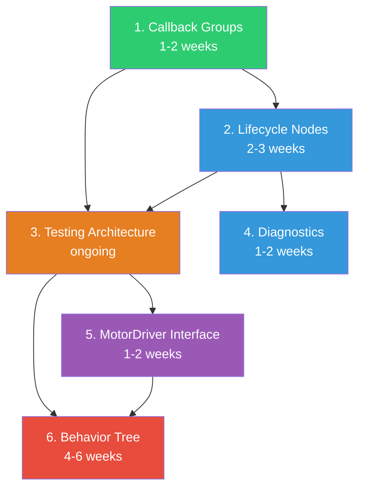

# Cross-Cutting Architectural Patterns: Migration Design

> **Scope:** 6 patterns across all production nodes (motor_control, odrive_service, cotton_detection, yanthra_move, vehicle_control, pattern_finder)
> **Date:** 2026-03-11
> **Status:** Draft

---

### Related Documents

- [Technical Debt Analysis](../project-notes/TECHNICAL_DEBT_ANALYSIS_2026-03-10.md) — source of truth for all debt items
- [Arm Nodes Roadmap](../project-notes/ARM_NODE_REFACTORING_ROADMAP_2026-03-10.md) — cotton_detection, yanthra_move, pattern_finder
- [Vehicle Nodes Roadmap](./vehicle_nodes_refactoring_roadmap.md) — vehicle_control, odrive_service
- [Shared Nodes Roadmap](./shared_nodes_refactoring_roadmap.md) — mg6010_controller, pid_tuning
- [Infrastructure Roadmap](./infrastructure_refactoring_roadmap.md) — common_utils, msgs, robot_description

---

## Table of Contents

1. [Lifecycle Node Adoption](#1-lifecycle-node-adoption)
2. [Callback Groups and Executor Strategy](#2-callback-groups-and-executor-strategy)
3. [ros2_control Integration](#3-ros2_control-integration)
4. [Behavior Tree for Pick Cycle](#4-behavior-tree-for-pick-cycle)
5. [Diagnostics Framework](#5-diagnostics-framework)
6. [Testing Architecture](#6-testing-architecture)
7. [Recommended Adoption Order](#7-recommended-adoption-order)

---

## 1. Lifecycle Node Adoption

### 1.1 Current State

Zero lifecycle nodes. Every node inherits from `rclcpp::Node` (C++) or `rclpy.node.Node` (Python). All hardware initialization — CAN bus, DepthAI camera, GPIO, IMU — happens inside constructors. The only recovery path for a failed hardware init is to restart the entire process.

Concrete examples from the codebase:

- **mg6010_controller_node.cpp (line 89):** `MG6010ControllerNode() : Node("motor_control")` — CAN interface is initialized at line 394 inside the constructor. If CAN fails, the node starts in a degraded mode with `can_available_ = false`, but there is no way to retry initialization without a full restart.
- **cotton_detection_node_main.cpp (line 46):** `auto node = std::make_shared<CottonDetectionNode>()` — DepthAI camera pipeline is built during construction. `cleanup_before_shutdown()` is called manually at line 66 before node destruction.
- **vehicle_control_node.py (line 98):** `super().__init__("vehicle_control_node")` — GPIO, MQTT, IMU, joystick, and thermal monitoring all initialize in `__init__`.

### 1.2 Target State

All hardware-interfacing nodes use `LifecycleNode` (C++) or lifecycle-equivalent (Python). Pure-logic nodes that perform no hardware I/O may skip lifecycle.

### 1.3 Lifecycle State Machine



### 1.4 Migration Mapping

| Current code location | Lifecycle callback | What moves |
|---|---|---|
| Constructor (parameter declaration, logging) | Constructor (stays) | `declare_parameter()`, version logging |
| Constructor (CAN init, camera init, GPIO init) | `on_configure()` | Hardware interface creation, `can_interface_->initialize()`, DepthAI pipeline build |
| Constructor (timer/sub/pub/service creation) | `on_activate()` | `create_wall_timer()`, `create_subscription()`, `create_publisher()`, `create_service()` |
| Destructor (`perform_shutdown()`, `cleanup_before_shutdown()`) | `on_deactivate()` + `on_cleanup()` | Motor parking sequence, DepthAI device release, GPIO cleanup |
| N/A (no retry path exists) | `on_cleanup()` → `on_configure()` | Hardware re-initialization without process restart |

### 1.5 Concrete C++ Migration: mg6010_controller_node

**Before (current):**
```cpp
class MG6010ControllerNode : public rclcpp::Node
{
public:
  MG6010ControllerNode()
  : Node("motor_control")
  {
    // Parameters
    this->declare_parameter<std::string>("interface_name", "can0");
    this->declare_parameter<int>("baud_rate", 500000);
    this->declare_parameter<std::vector<int64_t>>("motor_ids", {});
    // ... 60+ more parameter declarations ...

    // Hardware init (CAN bus) — no retry if this fails
    std::string interface_name = this->get_parameter("interface_name").as_string();
    can_interface_ = std::make_shared<MG6010CANInterface>();
    if (!can_interface_->initialize(interface_name, baud_rate)) {
      RCLCPP_ERROR(this->get_logger(), "CAN init failed");
      can_available_ = false;  // degraded mode — no recovery path
    }

    // ROS2 interfaces
    joint_state_pub_ = this->create_publisher<sensor_msgs::msg::JointState>("joint_states", 10);
    control_timer_ = this->create_wall_timer(100ms, [this]() { controlLoop(); });
    watchdog_timer_ = this->create_wall_timer(500ms, [this]() { watchdogCheck(); });
    // ... 15+ more timers, services, subscriptions ...
  }

  ~MG6010ControllerNode()
  {
    if (step_test_thread_.joinable()) step_test_thread_.join();
    if (joint_pos_cmd_thread_.joinable()) joint_pos_cmd_thread_.join();
    if (joint_homing_thread_.joinable()) joint_homing_thread_.join();
    perform_shutdown();  // parks motors, disables CAN
  }
};

// main():
rclcpp::executors::SingleThreadedExecutor executor;
executor.add_node(g_node);
while (rclcpp::ok() && !g_shutdown_requested) {
  executor.spin_once(std::chrono::milliseconds(100));
}
```

**After (lifecycle):**
```cpp
#include <rclcpp_lifecycle/lifecycle_node.hpp>

class MG6010ControllerNode : public rclcpp_lifecycle::LifecycleNode
{
public:
  MG6010ControllerNode()
  : LifecycleNode("motor_control")
  {
    // ONLY parameter declarations — no hardware, no ROS2 interfaces
    this->declare_parameter<std::string>("interface_name", "can0");
    this->declare_parameter<int>("baud_rate", 500000);
    this->declare_parameter<std::vector<int64_t>>("motor_ids", {});
    // ... parameter declarations only ...
  }

  CallbackReturn on_configure(const rclcpp_lifecycle::State &)
  {
    // Hardware init — CAN bus
    auto interface_name = this->get_parameter("interface_name").as_string();
    auto baud_rate = this->get_parameter("baud_rate").as_int();

    if (simulation_mode_) {
      sim_can_interface_ = std::make_shared<test::ConfigurableMockCANInterface>();
      sim_can_interface_->initialize("sim_can0", baud_rate);
      can_interface_ = sim_can_interface_;
      can_available_ = true;
    } else {
      can_interface_ = std::make_shared<MG6010CANInterface>();
      if (!can_interface_->initialize(interface_name, baud_rate)) {
        RCLCPP_ERROR(this->get_logger(), "CAN init failed — staying Unconfigured");
        return CallbackReturn::FAILURE;  // Can retry on_configure() later
      }
      can_available_ = true;
    }

    // Initialize motor controllers (but don't start control loop yet)
    initializeMotorControllers();
    return CallbackReturn::SUCCESS;
  }

  CallbackReturn on_activate(const rclcpp_lifecycle::State &)
  {
    // Create and activate all ROS2 interfaces
    joint_state_pub_ = this->create_publisher<sensor_msgs::msg::JointState>("joint_states", 10);
    motor_diagnostics_pub_ = this->create_publisher<DiagnosticArray>("~/motor_diagnostics", 10);

    control_timer_ = this->create_wall_timer(
        std::chrono::milliseconds(static_cast<int>(1000.0 / control_frequency_)),
        std::bind(&MG6010ControllerNode::controlLoop, this));
    watchdog_timer_ = this->create_wall_timer(500ms,
        std::bind(&MG6010ControllerNode::watchdogCheck, this));

    // Services, subscriptions, action servers ...
    RCLCPP_INFO(this->get_logger(), "Motor control node ACTIVE");
    return CallbackReturn::SUCCESS;
  }

  CallbackReturn on_deactivate(const rclcpp_lifecycle::State &)
  {
    // Stop accepting commands, cancel timers
    control_timer_->cancel();
    watchdog_timer_->cancel();
    // Park motors to safe position
    perform_shutdown();
    return CallbackReturn::SUCCESS;
  }

  CallbackReturn on_cleanup(const rclcpp_lifecycle::State &)
  {
    // Release hardware resources
    can_interface_.reset();
    controllers_.clear();
    return CallbackReturn::SUCCESS;
  }

  CallbackReturn on_shutdown(const rclcpp_lifecycle::State &)
  {
    // Emergency teardown — best-effort motor park, then release everything
    if (can_available_) perform_shutdown();
    can_interface_.reset();
    return CallbackReturn::SUCCESS;
  }
};
```

### 1.6 Python Lifecycle: vehicle_control_node

Vehicle_control_node is a 3,754-line god-class. Lifecycle adoption is recommended **after** the decomposition described in `vehicle_nodes_refactoring_roadmap.md` (steps 1-11). Converting the god-class to lifecycle before decomposition would make both changes harder.

If lifecycle is adopted post-decomposition, the thin `VehicleControlNode` wrapper would look like:

```python
from rclpy.lifecycle import LifecycleNode, LifecycleState, TransitionCallbackReturn

class VehicleControlNode(LifecycleNode):
    def __init__(self):
        super().__init__("vehicle_control_node")
        # Parameter declarations only
        self.declare_parameter("cmd_vel_timeout", 1.0)
        self.declare_parameter("mqtt.broker_host", "localhost")
        # ...

    def on_configure(self, state: LifecycleState) -> TransitionCallbackReturn:
        """Initialize hardware: GPIO, MQTT, joystick, IMU."""
        try:
            self.config = self._load_yaml_config()
            self.gpio_manager = GPIOManager(self.config)
            self.mqtt_bridge = MqttBridge(self.config)
            self.joystick_handler = JoystickHandler(self.config)
            self.motor_controller = VehicleMotorController(self.config)
            return TransitionCallbackReturn.SUCCESS
        except Exception as e:
            self.get_logger().error(f"Configure failed: {e}")
            return TransitionCallbackReturn.FAILURE

    def on_activate(self, state: LifecycleState) -> TransitionCallbackReturn:
        """Start ROS2 interfaces and control loops."""
        self.control_timer = self.create_timer(0.1, self._control_loop)
        self.gpio_timer = self.create_timer(0.1, self._gpio_processing)
        self.diagnostics_timer = self.create_timer(1.0, self._publish_diagnostics)
        self.mqtt_bridge.connect()
        self.joystick_handler.start()
        return TransitionCallbackReturn.SUCCESS

    def on_deactivate(self, state: LifecycleState) -> TransitionCallbackReturn:
        """Stop control loops, disconnect MQTT."""
        self.control_timer.cancel()
        self.gpio_timer.cancel()
        self.joystick_handler.stop()
        self.mqtt_bridge.disconnect()
        return TransitionCallbackReturn.SUCCESS

    def on_cleanup(self, state: LifecycleState) -> TransitionCallbackReturn:
        """Release hardware."""
        self.gpio_manager.cleanup()
        return TransitionCallbackReturn.SUCCESS
```

### 1.7 Node Classification

| Node | Hardware | Lifecycle? | Rationale |
|---|---|---|---|
| mg6010_controller_node | CAN bus (MG6010 motors) | **Yes** | CAN init failure needs retry path |
| odrive_service_node | CAN bus (ODrive motors) | **Yes** | Same as above — CAN + heartbeat monitoring |
| cotton_detection_node | DepthAI camera (USB) | **Yes** | Camera disconnection is common in field; needs re-init |
| yanthra_move (system core) | None (orchestrates via topics) | **Maybe** | Would benefit from ordered startup after motor/camera nodes |
| vehicle_control_node | GPIO, SPI (joystick), IMU | **Yes** | GPIO/IMU init can fail on RPi; needs clean shutdown |
| pattern_finder | None (pure computation) | **No** | Simple request-response node |
| pid_tuning | None (development tool) | **No** | Not a production node |

### 1.8 Risk

Lifecycle transitions add failure points. Every transition callback is a place where the node can get stuck. Bond connections (`bond::Bond`) are needed if a lifecycle manager (like `nav2_lifecycle_manager`) is used to orchestrate transitions across multiple nodes. Without bonds, a crashed node won't trigger re-configuration of its dependents.

**Mitigation:** Start with the motor node (most impactful), validate on hardware for a full field test cycle, then roll out to other nodes.

### 1.9 Effort

**L (2-3 weeks)** across all nodes. Motor node is 1 week alone due to complex shutdown sequence.

---

## 2. Callback Groups and Executor Strategy

### 2.1 Current State

**ALL** production nodes use `SingleThreadedExecutor` with zero callback groups. Every timer, subscription, and service callback runs on the same thread, serialized.

Evidence from the codebase:

- **mg6010_controller_node.cpp (line 4484):** `rclcpp::executors::SingleThreadedExecutor executor;`
- **odrive_service_node.cpp (line 1591):** `rclcpp::executors::SingleThreadedExecutor executor;`
- **cotton_detection_node_main.cpp (line 61):** `rclcpp::spin(node);` (default SingleThreadedExecutor)
- **yanthra_utilities.cpp (line 75):** `executor = std::make_shared<rclcpp::executors::SingleThreadedExecutor>();` (background thread)
- **vehicle_control_node.py (line 34):** `from rclpy.node import Node` (SingleThreadedExecutor by default via `rclpy.spin()`)

**Consequence:** In `mg6010_controller_node`, the 10 Hz control loop timer, the 500ms watchdog timer, the 5 Hz motion feedback timer, and 15+ service callbacks all compete for the single executor thread. If the `perform_shutdown()` sequence (which includes polling loops with `condition_variable` waits) blocks, the watchdog cannot fire. The node works around this with an `atomic<bool> watchdog_exempt_` flag, which is a symptom of the real problem.

### 2.2 Target State

`MultiThreadedExecutor` with 3 callback groups per hardware node:

| Callback Group | Type | Callbacks | Purpose |
|---|---|---|---|
| `safety_cb_group_` | MutuallyExclusive | Watchdog timer, E-stop service, thermal monitor | Must never be starved. Runs independently. |
| `hardware_cb_group_` | MutuallyExclusive | CAN read/write, motor command subscriptions, position command services | Serialized to prevent concurrent CAN bus access. |
| `processing_cb_group_` | Reentrant | Joint state publisher, diagnostics timer, status logging, stats timer | Can overlap — no shared mutable state. |

### 2.3 Concrete C++ Migration: mg6010_controller_node

```cpp
// In constructor (or on_configure if using lifecycle):
safety_cb_group_ = create_callback_group(rclcpp::CallbackGroupType::MutuallyExclusive);
hardware_cb_group_ = create_callback_group(rclcpp::CallbackGroupType::MutuallyExclusive);
processing_cb_group_ = create_callback_group(rclcpp::CallbackGroupType::Reentrant);

// Watchdog timer — MUST run even if hardware callbacks are blocked
watchdog_timer_ = create_wall_timer(
    std::chrono::milliseconds(500),
    std::bind(&MG6010ControllerNode::watchdogCheck, this),
    safety_cb_group_);

// E-stop service — MUST respond even during long motor operations
emergency_stop_srv_ = create_service<std_srvs::srv::Trigger>(
    "~/emergency_stop",
    std::bind(&MG6010ControllerNode::handleEmergencyStop, this, _1, _2),
    rmw_qos_profile_services_default,
    safety_cb_group_);

// Control loop — serialized with other hardware access
control_timer_ = create_wall_timer(
    std::chrono::milliseconds(100),
    std::bind(&MG6010ControllerNode::controlLoop, this),
    hardware_cb_group_);

// Position command subscriptions — serialized with control loop (same CAN bus)
for (size_t i = 0; i < motor_ids.size(); ++i) {
    rclcpp::SubscriptionOptions sub_opts;
    sub_opts.callback_group = hardware_cb_group_;
    auto sub = create_subscription<std_msgs::msg::Float64>(
        joint_names[i] + "/position_cmd", 10,
        [this, i](const std_msgs::msg::Float64::SharedPtr msg) {
            handlePositionCommand(i, msg);
        },
        sub_opts);
    position_cmd_subs_.push_back(sub);
}

// Joint state publisher timer — can run concurrently with hardware ops
// NOTE: reads motor state behind a mutex, does not touch CAN bus
stats_timer_ = create_wall_timer(
    std::chrono::seconds(60),
    std::bind(&MG6010ControllerNode::publishStats, this),
    processing_cb_group_);

// In main():
rclcpp::executors::MultiThreadedExecutor executor;
executor.add_node(g_node);
while (rclcpp::ok() && !g_shutdown_requested) {
    executor.spin_once(std::chrono::milliseconds(100));
}
```

**Critical: Thread safety.** Shared state accessed from multiple callback groups needs mutex protection. Currently the motor node has no locks on most shared state because everything is single-threaded. The following fields need `std::mutex` guards:

```cpp
// Fields accessed from both hardware_cb_group_ and processing_cb_group_:
std::mutex state_mutex_;
// Protect: controllers_[], motor_available_[], motor_error_state_[],
//          last_commanded_positions_[], motion_pending_[]

// Fields accessed from safety_cb_group_ and hardware_cb_group_:
std::mutex safety_mutex_;
// Protect: can_available_, safety_monitor_ state
```

### 2.4 Concrete Python Migration: vehicle_control_node

```python
from rclpy.callback_groups import MutuallyExclusiveCallbackGroup, ReentrantCallbackGroup
from rclpy.executors import MultiThreadedExecutor

class ROS2VehicleControlNode(Node):
    def __init__(self):
        super().__init__("vehicle_control_node")

        # Callback groups
        self._safety_cb_group = MutuallyExclusiveCallbackGroup()
        self._hardware_cb_group = MutuallyExclusiveCallbackGroup()
        self._processing_cb_group = ReentrantCallbackGroup()

        # Thermal monitor — must fire even if GPIO processing is slow
        self._thermal_timer = self.create_timer(
            1.0, self._check_cpu_temperature,
            callback_group=self._safety_cb_group)

        # Control loop — serialized with motor commands
        self._control_timer = self.create_timer(
            0.1, self._control_loop,
            callback_group=self._hardware_cb_group)

        # Diagnostics — can run concurrently
        self._diag_timer = self.create_timer(
            1.0, self._publish_diagnostics,
            callback_group=self._processing_cb_group)

        # Service clients — MUST be on a separate group from the timer
        # that calls them, otherwise spin_until_future_complete deadlocks
        self._motor_enable_client = self.create_client(
            SetAxisState, "/odrive/set_axis_state",
            callback_group=self._hardware_cb_group)

# In main():
executor = MultiThreadedExecutor()
node = ROS2VehicleControlNode()
executor.add_node(node)
executor.spin()
```

### 2.5 Callback Group Assignment: Motor Node



### 2.6 Migration Priority

1. **cotton_detection_node (CRITICAL):** The detection pipeline callback can block for 100ms+ per frame. During this time, any thermal monitoring or watchdog timer is starved. A thermal throttle event on RPi 4B during detection is unrecoverable without callback groups.
2. **mg6010_controller_node (HIGH):** Watchdog starvation during shutdown is already worked around with `watchdog_exempt_`. Callback groups eliminate the workaround.
3. **odrive_service_node (HIGH):** CAN RX thread is already separate (`std::thread`), but timer callbacks still compete.
4. **vehicle_control_node (MEDIUM):** The `spin_until_future_complete` deadlock (documented in the refactoring roadmap) is the most urgent fix, and callback groups are the proper solution.

### 2.7 Risk

Thread safety is the primary risk. Currently nodes are single-threaded, so there are zero mutexes on shared state. Moving to `MultiThreadedExecutor` without adding locks will introduce data races. The motor node's `controllers_[]` vector, `motor_available_[]` array, and `motor_busy_flags_[]` are all accessed from what would become different callback groups.

**Mitigation:** Add mutexes first (can be done on `SingleThreadedExecutor` with no behavioral change), then switch the executor.

### 2.8 Effort

**M (1-2 weeks)**, mostly adding mutexes to shared state. The executor switch itself is a one-line change per node.

---

## 3. ros2_control Integration

### 3.1 Current State

Motor nodes talk directly to the CAN bus from within the ROS2 node. There is no `hardware_interface` abstraction layer.

- **mg6010_controller_node** uses `MG6010CANInterface` → `MG6010Protocol` → raw CAN frames. The `CANInterface` abstract class exists (line 766: `std::shared_ptr<CANInterface> can_interface_`) but it is specific to the MG6010 protocol.
- **odrive_service_node** has `ODriveCanDriver` (clean abstraction) that the node *does not use* — it duplicates CAN frame building inline.

### 3.2 Assessment: NOT Recommended

`ros2_control` is **not recommended** for Pragati at this stage. Reasons:

1. **Custom CAN protocols.** MG6010 uses a proprietary multi-turn absolute encoder protocol. ODrive uses CANSimple with its own state machine (IDLE → CLOSED_LOOP → ERROR). Neither maps cleanly to `ros2_control`'s `hardware_interface::SystemInterface` which assumes standard position/velocity/effort command interfaces.

2. **Non-standard joint types.** Pragati has prismatic actuators (J5 linear extension), revolute joints (J3/J4 arm rotation), and Ackermann steering. `ros2_control`'s resource manager assumes homogeneous joint types per controller.

3. **RPi 4B resource constraints.** `ros2_control`'s control manager adds a dedicated real-time thread with a fixed-rate `read()` → `update()` → `write()` loop. On RPi 4B with 4 cores and limited CPU, this overhead is not justified for the 10 Hz control rate Pragati uses.

4. **Small team velocity.** Pragati has 1-2 developers. The abstraction cost of implementing `SystemInterface` for two custom protocols, defining URDF transmission elements, configuring controller chains, and maintaining the `ros2_control` YAML config does not pay back when the system has exactly 2 motor types that are unlikely to change.

### 3.3 Alternative: Lightweight MotorDriver Interface

Extract a minimal abstract interface that both motor types implement. This provides testability (mock the interface) and type safety without the full `ros2_control` overhead.

```cpp
#pragma once

#include <cstdint>
#include <optional>
#include <string>

namespace pragati {

struct MotorConfig {
    uint8_t motor_id;
    std::string joint_name;
    double gear_ratio{1.0};
    double min_position_rad{-6.28};
    double max_position_rad{6.28};
    double max_velocity_rad_s{3.14};
};

struct MotorState {
    double position_rad{0.0};
    double velocity_rad_s{0.0};
    double current_a{0.0};
    double temperature_c{0.0};
    uint32_t error_code{0};
    bool is_enabled{false};
};

class MotorDriver {
public:
    /// Initialize the driver with motor-specific config.
    /// Returns false if hardware is unreachable.
    virtual bool configure(const MotorConfig& config) = 0;

    /// Command a position (radians at the joint output shaft).
    virtual bool set_position(double position_rad) = 0;

    /// Command a velocity (radians/sec at the joint output shaft).
    virtual bool set_velocity(double velocity_rad_s) = 0;

    /// Read the latest motor state. Returns nullopt if communication failed.
    virtual std::optional<MotorState> read_state() = 0;

    /// Immediate motor stop. Must be safe to call from any thread.
    virtual bool emergency_stop() = 0;

    /// Enable/disable the motor driver.
    virtual bool set_enabled(bool enabled) = 0;

    virtual ~MotorDriver() = default;
};

}  // namespace pragati
```

**Implementations:**

| Class | Wraps | Notes |
|---|---|---|
| `MG6010MotorDriver` | `MG6010Controller` + `MG6010CANInterface` | Translates joint radians ↔ motor degrees via gear ratio |
| `ODriveMotorDriver` | `ODriveCanDriver` + `SocketCANInterface` | Translates joint radians ↔ ODrive turns |
| `MockMotorDriver` | In-memory state | For unit tests — no CAN dependency |

### 3.4 When to Revisit ros2_control

- When the team grows to 3+ developers (abstraction cost is shared)
- When adding a third motor type (the interface alone won't scale)
- When migrating to a more powerful compute platform (Jetson Orin, etc.)

### 3.5 Effort

**M (1-2 weeks)** for the lightweight `MotorDriver` interface and two implementations.

---

## 4. Behavior Tree for Pick Cycle

### 4.1 Current State

The cotton pick cycle lives in `yanthra_move/src/core/motion_controller.cpp` (3,783 lines total). The main pick method is `MotionController::pickCottonAtPosition()` starting at line 1177, which is a 245-line imperative method with:

- Sequential phase execution: approach → capture → retreat
- Manual timeout checking via a `isPickTimedOut()` lambda (lines 1202-1225)
- Inline recovery logic duplicated 3 times (lines 1291-1302, 1324-1346, 1369-1391)
- An outer loop in `pickCottonBolls()` (starting around line 1010) that iterates detections, tracks timing, and handles re-triggering detection between picks

The recovery pattern repeats nearly identically for each phase failure:
```cpp
// This pattern appears 3 times with minor variations:
if (full_homing && areMotorsAvailable()) {
    (void)moveToPackingPosition();  // Best-effort recovery
} else {
    if (joint_move_5_) {
        (void)joint_move_5_->move_joint(joint5_init_.homing_position, false);
    }
    yanthra_move::utilities::ros2SafeSleep(/*...*/);
}
```

### 4.2 Target State

BehaviorTree.CPP v4 tree decomposing the pick cycle into ~15-20 action/condition nodes with explicit retry and fallback semantics.

### 4.3 Behavior Tree Structure



### 4.4 BT XML: Top-Level Tree

```xml
<root BTCPP_format="4">
  <BehaviorTree ID="PickCottonCycle">
    <Sequence>
      <!-- Pre-condition: move L3 from parking if needed -->
      <IfThenElse>
        <Condition ID="IsL3AtParking"/>
        <Action ID="MoveL3ToHoming"/>
        <AlwaysSuccess/>
      </IfThenElse>

      <!-- Main pick loop -->
      <ForEach collection="{detections}" item="{current_detection}">
        <Sequence>
          <!-- Deadline decorator: abort if pick takes too long -->
          <Timeout msec="{pick_cycle_timeout_ms}">
            <Sequence name="PickOneCotton">
              <!-- Phase 1: Approach -->
              <Fallback>
                <Action ID="ExecuteApproachTrajectory"
                        detection="{current_detection}"
                        duration_ms="{approach_ms}"/>
                <Sequence name="ApproachRecovery">
                  <Action ID="LogPhaseFailure" phase="approach"/>
                  <Action ID="RetractJ5ToHome"/>
                </Sequence>
              </Fallback>

              <!-- Phase 2: Capture -->
              <Fallback>
                <Action ID="ExecuteCaptureSequence"
                        duration_ms="{capture_ms}"/>
                <Sequence name="CaptureRecovery">
                  <Action ID="DeactivateEndEffector"/>
                  <Action ID="RetractJ5ToHome"/>
                </Sequence>
              </Fallback>

              <!-- Phase 3: Retreat -->
              <Fallback>
                <Action ID="ExecuteRetreatTrajectory"
                        home_j5="true" home_j3="{home_j3}" home_j4="{home_j4}"
                        duration_ms="{retreat_ms}"/>
                <Sequence name="RetreatRecovery">
                  <Action ID="ForceEndEffectorOff"/>
                  <Action ID="MoveToPackingPosition"/>
                </Sequence>
              </Fallback>
            </Sequence>
          </Timeout>

          <!-- Optional: re-trigger detection after successful pick -->
          <IfThenElse>
            <Condition ID="ShouldRetriggerDetection"/>
            <Action ID="RetriggerDetection" updated_detections="{detections}"/>
            <AlwaysSuccess/>
          </IfThenElse>
        </Sequence>
      </ForEach>

      <!-- Post-condition: emit cycle summary -->
      <Action ID="EmitCycleSummary"/>
    </Sequence>
  </BehaviorTree>
</root>
```

### 4.5 Example Action Node: ExecuteApproachTrajectory

```cpp
#include <behaviortree_cpp/action_node.h>
#include "yanthra_move/core/motion_controller.hpp"

class ExecuteApproachTrajectory : public BT::StatefulActionNode
{
public:
    ExecuteApproachTrajectory(const std::string& name, const BT::NodeConfig& config)
        : BT::StatefulActionNode(name, config) {}

    static BT::PortsList providedPorts()
    {
        return {
            BT::InputPort<CottonDetection>("detection"),
            BT::OutputPort<int64_t>("duration_ms")
        };
    }

    BT::NodeStatus onStart() override
    {
        auto detection = getInput<CottonDetection>("detection");
        if (!detection) {
            return BT::NodeStatus::FAILURE;
        }

        detection_ = detection.value();
        start_time_ = std::chrono::steady_clock::now();

        // Validate coordinates (reject NaN/inf/zero)
        const auto& pos = detection_.position;
        if (std::isnan(pos.x) || std::isnan(pos.y) || std::isnan(pos.z) ||
            std::isinf(pos.x) || std::isinf(pos.y) || std::isinf(pos.z)) {
            RCLCPP_WARN(node_->get_logger(), "Invalid detection coordinates");
            return BT::NodeStatus::FAILURE;
        }

        // Start the approach (non-blocking if possible)
        if (!motion_controller_->startApproachTrajectory(detection_.position)) {
            return BT::NodeStatus::FAILURE;
        }

        return BT::NodeStatus::RUNNING;
    }

    BT::NodeStatus onRunning() override
    {
        if (motion_controller_->isApproachComplete()) {
            auto elapsed = std::chrono::steady_clock::now() - start_time_;
            auto ms = std::chrono::duration_cast<std::chrono::milliseconds>(elapsed).count();
            setOutput("duration_ms", ms);
            return BT::NodeStatus::SUCCESS;
        }

        if (motion_controller_->isEmergencyStopRequested()) {
            return BT::NodeStatus::FAILURE;
        }

        return BT::NodeStatus::RUNNING;
    }

    void onHalted() override
    {
        // Called on timeout or parent cancel — safe retract
        motion_controller_->cancelCurrentMotion();
    }

private:
    CottonDetection detection_;
    std::chrono::steady_clock::time_point start_time_;
    MotionController* motion_controller_{nullptr};  // Injected via BT blackboard
};
```

### 4.6 Phased Migration

| Phase | Description | Effort | Deliverable |
|---|---|---|---|
| **Phase 1** | Extract pick cycle into a `PickCycleManager` class. No BT yet — just move the 245-line `pickCottonAtPosition` + 170-line `pickCottonBolls` out of `MotionController` into their own class with explicit phase methods. | 1-2 weeks | `pick_cycle_manager.cpp/hpp` with `approachPhase()`, `capturePhase()`, `retreatPhase()` |
| **Phase 2** | Introduce BT for top-level sequencing. The `PickCycleManager` becomes a BT tree executor. Each phase is a single coarse-grained BT action node wrapping the extracted methods. | 2-3 weeks | BT XML + 3 action nodes + `ForEach` loop |
| **Phase 3** | Decompose into granular BT nodes. Split approach into coordinate validation + IK + motor move. Split capture into EE activation + vacuum settle + grasp verify. Add retry decorators per-node. | 2-3 weeks | 15-20 fine-grained BT action/condition nodes |

### 4.7 Risk

- **BehaviorTree.CPP v4 dependency:** Adds ~5MB to the RPi image. Build time on RPi is 10-15 minutes for the BT library alone.
- **Learning curve:** The team has no BT experience. Phase 1 (plain extraction) provides most of the value with zero new dependencies.
- **Runtime overhead:** Negligible — BT tick rate would match the existing control rate (10 Hz).

### 4.8 Effort

**XL (4-6 weeks)** for full migration. **S-M (1-2 weeks)** for Phase 1 extraction alone, which is recommended as a standalone improvement regardless of whether BT is adopted.

---

## 5. Diagnostics Framework

### 5.1 Current State

Ad-hoc health monitoring with no standardized diagnostics:

- **mg6010_controller_node** publishes `~/motor_diagnostics` as `diagnostic_msgs::msg::DiagnosticArray` (line 1344), but constructs the messages manually without using `diagnostic_updater`.
- **vehicle_control_node** has 280 lines of inline diagnostics (lines 891-1170) that publish JSON strings to `/vehicle/diagnostics`.
- **odrive_service_node** stores `last_heartbeat_time` per motor (line 68) — ✅ now checked at 1Hz with 2s staleness timeout (odrive-data-race-heartbeat-timeout, bad11785). Not yet using `diagnostic_updater`.
- No `diagnostic_aggregator` is running. No unified view of system health.

### 5.2 Target State

All hardware nodes publish to `/diagnostics` using `diagnostic_updater`. A `diagnostic_aggregator` groups diagnostics by subsystem. The web dashboard subscribes to aggregated diagnostics.

### 5.3 Diagnostics Flow



### 5.4 C++ Implementation: Motor Node

```cpp
#include <diagnostic_updater/diagnostic_updater.hpp>

class MG6010ControllerNode : public rclcpp::Node  // or LifecycleNode
{
    // In constructor or on_configure():
    void setupDiagnostics()
    {
        updater_ = std::make_shared<diagnostic_updater::Updater>(this);
        updater_->setHardwareID("mg6010_arm_" + std::to_string(arm_id_));

        // CAN bus health
        updater_->add("CAN Bus", [this](diagnostic_updater::DiagnosticStatusWrapper& stat) {
            if (!can_available_) {
                stat.summary(diagnostic_msgs::msg::DiagnosticStatus::ERROR,
                             "CAN bus not initialized");
                stat.add("interface", interface_name_);
                return;
            }
            if (can_error_count_ > 0) {
                stat.summary(diagnostic_msgs::msg::DiagnosticStatus::WARN,
                             "CAN errors detected");
            } else {
                stat.summary(diagnostic_msgs::msg::DiagnosticStatus::OK, "Connected");
            }
            stat.add("interface", interface_name_);
            stat.add("error_count", std::to_string(can_error_count_));
            stat.add("simulation_mode", simulation_mode_ ? "true" : "false");
        });

        // Per-motor health
        for (size_t i = 0; i < controllers_.size(); ++i) {
            std::string motor_name = joint_names_[i];
            updater_->add("Motor: " + motor_name,
                [this, i, motor_name](diagnostic_updater::DiagnosticStatusWrapper& stat) {
                    if (!motor_available_[i].load()) {
                        stat.summary(diagnostic_msgs::msg::DiagnosticStatus::ERROR,
                                     "Motor disabled (consecutive failures)");
                        stat.add("failure_count",
                                 std::to_string(motor_failure_count_[i]));
                        stat.add("last_error", motor_last_error_[i]);
                        return;
                    }
                    auto state = controllers_[i]->getMotorState();
                    if (state.error_state != 0) {
                        stat.summary(diagnostic_msgs::msg::DiagnosticStatus::WARN,
                                     "Motor error: " + std::to_string(state.error_state));
                    } else {
                        stat.summary(diagnostic_msgs::msg::DiagnosticStatus::OK, "Running");
                    }
                    stat.add("position_deg", std::to_string(state.multi_turn_angle));
                    stat.add("temperature_c", std::to_string(state.temperature));
                    stat.add("current_a", std::to_string(state.torque_current));
                    stat.add("enabled", motor_enabled_flags_[i].load() ? "true" : "false");
            });
        }

        // Watchdog health
        updater_->add("Control Loop", [this](diagnostic_updater::DiagnosticStatusWrapper& stat) {
            auto age = std::chrono::steady_clock::now() - last_control_loop_tick_;
            double age_ms = std::chrono::duration_cast<std::chrono::duration<double, std::milli>>(age).count();
            double expected_ms = 1000.0 / control_frequency_;
            if (age_ms > expected_ms * 3.0) {
                stat.summary(diagnostic_msgs::msg::DiagnosticStatus::ERROR,
                             "Control loop stalled");
            } else if (age_ms > expected_ms * 2.0) {
                stat.summary(diagnostic_msgs::msg::DiagnosticStatus::WARN,
                             "Control loop slow");
            } else {
                stat.summary(diagnostic_msgs::msg::DiagnosticStatus::OK, "On time");
            }
            stat.add("last_tick_age_ms", std::to_string(age_ms));
            stat.add("expected_period_ms", std::to_string(expected_ms));
        });
    }

private:
    std::shared_ptr<diagnostic_updater::Updater> updater_;
};
```

### 5.5 Python Implementation: Vehicle Control Node

```python
from diagnostic_updater import Updater, FunctionDiagnosticTask
from diagnostic_msgs.msg import DiagnosticStatus


class ROS2VehicleControlNode(Node):
    def _setup_diagnostics(self):
        self._updater = Updater(self)
        self._updater.setHardwareID("vehicle_rpi")

        self._updater.add(FunctionDiagnosticTask(
            "MQTT Connection", self._diag_mqtt))
        self._updater.add(FunctionDiagnosticTask(
            "CPU Temperature", self._diag_thermal))
        self._updater.add(FunctionDiagnosticTask(
            "GPIO", self._diag_gpio))
        self._updater.add(FunctionDiagnosticTask(
            "Joystick", self._diag_joystick))

    def _diag_mqtt(self, stat):
        if self._mqtt_client is None:
            stat.summary(DiagnosticStatus.WARN, "MQTT client not initialized")
            return stat
        if self._mqtt_connected:
            stat.summary(DiagnosticStatus.OK, "Connected")
            stat.add("reconnect_count", str(self._mqtt_reconnect_count))
            if self._mqtt_connect_time:
                uptime = time.monotonic() - self._mqtt_connect_time
                stat.add("uptime_s", f"{uptime:.1f}")
        else:
            stat.summary(DiagnosticStatus.ERROR, "Disconnected")
            stat.add("reconnect_count", str(self._mqtt_reconnect_count))
        return stat

    def _diag_thermal(self, stat):
        if not self._thermal_monitoring_available:
            stat.summary(DiagnosticStatus.WARN, "Thermal sysfs unavailable")
            return stat
        try:
            with open("/sys/class/thermal/thermal_zone0/temp", "r") as f:
                temp_c = int(f.read().strip()) / 1000.0
            if temp_c > 80.0:
                stat.summary(DiagnosticStatus.ERROR,
                             f"Overheating: {temp_c:.1f}C")
            elif temp_c > 70.0:
                stat.summary(DiagnosticStatus.WARN,
                             f"Hot: {temp_c:.1f}C")
            else:
                stat.summary(DiagnosticStatus.OK, f"{temp_c:.1f}C")
            stat.add("temperature_c", f"{temp_c:.1f}")
        except (OSError, ValueError) as e:
            stat.summary(DiagnosticStatus.ERROR, f"Read error: {e}")
        return stat
```

### 5.6 Aggregator Configuration

```yaml
# config/diagnostic_aggregator.yaml
diagnostic_aggregator:
  ros__parameters:
    analyzers:
      arm_motors:
        type: diagnostic_aggregator/AnalyzerGroup
        path: Arm Motors
        analyzers:
          mg6010:
            type: diagnostic_aggregator/GenericAnalyzer
            path: MG6010
            startswith: ["Motor:"]
            timeout: 5.0
          can_bus:
            type: diagnostic_aggregator/GenericAnalyzer
            path: CAN
            contains: ["CAN Bus"]
            timeout: 5.0

      vehicle_motors:
        type: diagnostic_aggregator/AnalyzerGroup
        path: Vehicle Motors
        analyzers:
          odrive:
            type: diagnostic_aggregator/GenericAnalyzer
            path: ODrive
            startswith: ["ODrive Motor:"]
            timeout: 5.0

      cameras:
        type: diagnostic_aggregator/GenericAnalyzer
        path: Cameras
        contains: ["DepthAI", "Detection Pipeline"]
        timeout: 10.0

      system:
        type: diagnostic_aggregator/AnalyzerGroup
        path: System Health
        analyzers:
          thermal:
            type: diagnostic_aggregator/GenericAnalyzer
            path: Thermal
            contains: ["CPU Temperature", "Throttle"]
          connectivity:
            type: diagnostic_aggregator/GenericAnalyzer
            path: Connectivity
            contains: ["MQTT", "CAN Bus"]
```

### 5.7 Effort

**M (1-2 weeks).** The motor node already publishes `DiagnosticArray` — the migration is mostly replacing manual message construction with `diagnostic_updater`. The aggregator config is new but straightforward.

---

## 6. Testing Architecture

### 6.1 Current State

| Package | Unit Tests | Integration Tests | Test Framework | Coverage |
|---|---|---|---|---|
| motor_control_ros2 | gtest (safety, simulation, absent motor) | 1 launch test | gtest + launch_testing | Partial — no CAN mock tests for protocol |
| odrive_control_ros2 | **Zero** | **Zero** | N/A | None |
| cotton_detection_ros2 | gtest (simulation mode, basic) | None | gtest | Minimal — no pipeline accuracy tests |
| yanthra_move | gtest (motion controller, arm integration, error recovery) | None | gtest | Partial — mock joint moves |
| vehicle_control | pytest (unit, thermal) | None | pytest | Minimal — state machine only |

### 6.2 Target State: 3-Tier Testing

```
┌─────────────────────────────────────────────────────┐
│ Tier 3: Hardware-in-the-Loop (HIL)                  │
│ Run: Manual trigger on RPi with real CAN + motors   │
│ Frequency: Before each field deployment             │
│ Framework: launch_testing + custom scripts          │
├─────────────────────────────────────────────────────┤
│ Tier 2: Integration Tests                           │
│ Run: CI or local colcon test                        │
│ Frequency: Every PR                                 │
│ Framework: launch_testing (multi-node)              │
├─────────────────────────────────────────────────────┤
│ Tier 1: Unit Tests                                  │
│ Run: colcon test or pytest                          │
│ Frequency: Every commit                             │
│ Framework: gtest/gmock (C++), pytest (Python)       │
└─────────────────────────────────────────────────────┘
```

### 6.3 CAN Mocking Strategy

Use Linux's virtual CAN interface (`vcan`) for unit and integration tests. The `ConfigurableMockCANInterface` already exists in the motor_control_ros2 package (used by `simulation_mode`). For odrive, the `ODriveCanDriver` can be tested against a `vcan` socket.

```bash
# Setup vcan (done once in CI/test environment):
sudo modprobe vcan
sudo ip link add dev vcan0 type vcan
sudo ip link set up vcan0
```

### 6.4 Test Directory Structure

```
src/<package>/
  test/
    unit/                    # Tier 1: gtest/pytest, mocked dependencies
      test_<component>.cpp
    integration/             # Tier 2: launch_testing, real nodes + sim hardware
      test_<scenario>.py
    hil/                     # Tier 3: hardware-in-the-loop (manual)
      test_<hardware>.py
    fixtures/                # Shared test data
      test_images/
      can_traces/
```

### 6.5 Example: gtest for Motor Node with Mocked CAN

```cpp
#include <gtest/gtest.h>
#include <gmock/gmock.h>
#include "motor_control_ros2/motor_abstraction.hpp"
#include "motor_control_ros2/safety_monitor.hpp"
#include "motor_control_ros2/simulation/mock_can_interface.hpp"

using namespace motor_control_ros2;
using namespace testing;

class MotorEmergencyStopTest : public ::testing::Test {
protected:
    void SetUp() override {
        mock_can_ = std::make_shared<test::ConfigurableMockCANInterface>();
        mock_can_->initialize("vcan0", 500000);

        // Configure a simulated motor
        test::MotorSimConfig sim_config;
        sim_config.velocity_max_dps = 360.0;
        mock_can_->enable_motor_simulation(1, sim_config);

        // Create controller through the abstraction layer
        controller_ = std::make_shared<MG6010Controller>(mock_can_, 1);
        ASSERT_TRUE(controller_->initialize());
    }

    std::shared_ptr<test::ConfigurableMockCANInterface> mock_can_;
    std::shared_ptr<MotorControllerInterface> controller_;
};

TEST_F(MotorEmergencyStopTest, EmergencyStopSendsShutdownCommand) {
    // Move motor to a position
    ASSERT_TRUE(controller_->setPosition(90.0));

    // Advance simulation so motor is in motion
    mock_can_->advance_time(std::chrono::milliseconds(100));

    // E-stop
    ASSERT_TRUE(controller_->emergencyStop());

    // Verify motor is stopped (velocity near zero after e-stop)
    auto state = controller_->getMotorState();
    EXPECT_NEAR(state.speed, 0.0, 1.0);
}

TEST_F(MotorEmergencyStopTest, EmergencyStopWhenCANDisconnected) {
    // Simulate CAN bus failure
    mock_can_->simulate_disconnect();

    // E-stop should return false but not crash
    EXPECT_FALSE(controller_->emergencyStop());
}

TEST_F(MotorEmergencyStopTest, PositionCommandAfterEmergencyStop) {
    controller_->emergencyStop();

    // Position commands after e-stop should be rejected until re-enabled
    EXPECT_FALSE(controller_->setPosition(45.0));
}
```

### 6.6 Example: pytest for Vehicle Control with Mocked ROS2

```python
import pytest
from unittest.mock import MagicMock, patch
from vehicle_control.core.state_machine import VehicleStateMachine
from vehicle_control.config.constants import VehicleState


class TestVehicleStateMachine:
    def setup_method(self):
        self.fsm = VehicleStateMachine()

    def test_initial_state_is_idling(self):
        assert self.fsm.get_current_state() == VehicleState.IDLING

    def test_transition_to_moving(self):
        result = self.fsm.transition_to_state(VehicleState.MOVING_FORWARD)
        assert result is True
        assert self.fsm.get_current_state() == VehicleState.MOVING_FORWARD

    def test_emergency_stop_from_any_state(self):
        """E-stop must work from every state."""
        for state in VehicleState:
            self.fsm = VehicleStateMachine()
            self.fsm.transition_to_state(state)
            result = self.fsm.transition_to_state(VehicleState.EMERGENCY_STOPPED)
            assert result is True, (
                f"E-stop transition failed from {state.name}"
            )

    def test_cannot_move_when_emergency_stopped(self):
        self.fsm.transition_to_state(VehicleState.EMERGENCY_STOPPED)
        result = self.fsm.transition_to_state(VehicleState.MOVING_FORWARD)
        assert result is False
```

### 6.7 Example: launch_testing Integration Test

```python
import launch
import launch_testing
import launch_testing.actions
import unittest
from launch_ros.actions import Node as LaunchNode

import rclpy
from rclpy.node import Node
from sensor_msgs.msg import JointState
from std_srvs.srv import Trigger


def generate_test_description():
    """Launch motor node in simulation mode."""
    motor_node = LaunchNode(
        package="motor_control_ros2",
        executable="mg6010_controller_node",
        parameters=[{
            "simulation_mode": True,
            "motor_ids": [1, 2],
            "joint_names": ["test_j1", "test_j2"],
            "joint_types": ["revolute", "revolute"],
            "interface_name": "vcan0",
            "control_frequency": 10.0,
        }],
        output="screen",
    )

    return launch.LaunchDescription([
        motor_node,
        launch_testing.actions.ReadyToTest(),
    ]), {"motor_node": motor_node}


class TestMotorNodeIntegration(unittest.TestCase):
    @classmethod
    def setUpClass(cls):
        rclpy.init()
        cls.node = Node("test_motor_integration")
        cls.joint_states_received = []

        cls.sub = cls.node.create_subscription(
            JointState, "/joint_states",
            lambda msg: cls.joint_states_received.append(msg),
            10)

    @classmethod
    def tearDownClass(cls):
        cls.node.destroy_node()
        rclpy.shutdown()

    def test_joint_states_published(self):
        """Motor node should publish joint states within 5 seconds."""
        end_time = self.node.get_clock().now() + rclpy.duration.Duration(seconds=5)
        while (self.node.get_clock().now() < end_time
               and len(self.joint_states_received) == 0):
            rclpy.spin_once(self.node, timeout_sec=0.1)

        self.assertGreater(len(self.joint_states_received), 0,
                           "No joint states received within 5 seconds")
        msg = self.joint_states_received[0]
        self.assertEqual(len(msg.name), 2)
        self.assertIn("test_j1", msg.name)
        self.assertIn("test_j2", msg.name)

    def test_emergency_stop_service_available(self):
        """E-stop service should be available."""
        client = self.node.create_client(Trigger, "/motor_control/emergency_stop")
        self.assertTrue(
            client.wait_for_service(timeout_sec=5.0),
            "Emergency stop service not available")
```

### 6.8 Priority Matrix

Tests ordered by safety value per effort:

| Priority | Test Category | Package | Safety Impact | Effort | Rationale |
|---|---|---|---|---|---|
| **1** | Emergency stop (unit + integration) | motor_control | **Critical** — motor runaway | S | Mock CAN already exists. Test that e-stop works when CAN is up AND when CAN is down. |
| **2** | CAN failure detection | motor_control, odrive | **Critical** — ✅ Partially done | M | CAN write failures (1.8) ✅ and heartbeat timeout (2.3) ✅ detected. Remaining: CAN bus-off detection not yet implemented. |
| **3** | Pick cycle state transitions | yanthra_move | **High** — arm collision risk | M | Test each phase failure → recovery path. Verify J5 always retracts. |
| **4** | ODrive unit tests (anything) | odrive_control | **High** — zero test coverage | M | Start with `MotionStateMachine` and `ODriveCanDriver` protocol parsing. |
| **5** | Detection pipeline accuracy | cotton_detection | **Medium** — pick success rate | L | Test images with known cotton positions. Verify bounding box accuracy. |
| **6** | Vehicle state machine | vehicle_control | **Medium** — already tested | S | Expand existing tests. Add E-stop from every state. |
| **7** | Thermal derating | motor_control | **Low** — defense-in-depth | S | Unit test derating curve calculation. |
| **8** | Diagnostics publish | all packages | **Low** — observability | S | Verify diagnostic messages are well-formed. |

### 6.9 Effort

**XL total (ongoing)**, but can be done incrementally per node refactoring. Each node refactoring step in the roadmaps should include corresponding tests. The motor e-stop tests (priority 1) can be done in 2-3 days.

---

## 7. Recommended Adoption Order

### 7.1 Dependency Graph



### 7.2 Priority Table

| Order | Pattern | Effort | Dependencies | Safety ROI | Rationale |
|---|---|---|---|---|---|
| **1** | Callback Groups + MultiThreadedExecutor | M (1-2 weeks) | None | **Highest** | Fixes watchdog starvation, E-stop starvation, and the `spin_until_future_complete` deadlock. No new dependencies. Every node benefits immediately. |
| **2** | Lifecycle Nodes | L (2-3 weeks) | Callback groups (helps but not required) | **High** | Enables CAN bus retry, ordered startup/shutdown, and cleaner integration testing. Required by diagnostics and testing for proper node state management. |
| **3** | Testing Architecture | Ongoing (XL total) | Benefits from lifecycle (test node state transitions) | **High** | Safety tests (e-stop, CAN failure) should start immediately in parallel with callback group work. Integration tests benefit from lifecycle for setup/teardown. |
| **4** | Diagnostics Framework | M (1-2 weeks) | Lifecycle (cleaner but not required) | **Medium** | Replaces ad-hoc JSON health logging with standardized `/diagnostics`. Enables the web dashboard to show real system health. |
| **5** | Lightweight MotorDriver Interface | M (1-2 weeks) | Testing (needed for mock drivers) | **Medium** | Enables true unit testing of motor-dependent code. Decouples motor protocol from ROS2 node logic. |
| **6** | Behavior Tree for Pick Cycle | XL (4-6 weeks) | Testing + MotorDriver interface | **Medium** | Largest effort, highest complexity. Phase 1 (extract pick cycle class) can start independently. Full BT migration depends on having solid test coverage to validate behavioral equivalence. |

### 7.3 Timeline Summary

| Weeks | Activity |
|---|---|
| 1-2 | Callback groups: add mutexes to motor + detection nodes, switch to MultiThreadedExecutor |
| 2-4 | Lifecycle: migrate mg6010_controller_node (highest-value target) |
| 2-6 | Testing: e-stop tests, CAN failure tests, ODrive first tests (parallel with above) |
| 5-6 | Diagnostics: wire `diagnostic_updater` into motor + vehicle nodes |
| 6-8 | MotorDriver interface: extract from mg6010 + odrive nodes |
| 8-14 | Behavior tree: Phase 1 extraction, then Phase 2 BT integration |

**Total: ~14 weeks** for all 6 patterns (1 developer). Testing is ongoing throughout and extends beyond this timeline.
