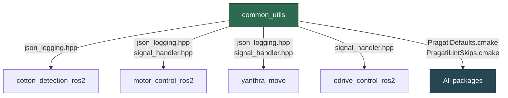

# Infrastructure Packages Refactoring Roadmap

> **Scope:** `common_utils`, `motor_control_msgs`, `robot_description`, `cotton_detection` interfaces, cross-cutting duplication
> **Date:** 2026-03-11
> **Updated:** 2026-03-12
> **Status:** Complete (P3 joint limit reconciliation blocked on hardware team)
> **OpenSpec Change:** `openspec/changes/archive/2026-03-12-infrastructure-packages-refactoring/`

---

## Status Summary (Updated 2026-03-12)

| Package | Progress | Notes |
|---------|----------|-------|
| common_utils | ✅ 2/2 phases done | CMake modules extracted (PragatiDefaults, PragatiLintSkips, PragatiRPiDetect). Signal handler consolidated (pragati::install_signal_handlers API). Now a compiled library. |
| motor_control_msgs | ✅ 2/3 phases done | PID field aliases removed from ReadPID/WritePID/WritePIDToROM. Interface README created. JointHoming.srv retained (active consumer in yanthra_move). Phase 3 (README docs) complete. |
| robot_description | ✅ 2/3 phases done | Dead data removed (meshes_final, calibration_files). Joint naming fixed ("joint N" → "jointN"). **Phase 4 (joint limits reconciliation) blocked on hardware team.** |
| cotton_detection_ros2 interfaces | ✅ 1/1 phases done | Interfaces extracted to new cotton_detection_msgs package. cotton_detection_ros2 and yanthra_move updated. |
| odrive_control_ros2 | ✅ 1/1 phases done | Socketcan loopback bugfix applied (setsockopt moved from apply_filters to initialize). |

### Deferred Items (from implementation)

| Item | Reason | Blocked On |
|------|--------|------------|
| Task 6.10: Topic publish verification test | Needs DepthAI hardware | Hardware availability |
| Task 6.12: Cross-compile verification | Needs RPi sysroot | RPi sysroot setup |
| Task 8.1-8.5: Joint limit reconciliation | Needs physical measurement | Hardware team input |

---

### Related Documents

- [Technical Debt Analysis](../project-notes/TECHNICAL_DEBT_ANALYSIS_2026-03-10.md) — source of truth for all debt items
- [Arm Nodes Roadmap](../project-notes/ARM_NODE_REFACTORING_ROADMAP_2026-03-10.md) — cotton_detection, yanthra_move, pattern_finder (consumers)
- [Vehicle Nodes Roadmap](./vehicle_nodes_refactoring_roadmap.md) — vehicle_control, odrive_service (consumers)
- [Shared Nodes Roadmap](./shared_nodes_refactoring_roadmap.md) — mg6010_controller, pid_tuning (consumers)
- [Cross-Cutting Patterns Migration](./cross_cutting_patterns_migration.md) — lifecycle, callback groups, BT, testing patterns

---

## Table of Contents

1. [common_utils](#1-common_utils)
2. [motor_control_msgs](#2-motor_control_msgs)
3. [robot_description](#3-robot_description)
4. [cotton_detection_ros2 Interfaces](#4-cotton_detection_ros2-interfaces)
5. [Cross-Cutting Duplication Summary](#5-cross-cutting-duplication-summary)
6. [Recommended Implementation Order](#6-recommended-implementation-order)

---

## 1. common_utils

### 1.1 Current State

| Attribute | Value |
|---|---|
| **Location** | `src/common_utils/` |
| **LOC** | 344 |
| **Files** | 6 |
| **Type** | C++ compiled library + Python module |

Currently contains only JSON structured logging — 4 helper functions: envelope creation, motor alerts, timing events, health summaries.

#### Downstream consumers (3 packages)

All use the C++ `json_logging.hpp`:

- `cotton_detection_ros2`
- `motor_control_ros2`
- `yanthra_move`

#### What it does NOT contain but should

| Pattern | Copies | Lines Duplicated | Locations |
|---|---|---|---|
| Signal handlers | 5 | ~120 | `mg6010_controller_node.cpp`, `yanthra_move_system_core.cpp`, `cotton_detection_node_main.cpp`, `odrive_can_tool.cpp`, + 1 more |
| CAN bus socket init | 3 | ~75 | `mg6010_can_interface.cpp`, `socketcan_interface.cpp`, `generic_motor_controller.cpp` |
| RPi arch detection (CMake) | 6 | ~96 | Every `CMakeLists.txt` |
| Lint skip boilerplate (CMake) | 7 | ~42 | Every `CMakeLists.txt` |
| Build optimization flags (CMake) | 6 | ~96 | Every `CMakeLists.txt` |
| Git version generation | 3 | — | Multiple packages |

### 1.2 Target Architecture

Infrastructure hub with 3 categories:

**C++ Headers:**
- `json_logging.hpp` (existing)
- `signal_handler.hpp` (new)

**Python Module:**
- `json_logging.py` (existing)
- `signal_handler.py` (new)

**CMake Modules:**
- `PragatiDefaults.cmake` (new — build warning flags: `-Wall`, `-Wextra`, `-Wpedantic`, and optimization flags)
- `PragatiLintSkips.cmake` (new — lint suppression boilerplate)
- `PragatiRPiDetect.cmake` (new — RPi architecture detection, sets `PRAGATI_IS_RPI`)



#### New headers

**`signal_handler.hpp`**

```cpp
namespace pragati {
  void install_signal_handlers(bool enable_crash_handler = false);
  bool shutdown_requested();
}
```

Replaces 5 independent implementations (~25 lines each) with a single shared header + a one-line call at each consumer.

### 1.3 Migration Path

| Phase | Description | Risk | Effort | Details |
|---|---|---|---|---|
| **1** | **CMake modules** | Low | 2 hrs | Extract `PragatiDefaults.cmake`, `PragatiLintSkips.cmake`, `PragatiRPiDetect.cmake`. Replace ~20 lines per `CMakeLists.txt` with one `include()`. Zero runtime risk — build-system only. |
| **2** | **Signal handler extraction** | Medium | 4 hrs | Create `signal_handler.hpp` + gtest with signal delivery. Migrate consumers one at a time: replace ~25-line blocks with `pragati::install_signal_handlers()` + `pragati::shutdown_requested()`. |

---

## 2. motor_control_msgs

### 2.1 Current State

| Attribute | Value |
|---|---|
| **Location** | `src/motor_control_msgs/` |
| **LOC** | 399 |
| **Services** | 18 |
| **Actions** | 3 |
| **Consumers** | `motor_control_ros2`, `odrive_control_ros2`, `yanthra_move` |

#### Service groups

| Group | Services | Count |
|---|---|---|
| **Motor Safety** | EmergencyStop, DriveStop, ClearMotorErrors | 3 |
| **Motor Commands** | MotorCommand (8 modes), MotorLifecycle (6 actions), JointPositionCommand | 3 |
| **Joint-Level** | JointPositionCommand, JointStatus, JointHoming (srv), SetAxisState | 4 |
| **Telemetry Read** | ReadEncoder, ReadMotorAngles, ReadMotorLimits, ReadMotorState, ReadPID | 5 |
| **Configuration Write** | WriteEncoderZero, WriteMotorLimits, WritePID, WritePIDToROM | 4 |

**Actions (3):** JointHoming, JointPositionCommand, StepResponseTest

### 2.2 Issues Found

1. **Dead service: `JointHoming.srv`** — superseded by `JointHoming.action`. The service version is never called; the action provides feedback/cancellation that the service cannot.

2. **Deprecated field duplication:** 12 deprecated field aliases across `ReadPID`, `WritePID`, and `WritePIDToROM`. These aliases add maintenance burden and bloat generated code.

3. **`ReadMotorState` vs specialized reads overlap:** `ReadMotorState` returns a superset of data that `ReadEncoder`, `ReadMotorAngles`, etc. return individually. However, the specialized reads are still useful for targeted CAN queries (fewer bus frames per call).

### 2.3 Target

Remove `JointHoming.srv`, plan deprecated field cleanup, keep specialized reads.

**Final count:** 17 services, 3 actions.

### 2.4 Migration Path

| Phase | Description | Risk | Effort | Details |
|---|---|---|---|---|
| **1** | **Remove dead `JointHoming.srv`** | Low | 30 min | Delete the `.srv` file, remove from `CMakeLists.txt`. Verify no consumer imports it (grep confirms action is used instead). |
| **2** | **Deprecated field cleanup** | Low | 1 hr | Remove 12 deprecated field aliases from `ReadPID.srv`, `WritePID.srv`, `WritePIDToROM.srv`. Update any consumer code still referencing old field names. |
| **3** | **Add README documentation** | Low | 30 min | Add `README.md` documenting each service/action group, field semantics, and usage examples. |

---

## 3. robot_description

### 3.1 Current State

| Attribute | Value |
|---|---|
| **Location** | `src/robot_description/` |
| **LOC** | 2,817 |
| **Production URDF** | `MG6010_FLU.urdf` (444 lines) |
| **Simulation xacro** | 353 lines |
| **Xacro modules** | 6 (578 lines total) |
| **Launch files** | 8 (703 lines total) |
| **Also includes** | configs, meshes |

### 3.2 Issues Found

1. **Joint limit mismatch:** `joint3` lower limit is `-0.9 rad` in FLU URDF vs `-1.5708 rad` in simulation xacro. This means simulation allows motions that hardware does not — or vice versa.

2. **Joint naming inconsistency:** FLU URDF uses `"joint2"` (no space), xacro uses `"joint 2"` (WITH space). This causes silent failures when URDF/xacro components are mixed — `ros2_control` will not match joints across the two naming schemes.

3. **Duplicate mesh directories:** `meshes/` (11 STL files) and `meshes_final/` (7 STL files). The `meshes_final/` directory appears to be dead data — no URDF/xacro references it.

4. **Stale calibration files:** Calibration data from 2019 for Intel RealSense cameras. The project now uses OAK-D Lite cameras — these files are dead artifacts.

5. **OAK-D Lite xacro not integrated:** 207 lines of well-defined OAK-D Lite xacro exist but are commented out and not included in any launch pipeline.

6. **`ros2_control.xacro` joint naming:** Uses space-named joints (`"joint 2"`) that do not match the production URDF (`"joint2"`), breaking `ros2_control` hardware interface matching.

### 3.3 Target

- Clean, consistent URDF chain with matching joint names across all files
- Single mesh directory (remove dead `meshes_final/`)
- Consistent joint limits across production and simulation
- No stale calibration data

### 3.4 Migration Path

| Phase | Description | Risk | Effort | Details |
|---|---|---|---|---|
| **1** | **Clean up dead data** | Low | 1 hr | Delete `meshes_final/` directory. Remove stale Intel RealSense calibration files. Verify no file references them. |
| **2** | **Joint naming consistency** | Medium | 2 hrs | Standardize on `"joint2"` (no space) across all URDF, xacro, and `ros2_control.xacro` files. Update `ros2_control.xacro` space-named joints. Verify launch files still load correctly. |
| **4** | **Joint limit reconciliation** | High | TBD | Reconcile `joint3` limits between FLU URDF (`-0.9 rad`) and simulation xacro (`-1.5708 rad`). **Requires hardware team input** to confirm actual mechanical limits before changing values. |

---

## 4. cotton_detection_ros2 Interfaces

### 4.1 Current State

4 interface files bundled inside `cotton_detection_ros2`:

| File | Type |
|---|---|
| `CottonPosition.msg` | Message |
| `DetectionResult.msg` | Message |
| `PerformanceMetrics.msg` | Message |
| `CottonDetection.srv` | Service |

The same package is both the interface definition package and the node implementation package.

### 4.2 Problem

This violates ROS2 best practice of separating interface definitions from implementation:

- **Downstream consumer impact:** `yanthra_move` must depend on the entire `cotton_detection_ros2` node package just to use the message types. This pulls in DepthAI, OpenCV, and other heavy dependencies unnecessarily.
- **Rebuild overhead:** Any interface change forces a full node rebuild (model loading, inference code recompilation).
- **Inconsistency:** `motor_control_msgs` already follows the correct pattern (separate interface package). Cotton detection should mirror this.

### 4.3 Target

Extract interfaces to a new `cotton_detection_msgs` package, mirroring the `motor_control_msgs` pattern.

```
src/cotton_detection_msgs/       # NEW — interface-only package
  msg/
    CottonPosition.msg
    DetectionResult.msg
    PerformanceMetrics.msg
  srv/
    CottonDetection.srv
  CMakeLists.txt
  package.xml

src/cotton_detection_ros2/       # EXISTING — node implementation only
  # No longer contains msg/srv definitions
  # Depends on cotton_detection_msgs
```

### 4.4 Migration Path

| Phase | Description | Risk | Effort | Details |
|---|---|---|---|---|
| **1** | **Create `cotton_detection_msgs` package** | Low | 2 hrs | Create package with `rosidl_default_generators`. Move `.msg` and `.srv` files. Verify message generation with `colcon build`. |
| **2** | **Update `cotton_detection_ros2`** | Low | 1 hr | Remove interface files from the node package. Add `<depend>cotton_detection_msgs</depend>` to `package.xml`. Update `CMakeLists.txt` and all `#include` / `import` statements. |
| **3** | **Update consumers** | Low | 30 min | Update `yanthra_move` (and any other consumers) to depend on `cotton_detection_msgs` instead of `cotton_detection_ros2`. |

---

## 5. Cross-Cutting Duplication Summary

| What | Current | After Refactor | Lines Saved |
|---|---|---|---|
| Signal handlers | 5 x ~25 = 125 lines | 1 x ~60 (shared) + 5 x 2 (calls) = 70 | **55** |
| CMake RPi + opts | 6 x ~16 = 96 lines | 1 x ~20 (module) + 6 x 1 (include) = 26 | **70** |
| CMake lint skips | 7 x ~6 = 42 lines | 1 x ~10 (module) + 7 x 1 (include) = 17 | **25** |
| **Total** | **263 lines** | **113 lines** | **150** |

Beyond raw line count, consolidation provides:

- **Single source of truth** for signal handling behavior and build flags
- **Consistent behavior** across all packages (e.g., same signal handler semantics everywhere)
- **Easier auditing** — one place to review and update instead of 5-7 scattered copies

---

## 6. Recommended Implementation Order

All items from all 4 packages, ordered by risk/effort/impact:

| Priority | Package | Phase | Description | Risk | Effort | Impact |
|---|---|---|---|---|---|---|
| **P0** | common_utils | Phase 1 | CMake modules extraction | Low | 2 hrs | Eliminates ~20 duplicate lines per package (6 packages) |
| **P0** | motor_control_msgs | Phase 1 | Remove dead `JointHoming.srv` | Low | 30 min | Removes confusion, dead code |
| **P0** | robot_description | Phase 1 | Clean up dead data (meshes_final, stale calibration) | Low | 1 hr | Removes ~18 dead files |
| **P1** | common_utils | Phase 2 | Signal handler extraction | Medium | 4 hrs | Eliminates 5 duplicate implementations |
| **P1** | motor_control_msgs | Phase 2 | Deprecated field cleanup | Low | 1 hr | Simplifies 3 service definitions |
| **P1** | robot_description | Phase 2 | Joint naming consistency | Medium | 2 hrs | Fixes silent `ros2_control` failures |
| **P1** | cotton_detection_ros2 | Phase 1 | Create `cotton_detection_msgs` package | Low | 2 hrs | Decouples interface from implementation |
| **P1** | odrive_control_ros2 | Bugfix | Socketcan loopback disable bug (setsockopt scoping) | Low | 1 hr | Fixes CPU waste from CAN loopback echo |
| **P2** | cotton_detection_ros2 | Phase 2-3 | Update node and consumers | Low | 1.5 hrs | Completes interface extraction |
| **P2** | motor_control_msgs | Phase 3 | Add README documentation | Low | 30 min | Improves developer onboarding |
| **P3** | robot_description | Phase 4 | Joint limit reconciliation | High | TBD | Requires hardware team input |

### Effort summary

| Package | Total Effort | Priority Range |
|---|---|---|
| common_utils | ~6 hrs | P0-P1 |
| motor_control_msgs | ~2 hrs | P0-P2 |
| robot_description | ~3 hrs + TBD | P0-P3 |
| cotton_detection_ros2 interfaces | ~3.5 hrs | P1-P2 |
| odrive_control_ros2 | ~1 hr | P1 |
| **Grand total** | **~15.5 hrs + TBD** | |
