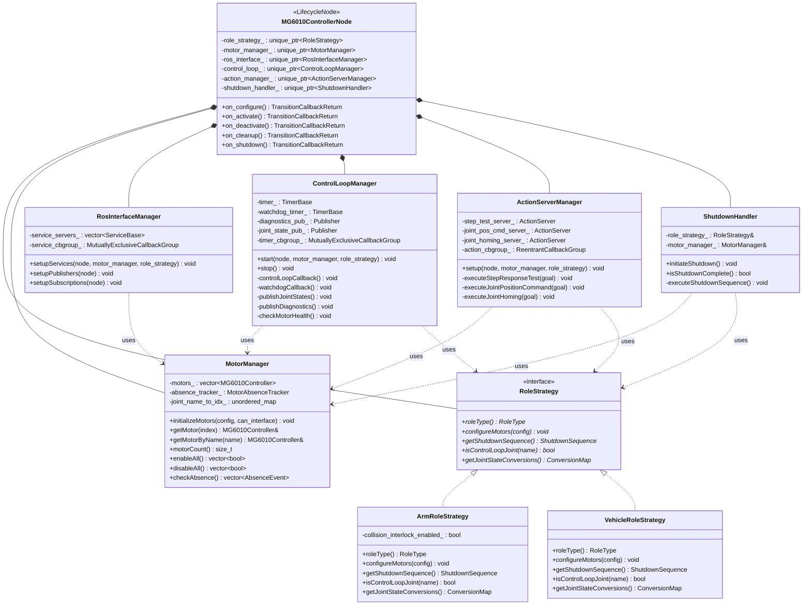
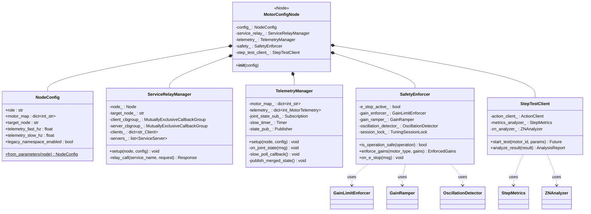

# Shared Nodes Refactoring Roadmap

> **Scope:** `mg6010_controller_node` (C++), `pid_tuning_node` (Python) — nodes used on both arm-side and vehicle-side deployments
> **Date:** 2026-03-11
> **Status:** Active — mg6010 decomposition COMPLETE (10/10 steps), pid_tuning not started

## Status Summary (Updated 2026-03-15)

| Node | Progress | Notes |
|------|----------|-------|
| mg6010_controller_node | 10/10 steps done — COMPLETE | Steps 1-3 complete (MotorTestSuite, ControlLoopManager, RosInterfaceManager extracted). Steps 4-5 complete (ActionServerManager, MotorManager) — archived at openspec/changes/archive/2026-03-13-mg6010-decomposition-phase2/. Steps 6-10 complete (RoleStrategy, ShutdownHandler, MultiThreadedExecutor+callback groups, LifecycleNode, final cleanup) — archived at openspec/changes/archive/2026-03-15-mg6010-decomposition-phase3/. Node reduced 4,511→3,672 LOC. 109+ new decomposition tests total. 21/22 test targets pass (1 pre-existing callback group service namespace issue). Cross-compile for RPi 4B passes. **2026-03-14:** blocking-sleeps-error-handlers — `ros2SafeSleep()` renamed to `blockingThreadSleep()` (48 call sites), 11 missing RCLCPP_ERROR logs added to catch blocks in generic_motor_controller.cpp, `watchdog_exempt_` coverage extended to position commands (4 exit paths each in mg6010_controller_node.cpp and action_server_manager.cpp). |
| pid_tuning_node | 0/7 steps done | Not started |
| motion_controller (yanthra_move) | COMPLETE | Decomposed into 5 classes via motion-controller-decomposition |

---

### Related Documents

- [Technical Debt Analysis](../project-notes/TECHNICAL_DEBT_ANALYSIS_2026-03-10.md) — source of truth for all debt items
- [Cross-Cutting Patterns Migration](./cross_cutting_patterns_migration.md) — lifecycle, callback groups, BT, testing patterns
- [Infrastructure Roadmap](./infrastructure_refactoring_roadmap.md) — common_utils, msgs consumed by shared nodes (note: ConsecutiveFailureTracker added to common_utils on 2026-03-14 via blocking-sleeps-error-handlers)

---

## Table of Contents

1. [mg6010_controller_node (C++)](#1-mg6010_controller_node-c)
   - [1.1 Current State](#11-current-state)
   - [1.2 Target Architecture](#12-target-architecture)
   - [1.3 Migration Path](#13-migration-path)
2. [pid_tuning_node (Python)](#2-pid_tuning_node-python)
   - [2.1 Current State](#21-current-state)
   - [2.2 Target Architecture](#22-target-architecture)
   - [2.3 Migration Path](#23-migration-path)

---

## 1. mg6010_controller_node (C++)

### 1.1 Current State

| Attribute | Value |
|---|---|
| **Package** | `src/motor_control_ros2/` |
| **Main source** | `src/mg6010_controller_node.cpp` |
| **Main class** | `MG6010ControllerNode(rclcpp_lifecycle::LifecycleNode)` — decomposed into 8 delegate classes |
| **LOC (main file)** | 3,672 |
| **Executor** | `MultiThreadedExecutor(4)` — matches RPi 4B 4 cores |
| **Callback groups** | 3: `safety_cb_group_` (MutuallyExclusive), `hardware_cb_group_` (MutuallyExclusive), `processing_cb_group_` (Reentrant) |
| **Threading** | Executor-managed via callback groups (raw `std::thread` removed) |
| **Lifecycle** | `on_configure()`, `on_activate()`, `on_deactivate()`, `on_cleanup()`, `on_shutdown()` |
| **Node name (arm)** | `motor_control` (via `mg6010_controller.launch.py`) |
| **Node name (vehicle)** | `vehicle_motor_control` in `/vehicle` namespace (via `vehicle_motors.launch.py`) |
| **Delegate classes** | MotorTestSuite, ControlLoopManager, RosInterfaceManager, ActionServerManager, MotorManager, RoleStrategy (ArmRoleStrategy/VehicleRoleStrategy), ShutdownHandler, SafetyMonitor |

#### Source File Inventory

| File | Lines | Key Content |
|---|---|---|
| `src/mg6010_controller_node.cpp` | 3,672 | LifecycleNode: on_configure/activate/deactivate/cleanup/shutdown, delegates to 8 extracted classes, main() with MultiThreadedExecutor(4) |
| `src/mg6010_controller.cpp` | 2,070 | Motor-level control, recovery state machine, coordinate transforms, thermal derating, stall detection |
| `src/mg6010_protocol.cpp` | 1,070 | CAN wire protocol encoding/decoding for MG6010/MG6012 |
| `src/mg6010_can_interface.cpp` | 494 | SocketCAN with epoll, automatic reconnection, frame buffering |
| `src/safety_monitor.cpp` | 986 | Safety state machine, e-stop, temperature/voltage/position monitoring |
| `src/motor_abstraction.cpp` | 397 | Factory pattern, configuration management |
| `include/.../mg6010_controller.hpp` | 397 | Class declaration, RecoveryStep enum, all member variables |
| `include/.../motor_types.hpp` | 156 | MotorStatus, SafetyLimits, HomingConfig, MotorConfiguration |
| `include/.../motor_controller_interface.hpp` | 323 | Pure virtual interface, PIDParams, FullMotorState |
| `include/.../motor_absence.hpp` | 118 | Absence detection structs and inline free functions |
| `config/production.yaml` | 176 | Arm config: joints 3/4/5, MG6010-i6 |
| `config/vehicle_motors.yaml` | 132 | Vehicle config: steering_left/right/front only |
| `launch/mg6010_controller.launch.py` | 124 | Arm launch, loads production.yaml |
| `launch/vehicle_motors.launch.py` | 65 | Vehicle launch, loads vehicle_motors.yaml, /vehicle namespace |
| `CMakeLists.txt` | 597 | Build config |
| **Total** | **~11,626** | |

#### Responsibilities Mixed Into One Class

The `MG6010ControllerNode` constructor alone spans **lines 89-732** (643 lines). The following responsibilities are all interleaved in a single class:

| # | Responsibility | Lines (approx.) | Estimated LOC |
|---|---|---|---|
| 1 | Parameter declaration & loading | 89-350 | ~260 |
| 2 | Motor initialization & CAN interface setup | 351-530 | ~180 |
| 3 | Simulation mode support | 530-575 | ~45 |
| 4 | ROS2 interface wiring (topics, services, actions, timers) | 576-732 | ~160 |
| 5 | Control loop (polling, diagnostics, absence detection) | 2311-2638 | ~330 |
| 6 | Watchdog timer | 768-820 | ~50 |
| 7 | Motion feedback publishing | 2639-2815 | ~175 |
| 8 | Service callbacks (17 services) | 2816-3482 | ~665 |
| 9 | Action server: StepResponseTest | 3568-3739 | ~170 |
| 10 | Action server: JointPositionCommand | 3824-3999 | ~175 |
| 11 | Action server: JointHoming | 4065-4242 | ~180 |
| 12 | Shutdown & signal handling | 1067-1240 | ~175 |
| 13 | Degraded mode & collision interlock | 821-1066 | ~245 |
| 14 | Test methods (embedded test harness) | 4244-4437 | ~195 |
| 15 | main() and signal handler | 4439-4511 | ~70 |

#### ROS2 Interfaces

**Subscriptions:**
- `/e_stop` (std_msgs/Bool) — emergency stop
- `/collision_interlock` (std_msgs/Bool) — collision avoidance interlock

**Publishers:**
- `/joint_states` (sensor_msgs/JointState) — joint positions, velocities, efforts
- `/motor_status` (motor_control_msgs/MotorStatusArray) — per-motor status
- `/diagnostics` (diagnostic_msgs/DiagnosticArray) — motor diagnostics
- `/motor_absence` (std_msgs/String) — JSON motor absence events

**Services (17 total):**
- `~/enable_motors`, `~/disable_motors` (std_srvs/Trigger)
- `~/motor_availability` (motor_control_msgs/MotorAvailability)
- `~/pid_read`, `~/pid_write`, `~/pid_write_rom` (motor_control_msgs/PID*)
- `~/motor_command` (motor_control_msgs/MotorCommand)
- `~/motor_lifecycle` (motor_control_msgs/MotorLifecycle) — with async reboot via one-shot timer
- `~/motor_limits_read`, `~/motor_limits_write` (motor_control_msgs/MotorLimits*)
- `~/encoder_read`, `~/encoder_write` (motor_control_msgs/Encoder*)
- `~/motor_angles` (motor_control_msgs/MotorAngles)
- `~/clear_errors` (std_srvs/Trigger)
- `~/read_motor_state` (motor_control_msgs/ReadMotorState)

**Action Servers (3):**
- `~/step_response_test` (motor_control_msgs/StepResponseTest) — dedicated thread
- `~/joint_position_command` (motor_control_msgs/JointPositionCommand) — dedicated thread
- `~/joint_homing` (motor_control_msgs/JointHoming) — dedicated thread

**Timers:**
- Control loop (configurable Hz, default 50Hz)
- Watchdog timer (configurable period, default 500ms)

#### Threading Model

> **Updated 2026-03-15:** Migrated to MultiThreadedExecutor with callback groups (Step 8) and LifecycleNode (Step 9).

```
┌─────────────────────────────────────────────────────────────┐
│  MultiThreadedExecutor (4 threads)                          │
├─────────────────────────────────────────────────────────────┤
│  safety_cb_group_ (MutuallyExclusive) — Safety-Critical     │
│  ├── watchdog timer                                         │
│  ├── /e_stop callback                                       │
│  └── /collision_interlock callback                          │
├─────────────────────────────────────────────────────────────┤
│  hardware_cb_group_ (MutuallyExclusive) — Hardware I/O      │
│  ├── control_loop timer (50Hz)                              │
│  ├── all 17 service callbacks (CAN bus access)              │
│  ├── joint_position_command action server                   │
│  └── joint_homing action server                             │
├─────────────────────────────────────────────────────────────┤
│  processing_cb_group_ (Reentrant) — Processing/Reporting    │
│  ├── step_response_test action server                       │
│  ├── joint state publisher                                  │
│  └── diagnostics / stats timers                             │
└─────────────────────────────────────────────────────────────┘

Mutexes:
  motion_mutex_         — guards motion state
  step_test_mutex_      — guards step test execution
  joint_pos_cmd_mutex_  — guards joint position commands
  joint_homing_mutex_   — guards homing execution
  shutdown_cv_mutex_    — guards shutdown condition variable
```

#### Dual-Role Detection (Arm vs Vehicle) — Current Issues

The node supports both arm and vehicle roles via **different config files loaded at launch**, but role-specific behavior is detected through **fragile string matching** scattered across the codebase:

| Location | Pattern | Problem |
|---|---|---|
| Line 582-586 | `joint_name.find("steering")` | Implicit vehicle detection |
| Line 640-659 | `joint_name.find("drive")` | Implicit vehicle detection |
| Line 967 | `joint_name.find("drive")` to skip control loop | Scattered role logic |
| Lines 1114-1119 | Literal `"joint5"`, `"joint3"`, `"joint4"` checks | Hardcoded arm joint names in shutdown |
| Lines 1122-1133 | `j5_idx`, `j3_idx`, `j4_idx` → special parking sequence | Arm-specific shutdown baked into generic code |

There is **no role enum, no strategy pattern, no explicit arm/vehicle flag**. The same executable relies entirely on joint name strings to branch behavior. This means:
- Adding a new joint type requires auditing every `find()` call
- Vehicle behavior is "whatever isn't arm"
- Shutdown sequences are untestable without real joint name configs
- No compile-time or startup-time validation of role consistency

#### Critical Tech Debt

1. **~~God-class (CRITICAL)~~ — PARTIALLY RESOLVED (2026-03-15):** `MG6010ControllerNode` reduced from 4,511 to 3,672 lines via 8 extracted delegate classes (MotorTestSuite, ControlLoopManager, RosInterfaceManager, ActionServerManager, MotorManager, RoleStrategy, ShutdownHandler, SafetyMonitor). Now a LifecycleNode with clear lifecycle callbacks. Still above 2,500 LOC target — further decomposition deferred to Phase 4.

2. **~~Fragile dual-role detection (HIGH)~~ — RESOLVED (2026-03-15):** Replaced scattered `joint_name.find("steering")` / `find("drive")` string matching with polymorphic `RoleStrategy` interface (`ArmRoleStrategy`, `VehicleRoleStrategy`). Auto-detect from joint_names kept with TODO for removal after v1.0 field trial. 10 tests in test_role_strategy.cpp.

3. **~~Watchdog false-positive (HIGH)~~ — RESOLVED:** ~~`joint_position_command_callback` (line 3824) blocks for up to 5s with `wait_for_completion=true` but does NOT set `watchdog_exempt_` (line 795 only set during homing/shutdown). This means the watchdog can trigger a false timeout during long position commands.~~ Fixed in phase-1-critical-fixes (f1685f2c): `watchdog_exempt_` is now set in `joint_position_command_callback`. *Updated 2026-03-14:* blocking-sleeps-error-handlers extended `watchdog_exempt_` coverage to all 4 exit paths in position command execution (mg6010_controller_node.cpp and action_server_manager.cpp), ensuring the flag is always cleared even on error/cancellation paths.

4. **~~SingleThreadedExecutor with blocking actions (HIGH)~~ — RESOLVED (2026-03-15):** Replaced `SingleThreadedExecutor` + raw `std::thread` with `MultiThreadedExecutor(4)` and 3 callback groups (safety, hardware, processing). Action servers now run via callback groups, not dedicated threads. *Note:* The blocking `wait_for_completion=true` loop in `joint_position_command_callback` was removed in phase-2-critical-fixes (d3e0885c). *Updated 2026-03-14:* blocking-sleeps-error-handlers confirmed all 48 `blockingThreadSleep()` calls (formerly `ros2SafeSleep()`) are on dedicated action threads, not executor callbacks. *Updated 2026-03-15:* Step 8 completed — 5 tests in test_callback_groups.cpp.

5. **Hardcoded MAX_MOTORS=6 (MEDIUM):** Line 83 defines `MAX_MOTORS=6` and all arrays use `std::array<T, MAX_MOTORS>`. Config can specify fewer motors but the array size is compile-time. Wastes memory for vehicle (3 motors) and prevents >6 motor configs without recompilation.

6. **Embedded test methods (MEDIUM):** Lines 4244-4437 contain test harness methods (`test_status`, `test_enable`, `test_position`, `test_velocity`, `test_full_sequence`) inside the production node class. These should be in a separate test node.

7. **control_loop() complexity (MEDIUM):** Single method spanning 327 lines (2311-2638) handling: watchdog tick, JointState publishing, motor absence detection, error/stall/thermal checks, diagnostic publishing, and unit conversions. Cyclomatic complexity is very high.

8. **~~Signal handler coupling (LOW)~~ — RESOLVED (2026-03-15):** Migrated to `rclcpp_lifecycle::LifecycleNode` (Step 9). Shutdown logic extracted to `ShutdownHandler` class. Lifecycle callbacks (`on_shutdown`) replace the self-pipe signal pattern. 8 tests in test_shutdown_handler.cpp, 10 lifecycle integration tests in test_lifecycle_node.cpp.

9. **~~Missing error logging in catch blocks (MEDIUM)~~ — RESOLVED (2026-03-14):** 11 of 12 catch blocks in `generic_motor_controller.cpp` were silently swallowing exceptions without any RCLCPP_ERROR logging. Fixed in blocking-sleeps-error-handlers: all catch blocks now log the exception message. The 12th catch (mg6010_controller.cpp destructor `catch(...)` after typed catch) was verified correct — catch-all in destructors is proper C++ practice.

---

### 1.2 Target Architecture

#### Design Principles

1. **Explicit role via strategy pattern** — arm vs vehicle behavior encapsulated in role-specific strategy classes, selected at startup from config
2. **Lifecycle node** — adopt `rclcpp_lifecycle::LifecycleNode` for clean state transitions (unconfigured → inactive → active → finalized)
3. **Responsibility decomposition** — break god-class into focused components with clear ownership boundaries
4. **MultiThreadedExecutor with callback groups** — replace SingleThreadedExecutor + raw threads with proper ROS2 callback groups
5. **Dynamic motor count** — replace compile-time `MAX_MOTORS=6` arrays with `std::vector`
6. **Testability** — each component independently constructible and testable, test methods extracted to separate test node

#### Class Decomposition



#### Callback Group Assignment

> **Canonical design**: See `cross_cutting_patterns_migration.md` §2 for the full callback
> group design with code examples. The design uses 3 groups organized by **safety criticality**
> (not by interface type), which ensures safety-critical callbacks are never starved.

```
┌─────────────────────────────────────────────────────────────┐
│  MultiThreadedExecutor (4 threads)                          │
├─────────────────────────────────────────────────────────────┤
│  safety_cb_group_ (MutuallyExclusive) — Safety-Critical     │
│  ├── watchdog timer                                         │
│  ├── /e_stop callback                                       │
│  └── /collision_interlock callback                          │
├─────────────────────────────────────────────────────────────┤
│  hardware_cb_group_ (MutuallyExclusive) — Hardware I/O      │
│  ├── control_loop timer (50Hz)                              │
│  ├── all 17 service callbacks (CAN bus access)              │
│  ├── joint_position_command action server                   │
│  └── joint_homing action server                             │
├─────────────────────────────────────────────────────────────┤
│  processing_cb_group_ (Reentrant) — Processing/Reporting    │
│  ├── step_response_test action server                       │
│  ├── joint state publisher                                  │
│  └── diagnostics / stats timers                             │
└─────────────────────────────────────────────────────────────┘
```

The key insight is grouping by **safety criticality**: the safety group must never be starved
by long-running hardware operations. E-stop and collision interlock go in the safety group
(not subscriptions), because they are safety-critical. This replaces the raw `std::thread`
spawning with proper ROS2 callback groups while ensuring safety callbacks always run.

#### Dual-Role Handling

**Config-driven role declaration:**

```yaml
# production.yaml (arm)
role: arm
joints:
  - name: joint5
    motor_id: 1
    type: revolute
    ...

# vehicle_motors.yaml (vehicle)
role: vehicle
joints:
  - name: steering_left
    motor_id: 1
    type: steering
    ...
```

**Startup sequence:**
1. Node reads `role` parameter (string: "arm" or "vehicle")
2. Factory creates `ArmRoleStrategy` or `VehicleRoleStrategy`
3. All role-dependent behavior routes through the strategy interface
4. No string matching on joint names for role detection anywhere in the codebase

**What each strategy encapsulates:**

| Concern | ArmRoleStrategy | VehicleRoleStrategy |
|---|---|---|
| Shutdown sequence | J5→park, J3→home, J4→park, J3→park | All steering→center, then disable |
| Control loop joints | All joints participate | Skip "drive" joints (ODrive-managed) |
| JointState conversions | Rotations→radians for revolute | Rotations→radians for steering |
| Collision interlock | Enabled (checks interlock topic) | Disabled |
| Degraded mode | Joint-level degradation | Steering-level degradation |

#### Dynamic Motor Count

Replace:
```cpp
// Current (line 83)
static constexpr int MAX_MOTORS = 6;
std::array<std::unique_ptr<MG6010Controller>, MAX_MOTORS> motors_;
```

With:
```cpp
// Target
std::vector<std::unique_ptr<MG6010Controller>> motors_;
// Sized at configure-time from YAML joint list
```

This requires updating all `MAX_MOTORS`-indexed loops to use `motors_.size()` — a mechanical refactor with low risk since all loops already check `motor_count_` at runtime.

---

### 1.3 Migration Path

Each step is a self-contained commit that keeps the node functional on **both arm and vehicle** deployments. Steps are ordered to minimize risk — pure extractions first, behavioral changes last.

#### Step 1: Extract Test Methods to Separate Node ✅ COMPLETE (mg6010-decomposition)

> **Completed via:** OpenSpec change `mg6010-decomposition` (TG1-3), archived 2026-03-12.
> **Actual result:** Extracted `MotorTestSuite` class (~633 lines) with 6 read-only diagnostic service callbacks + legacy test methods + motor availability. 26 unit tests added.

| Attribute | Value |
|---|---|
| **Effort** | S (Small) |
| **Risk** | Very Low |
| **Files changed** | `mg6010_controller_node.cpp` (delete lines 4244-4437), new `mg6010_test_node.cpp` |
| **Deployment impact** | None — test methods are only called from test launch files |

**What:** Move `test_status`, `test_enable`, `test_position`, `test_velocity`, `test_full_sequence` to a dedicated `MG6010TestNode` class in a new source file. Update `mg6010_test.launch.py` to use the new test node. Remove test methods from the production class.

**Why first:** Zero-risk extraction that immediately reduces production class by ~195 lines. No behavioral change to production node.

**Verification:** Existing test launch file works with new test node. Production node still starts and operates normally.

#### Step 2: Extract ControlLoopManager ✅ COMPLETE (mg6010-decomposition)

> **Completed via:** OpenSpec change `mg6010-decomposition` (TG4-6), archived 2026-03-12.
> **Actual result:** Extracted `ControlLoopManager` class (~330 lines) with PID write/write-to-ROM callbacks + control loop timer/publisher. 26 unit tests added.

| Attribute | Value |
|---|---|
| **Effort** | M (Medium) |
| **Risk** | Low |
| **Files changed** | `mg6010_controller_node.cpp`, new `control_loop_manager.hpp/cpp` |
| **Deployment impact** | None — internal refactor, same external behavior |

**What:** Extract `control_loop()` (lines 2311-2638) and related methods (watchdog callback, JointState publishing, diagnostics publishing, motor absence checking, health monitoring) into a `ControlLoopManager` class. The manager receives references to the motor array and node for publishing.

**Decompose `control_loop()` into sub-methods:**
- `publishJointStates()` — JointState message construction and publishing
- `checkMotorHealth()` — error/stall/thermal state checks per motor
- `publishDiagnostics()` — DiagnosticArray construction
- `handleMotorAbsence()` — absence detection with exponential backoff
- `tickWatchdog()` — watchdog timestamp update

**Why second:** The control loop is the largest single method (327 lines) and the most critical code path. Extracting it first makes all subsequent refactoring safer because the core loop is isolated and independently testable.

**Verification:** Control loop frequency unchanged. JointState/diagnostics publishing rates unchanged. Motor absence detection still works. Run `ros2 topic hz /joint_states` to verify.

#### Step 3: Extract RosInterfaceManager (Service Callbacks) ✅ COMPLETE (mg6010-decomposition)

> **Completed via:** OpenSpec change `mg6010-decomposition` (TG7-9), archived 2026-03-12.
> **Actual result:** Extracted `RosInterfaceManager` class (~200 lines) with 17 service bindings, 3 action servers, 3×N subscribers, 2 publishers. 24 unit tests added.

| Attribute | Value |
|---|---|
| **Effort** | L (Large) |
| **Risk** | Low-Medium |
| **Files changed** | `mg6010_controller_node.cpp`, new `ros_interface_manager.hpp/cpp` |
| **Deployment impact** | None — same service names and behavior |

**What:** Extract all 17 service callbacks (lines 2816-3482) into a `RosInterfaceManager` class. Each service callback becomes a method on the manager. Service server creation moves to the manager's `setupServices()` method. The manager holds references to `MotorManager` (see Step 5) or the motor array directly.

**Why here:** Service callbacks are the largest block of code (665 lines) that is purely reactive (request→response). They have clean boundaries — each callback reads parameters, calls motor methods, and returns a response. Low coupling between callbacks.

**Verification:** All 17 services respond correctly. Test via `ros2 service call` for each service. No behavior change.

#### Step 4: Extract ActionServerManager ✅ COMPLETE (mg6010-decomposition-phase2)

> **Completed via:** OpenSpec change `mg6010-decomposition-phase2`, archived 2026-03-13.
> **Actual result:** Extracted `ActionServerManager` class — `action_server_manager.cpp` (904L), `action_server_manager.hpp` (274L), `test_action_server_manager.cpp` (1,261L).
> **Post-extraction cleanup (2026-03-14):** blocking-sleeps-error-handlers renamed `ros2SafeSleep()` → `blockingThreadSleep()` throughout action_server_manager.cpp, extended `watchdog_exempt_` to all 4 position-command exit paths, added RCLCPP_ERROR logging to previously silent catch blocks.

| Attribute | Value |
|---|---|
| **Effort** | M (Medium) |
| **Risk** | Medium |
| **Files changed** | `mg6010_controller_node.cpp`, new `action_server_manager.hpp/cpp` |
| **Deployment impact** | None — same action server names and behavior |

**What:** Extract `executeStepResponseTest` (lines 3568-3739), `executeJointPositionCommand` (lines 3824-3999), and `executeJointHoming` (lines 4065-4242) plus their goal/cancel/feedback callbacks into an `ActionServerManager`. This class owns the three `rclcpp_action::Server` instances and their associated mutex/thread state.

**Risk note:** Action servers have complex threading (dedicated `std::thread` per action). The extraction must preserve the exact same threading model initially. Converting to callback groups happens in Step 8.

**Verification:** All three action servers accept goals, provide feedback, handle cancellation. Test `StepResponseTest` with the PID tuning dashboard. Test `JointHoming` via launch.

#### Step 5: Introduce MotorManager ✅ COMPLETE (mg6010-decomposition-phase2)

> **Completed via:** OpenSpec change `mg6010-decomposition-phase2`, archived 2026-03-13.
> **Actual result:** Extracted `MotorManager` class — `motor_manager.cpp` (389L), `motor_manager.hpp` (224L), `test_motor_manager.cpp` (590L).

| Attribute | Value |
|---|---|
| **Effort** | M (Medium) |
| **Risk** | Low |
| **Files changed** | `mg6010_controller_node.cpp`, new `motor_manager.hpp/cpp` |
| **Deployment impact** | None — internal restructure |

**What:** Create `MotorManager` to own the motor array, motor initialization, CAN interface setup, and motor-level operations (enable all, disable all, get by index/name). Move constructor lines 351-530 (motor init) into `MotorManager::initializeMotors()`. Replace direct motor array access throughout the extracted managers with `MotorManager` method calls.

**Also:** Replace `std::array<T, MAX_MOTORS>` with `std::vector<T>` sized from config. Update all `MAX_MOTORS`-indexed loops.

**Verification:** Same motors initialized. Same CAN interface. `ros2 service call ~/motor_availability` returns correct motor list.

#### Step 6: Introduce RoleStrategy (Arm vs Vehicle) ✅ COMPLETE (mg6010-decomposition-phase3)

> **Completed via:** OpenSpec change `mg6010-decomposition-phase3`, archived 2026-03-15.
> **Actual result:** Replaced scattered `joint_name.find("steering")` / `find("drive")` string matching with polymorphic `RoleStrategy` interface. `ArmRoleStrategy` and `VehicleRoleStrategy` concrete classes. Auto-detect from joint_names kept with TODO for removal after v1.0 field trial. 10 new tests (test_role_strategy.cpp).

| Attribute | Value |
|---|---|
| **Effort** | L (Large) |
| **Risk** | Medium-High |
| **Files changed** | `mg6010_controller_node.cpp`, all extracted managers, new `role_strategy.hpp/cpp`, both config YAMLs |
| **Deployment impact** | **Config file format change** — both arm and vehicle configs need `role:` field added |

**What:**
1. Define `RoleStrategy` interface with methods: `roleType()`, `getShutdownSequence()`, `isControlLoopJoint(name)`, `getJointStateConversions()`, `configureMotors(config)`
2. Implement `ArmRoleStrategy` and `VehicleRoleStrategy`
3. Add `role: arm` / `role: vehicle` to config YAML files
4. At startup, read `role` parameter and instantiate the correct strategy
5. Replace ALL `joint_name.find("steering")`, `joint_name.find("drive")`, and literal `"joint3"/"joint4"/"joint5"` checks with strategy method calls
6. Move the hardcoded arm shutdown sequence (lines 1114-1133) into `ArmRoleStrategy::getShutdownSequence()`

**Risk note:** This is the highest-risk step because it changes role-detection logic that is currently scattered and implicit. Thorough testing on both arm and vehicle hardware is required.

**Backward compatibility:** If `role` parameter is missing, auto-detect from joint names (preserving current string-matching logic) and log a deprecation warning. This ensures old config files still work during transition.

**Verification:**
- Arm: Start with `production.yaml` (with `role: arm`). Verify shutdown sequence J5→J3 home→J4→J3 park. Verify collision interlock active.
- Vehicle: Start with `vehicle_motors.yaml` (with `role: vehicle`). Verify steering-only control loop. Verify no collision interlock.
- Backward compat: Start with old config (no `role` field). Verify auto-detection works and deprecation warning logged.

#### Step 7: Extract ShutdownHandler ✅ COMPLETE (mg6010-decomposition-phase3)

> **Completed via:** OpenSpec change `mg6010-decomposition-phase3`, archived 2026-03-15.
> **Actual result:** Extracted ~300-line `perform_shutdown()` into dedicated `ShutdownHandler` class. Handles shutdown sequencing, motor disable, CAN cleanup. MotorManager now compiled AND linked into production executable. 8 new tests (test_shutdown_handler.cpp).

| Attribute | Value |
|---|---|
| **Effort** | S (Small) |
| **Risk** | Low |
| **Files changed** | `mg6010_controller_node.cpp`, new `shutdown_handler.hpp/cpp` |
| **Deployment impact** | None |

**What:** Extract shutdown logic (lines 1067-1240) into `ShutdownHandler`. This class uses `RoleStrategy::getShutdownSequence()` to execute the role-appropriate shutdown. Move the signal handler self-pipe pattern into the shutdown handler.

**Verification:** Clean shutdown on SIGTERM/SIGINT for both arm and vehicle. Motors reach safe positions before process exits.

#### Step 8: Migrate to MultiThreadedExecutor with Callback Groups ✅ COMPLETE (mg6010-decomposition-phase3)

> **Completed via:** OpenSpec change `mg6010-decomposition-phase3`, archived 2026-03-15.
> **Actual result:** Replaced `SingleThreadedExecutor` + raw threads with `MultiThreadedExecutor(4)` (matches RPi 4B 4 cores). 3 callback groups: `safety_cb_group_` (MutuallyExclusive), `hardware_cb_group_` (MutuallyExclusive), `processing_cb_group_` (Reentrant). All timers, services, subscriptions assigned to appropriate groups. 5 new tests (test_callback_groups.cpp).

| Attribute | Value |
|---|---|
| **Effort** | L (Large) |
| **Risk** | High |
| **Files changed** | `mg6010_controller_node.cpp` (main), all manager classes |
| **Deployment impact** | Threading model change — potential for new race conditions |

**What:**
1. Replace `SingleThreadedExecutor` with `MultiThreadedExecutor(4 threads)`
2. Create 4 callback groups (see Target Architecture diagram)
3. Assign timers, services, action servers, subscriptions to appropriate groups
4. Remove raw `std::thread` spawning from action servers — let the `ReentrantCallbackGroup` handle threading
5. Remove `step_test_thread_`, `joint_pos_cmd_thread_`, `joint_homing_thread_` member variables
6. Review and simplify mutex usage — some mutexes become unnecessary with proper callback group isolation

**Risk note:** This is the highest-risk step. Changing the threading model can introduce subtle race conditions. Must be thoroughly tested under load (multiple concurrent action goals, high-frequency service calls).

**Pre-work completed (2026-03-14):** blocking-sleeps-error-handlers audited all sleeps across the package. All 48 `blockingThreadSleep()` calls (renamed from `ros2SafeSleep()`) confirmed on dedicated action threads only — none on executor callbacks. This de-risks Step 8: when converting from raw `std::thread` to callback groups, no sleep calls will block the executor. The explicit naming convention (`blockingThreadSleep`) makes any future violations immediately obvious in code review.

**Also fix:** ~~The watchdog false-positive — set `watchdog_exempt_` in `executeJointPositionCommand` when `wait_for_completion=true`.~~ Already resolved in phase-1-critical-fixes (f1685f2c) and the blocking `wait_for_completion=true` loop was removed in phase-2-critical-fixes (d3e0885c). Watchdog coverage further hardened in blocking-sleeps-error-handlers (2026-03-14) — all exit paths now clear `watchdog_exempt_`.

**Verification:**
- Concurrent action goals don't deadlock
- Service calls during active actions respond promptly
- Watchdog doesn't false-trigger during long position commands
- Control loop maintains target frequency under load
- Run stress test: concurrent homing + step test + service calls

#### Step 9: Migrate to Lifecycle Node ✅ COMPLETE (mg6010-decomposition-phase3)

> **Completed via:** OpenSpec change `mg6010-decomposition-phase3`, archived 2026-03-15.
> **Actual result:** Migrated from `rclcpp::Node` to `rclcpp_lifecycle::LifecycleNode`. Split ~700-line constructor into `on_configure()`, `on_activate()`, `on_deactivate()`, `on_cleanup()`, `on_shutdown()`. All 7 delegate classes updated to accept `shared_ptr<LifecycleNode>`. SafetyMonitor parameter re-declaration guards added. 10 lifecycle integration tests (test_lifecycle_node.cpp).

| Attribute | Value |
|---|---|
| **Effort** | L (Large) |
| **Risk** | Medium |
| **Files changed** | `mg6010_controller_node.cpp`, all managers, both launch files |
| **Deployment impact** | Launch file changes — need `lifecycle_node` support in launch |

**What:**
1. Change base class from `rclcpp::Node` to `rclcpp_lifecycle::LifecycleNode`
2. Implement lifecycle callbacks:
   - `on_configure`: parameter loading, motor manager init, CAN interface setup
   - `on_activate`: start control loop, enable action servers, begin publishing
   - `on_deactivate`: stop control loop, disable action servers, stop publishing
   - `on_cleanup`: release motor resources, close CAN
   - `on_shutdown`: execute shutdown sequence via ShutdownHandler
3. Update launch files to use `lifecycle_node` launch descriptions with auto-transition to active
4. Update any external nodes that depend on this node being immediately active

**Verification:**
- `ros2 lifecycle set /motor_control configure` → node configures without activating
- `ros2 lifecycle set /motor_control activate` → control loop starts
- `ros2 lifecycle set /motor_control deactivate` → control loop stops, motors safe
- Both arm and vehicle launch files auto-transition to active correctly

#### Step 10: Final Cleanup ✅ COMPLETE (mg6010-decomposition-phase3)

> **Completed via:** OpenSpec change `mg6010-decomposition-phase3`, archived 2026-03-15.
> **Actual result:** Fixed 3 stale docstrings ("dedicated thread" → "executor thread via processing callback group"). Added TODO for auto-detect removal after v1.0 field trial. Node at 3,672 lines (above 2,500 target, deferred to Phase 4).

| Attribute | Value |
|---|---|
| **Effort** | S (Small) |
| **Risk** | Very Low |
| **Files changed** | Various |
| **Deployment impact** | None |

**What:**
- Remove any remaining `// TODO` or `// HACK` comments addressed by refactoring
- Update CMakeLists.txt for new source files
- Update package documentation
- Remove deprecated backward-compat auto-detection code (if all configs have been updated)
- Ensure all new classes have corresponding unit test files
- Run clang-tidy on all new files

#### Migration Summary

| Step | Description | Effort | Risk | LOC Moved | Status |
|---|---|---|---|---|---|
| 1 | Extract test methods | S | Very Low | ~195 | ✅ COMPLETE (2026-03-12) |
| 2 | Extract ControlLoopManager | M | Low | ~500 | ✅ COMPLETE (2026-03-12) |
| 3 | Extract RosInterfaceManager | L | Low-Med | ~665 | ✅ COMPLETE (2026-03-12) |
| 4 | Extract ActionServerManager | M | Medium | ~525 | ✅ COMPLETE (2026-03-13) |
| 5 | Introduce MotorManager | M | Low | ~250 | ✅ COMPLETE (2026-03-13) |
| 6 | Introduce RoleStrategy | L | Med-High | ~300 | ✅ COMPLETE (2026-03-15) |
| 7 | Extract ShutdownHandler | S | Low | ~175 | ✅ COMPLETE (2026-03-15) |
| 8 | MultiThreadedExecutor + callback groups | L | High | ~150 (rewrite) | ✅ COMPLETE (2026-03-15) |
| 9 | Lifecycle node migration | L | Medium | ~200 (rewrite) | ✅ COMPLETE (2026-03-15) |
| 10 | Final cleanup | S | Very Low | — | ✅ COMPLETE (2026-03-15) |
| **Total** | | **COMPLETE** | | **~3,162 lines extracted to 8 delegate classes** | **10/10** |

**Phase completion history:**
- **Phase 1 (Steps 1-3):** Archived 2026-03-12 via `mg6010-decomposition`. 76 tests. MotorTestSuite, ControlLoopManager, RosInterfaceManager extracted.
- **Phase 2 (Steps 4-5):** Archived 2026-03-13 via `mg6010-decomposition-phase2`. ActionServerManager, MotorManager extracted.
- **Phase 3 (Steps 6-10):** Archived 2026-03-15 via `mg6010-decomposition-phase3`. RoleStrategy, ShutdownHandler extracted. MultiThreadedExecutor, callback groups, LifecycleNode migration. 33 new tests (10 role_strategy + 8 shutdown_handler + 5 callback_groups + 10 lifecycle). Combined total: 109+ decomposition tests. 21/22 test targets pass (1 pre-existing callback group service namespace issue). Cross-compile for RPi 4B passes.

**Remaining:** Node at 3,672 LOC (above 2,500 target). Further decomposition deferred to Phase 4 if needed.

---

## 2. pid_tuning_node (Python)

### 2.1 Current State

| Attribute | Value |
|---|---|
| **Package** | `src/pid_tuning/` |
| **Main source** | `pid_tuning/pid_tuning_node.py` |
| **Main class** | `MotorConfigService(Node)` |
| **LOC (main file)** | 834 |
| **Executor** | `MultiThreadedExecutor` |
| **Threading** | MultiThreadedExecutor with 2 callback groups |
| **Entry points** | 3 (all point to same main): `motor_config_service`, `pid_tuning_node`, `pid_tuning_service` |

#### Source File Inventory

| File | Lines | Key Content |
|---|---|---|
| `pid_tuning/pid_tuning_node.py` | 834 | Main node: service relay, telemetry, e-stop, action client |
| `pid_tuning/pid_safety.py` | 687 | GainLimitEnforcer, GainRamper, OscillationDetector, TuningSessionLock, TuningSessionLogger |
| `pid_tuning/step_metrics.py` | 279 | Step response analysis: rise time, settling, overshoot, IAE/ISE/ITSE |
| `pid_tuning/zn_analyzer.py` | 452 | Ziegler-Nichols FOPDT analysis, 6 tuning rules, gain suggestion |
| `setup.py` | 27 | Entry points |
| `package.xml` | 25 | Dependencies |
| **Total** | **~2,304** | |

#### Responsibilities Mixed Into One Class

| # | Responsibility | Lines (approx.) | Estimated LOC |
|---|---|---|---|
| 1 | ROS2 service servers (new /motor_config/ namespace) | 128-220 | ~90 |
| 2 | ROS2 service servers (legacy /pid_tuning/ namespace) | 221-290 | ~70 |
| 3 | ROS2 service clients (to C++ motor_control node) | 291-380 | ~90 |
| 4 | Service relay logic (forward request → C++ node → return response) | 381-620 | ~240 |
| 5 | E-stop safety enforcement | 621-680 | ~60 |
| 6 | Tiered CAN telemetry (10Hz fast + 1Hz slow round-robin) | 681-780 | ~100 |
| 7 | Motor state publishing (JSON on /motor_config/motor_state) | 780-834 | ~55 |
| 8 | Hardcoded motor ID→joint name mapping | 56 | ~1 (but critical) |
| 9 | Action client for StepResponseTest | 100-127 | ~30 |

#### ROS2 Interfaces

**Subscriptions:**
- `/joint_states` (sensor_msgs/JointState) — 10Hz motor telemetry
- `/e_stop` (std_msgs/Bool) — e-stop status

**Publishers:**
- `/motor_config/motor_state` (std_msgs/String) — enhanced JSON motor state
- `/pid_tuning/motor_state` (std_msgs/String) — legacy duplicate

**Service Servers (dual namespace — new + legacy):**
- `~/enable_motor`, `~/disable_motor` (std_srvs/Trigger)
- `~/pid_read`, `~/pid_write`, `~/pid_write_rom` (motor_control_msgs/PID*)
- `~/motor_command` (motor_control_msgs/MotorCommand)
- `~/motor_lifecycle` (motor_control_msgs/MotorLifecycle)
- `~/encoder_read`, `~/encoder_write` (motor_control_msgs/Encoder*)
- `~/motor_angles` (motor_control_msgs/MotorAngles)
- `~/clear_errors` (std_srvs/Trigger)
- `~/read_motor_state` (motor_control_msgs/ReadMotorState)
- `~/motor_limits_read`, `~/motor_limits_write` (motor_control_msgs/MotorLimits*)

**Service Clients (to C++ motor_control node):**
- `/motor_control/enable_motors`, `/motor_control/disable_motors`
- `/motor_control/pid_read`, `/motor_control/pid_write`, `/motor_control/pid_write_rom`
- `/motor_control/motor_command`, `/motor_control/motor_lifecycle`
- `/motor_control/encoder_read`, `/motor_control/encoder_write`
- `/motor_control/motor_angles`, `/motor_control/clear_errors`
- `/motor_control/read_motor_state`
- `/motor_control/motor_limits_read`, `/motor_control/motor_limits_write`

**Action Clients:**
- `/motor_control/step_response_test` (motor_control_msgs/StepResponseTest)

**Timers:**
- 1Hz round-robin `ReadMotorState` polling (slow telemetry)

#### Threading Model

```
┌───────────────────────────────────────────────────┐
│  MultiThreadedExecutor                            │
├───────────────────────────────────────────────────┤
│  CallbackGroup 1 (MutuallyExclusive) — Clients    │
│  └── _call_service_synced (service client calls)  │
├───────────────────────────────────────────────────┤
│  CallbackGroup 2 (Reentrant) — Subs/Timers        │
│  ├── /joint_states subscription (10Hz)            │
│  ├── /e_stop subscription                         │
│  └── slow telemetry timer (1Hz)                   │
└───────────────────────────────────────────────────┘
```

Note: Service servers are on the **default callback group** (not explicitly assigned), which means they run on any available executor thread. This is functional but not explicit.

#### Critical Tech Debt

1. **Hardcoded motor ID→joint name mapping (CRITICAL):** Line 56: `{1: "joint5", 2: "joint3", 3: "joint4"}`. This is arm-specific. On vehicle, motor IDs map to different joints (steering_left, steering_right, steering_front). There is **no vehicle-aware mapping** — the node simply won't report correct joint names for vehicle deployments.

2. **`_call_service_synced` deadlock risk (HIGH):** Line ~395 uses `rclpy.spin_until_future_complete(self, ...)` from within the executor. While the MultiThreadedExecutor mitigates this compared to SingleThreadedExecutor, it can still deadlock if all executor threads are blocked on service calls simultaneously.

3. **Dual-namespace duplication (MEDIUM):** Every service is registered twice — once under `/motor_config/` and once under `/pid_tuning/`. This doubles the service server count (28 total) for backward compatibility. The legacy namespace should be deprecated with a timeline.

4. **Dead code in step_metrics.py (LOW):** Lines 207-216 contain an unreachable duplicate block after a `return` statement. This code can never execute.

5. **No vehicle role support (HIGH):** The entire node assumes arm deployment. Service client targets are hardcoded to `/motor_control/` (arm node name). For vehicle, they should target `/vehicle/vehicle_motor_control/`. The 1Hz telemetry round-robin hardcodes motor IDs 1-3 for arm joints.

6. **Session logger path hardcoded (LOW):** `TuningSessionLogger` writes to a hardcoded directory. Should be configurable via ROS2 parameter.

---

### 2.2 Target Architecture

#### Design Principles

1. **Config-driven motor mapping** — motor ID→joint name mapping from YAML, not hardcoded
2. **Role-aware service client targeting** — auto-configure client target node name from config
3. **Deprecate legacy namespace** — single `/motor_config/` namespace, remove `/pid_tuning/` after migration period
4. **Extract relay pattern** — generic service relay class to reduce boilerplate
5. **Fix deadlock** — replace `spin_until_future_complete` with proper async/await pattern

#### Class Decomposition



#### Config-Driven Motor Mapping

```yaml
# pid_tuning section in production.yaml (arm)
pid_tuning:
  role: arm
  target_node: /motor_control
  motor_map:
    1: joint5
    2: joint3
    3: joint4
  legacy_namespace: true  # enable /pid_tuning/ compat

# pid_tuning section in vehicle_motors.yaml (vehicle)
pid_tuning:
  role: vehicle
  target_node: /vehicle/vehicle_motor_control
  motor_map:
    1: steering_left
    2: steering_right
    3: steering_front
  legacy_namespace: false
```

#### Service Relay Pattern

Replace 17×2 handwritten relay callbacks with a generic relay:

```python
class ServiceRelayManager:
    def _create_relay(self, service_type, local_name, remote_name):
        """Create a service server that relays to a remote service client."""
        client = self._node.create_client(
            service_type, remote_name,
            callback_group=self._client_cbgroup
        )
        def relay_callback(request, response):
            if not client.wait_for_service(timeout_sec=2.0):
                response.success = False
                response.message = f"Service {remote_name} unavailable"
                return response
            future = client.call_async(request)
            # Use executor.spin_until_future_complete on a SEPARATE
            # temporary executor to avoid deadlock
            rclpy.spin_until_future_complete(
                self._relay_node, future, timeout_sec=5.0
            )
            return future.result() if future.done() else response

        self._node.create_service(
            service_type, local_name, relay_callback,
            callback_group=self._server_cbgroup
        )
```

This eliminates ~500 lines of repetitive relay boilerplate.

#### Deadlock Fix

Replace `rclpy.spin_until_future_complete(self, ...)` with either:
- **Option A (preferred):** Use a dedicated single-threaded `rclpy.executors.SingleThreadedExecutor` for spinning the client future — a lightweight "relay executor" that doesn't compete with the main executor
- **Option B:** Use `asyncio` bridge with `await future` if moving to async service callbacks (requires rclpy async support)

---

### 2.3 Migration Path

#### Step 1: Fix Dead Code and Add Config Parameters

| Attribute | Value |
|---|---|
| **Effort** | S (Small) |
| **Risk** | Very Low |
| **Files changed** | `step_metrics.py`, `pid_tuning_node.py` |
| **Deployment impact** | None |

**What:**
1. Remove dead code block at `step_metrics.py:207-216`
2. Add ROS2 parameters for: `role` (default: "arm"), `target_node` (default: "/motor_control"), `motor_map` (default: current hardcoded values), `legacy_namespace` (default: true)
3. Read parameters at startup but **still use them with current defaults** — no behavior change yet

**Verification:** Node starts and operates identically. New parameters visible via `ros2 param list`.

#### Step 2: Extract NodeConfig and Use Config-Driven Motor Mapping

| Attribute | Value |
|---|---|
| **Effort** | S (Small) |
| **Risk** | Low |
| **Files changed** | `pid_tuning_node.py`, new `node_config.py` |
| **Deployment impact** | None with defaults; vehicle config needs updating for vehicle deployment |

**What:**
1. Create `NodeConfig` dataclass with `from_parameters(node)` class method
2. Replace hardcoded `{1: "joint5", 2: "joint3", 3: "joint4"}` (line 56) with `config.motor_map`
3. Replace hardcoded `/motor_control/` service client targets with `config.target_node + "/service_name"`

**Verification:**
- Arm: starts with default parameters, same behavior as before
- Vehicle: start with `target_node:=/vehicle/vehicle_motor_control` and `motor_map:={1: steering_left, 2: steering_right, 3: steering_front}` — correct joint names in telemetry

#### Step 3: Extract ServiceRelayManager

| Attribute | Value |
|---|---|
| **Effort** | M (Medium) |
| **Risk** | Medium |
| **Files changed** | `pid_tuning_node.py`, new `service_relay.py` |
| **Deployment impact** | None — same services, same behavior |

**What:**
1. Create generic `ServiceRelayManager` with `_create_relay()` method
2. Replace all 17 handwritten relay callbacks with `_create_relay()` calls
3. **Fix deadlock:** Create a dedicated `SingleThreadedExecutor` + temporary `Node` for spinning client futures, replacing `rclpy.spin_until_future_complete(self, ...)`
4. If `config.legacy_namespace` is true, create duplicate servers under `/pid_tuning/`

**Risk note:** The deadlock fix changes the threading model for service calls. Must verify under concurrent load that relay calls complete correctly.

**Verification:** All services respond correctly. No deadlocks under concurrent calls. Legacy namespace services still work.

#### Step 4: Extract TelemetryManager

| Attribute | Value |
|---|---|
| **Effort** | S (Small) |
| **Risk** | Low |
| **Files changed** | `pid_tuning_node.py`, new `telemetry_manager.py` |
| **Deployment impact** | None |

**What:**
1. Move JointState subscription handler, slow telemetry timer, motor state publishing, and `MotorTelemetry` dataclass into `TelemetryManager`
2. TelemetryManager reads motor_map from config for correct joint name association
3. Move error flag decoding into TelemetryManager

**Verification:** `/motor_config/motor_state` publishes correct JSON with correct joint names. 10Hz fast + 1Hz slow telemetry rates maintained.

#### Step 5: Extract SafetyEnforcer

| Attribute | Value |
|---|---|
| **Effort** | S (Small) |
| **Risk** | Low |
| **Files changed** | `pid_tuning_node.py`, new `safety_enforcer.py` |
| **Deployment impact** | None |

**What:**
1. Create `SafetyEnforcer` wrapping: e-stop state, `GainLimitEnforcer`, `GainRamper`, `OscillationDetector`, `TuningSessionLock`
2. Move e-stop subscription handler to `SafetyEnforcer`
3. `ServiceRelayManager` calls `safety.is_operation_safe(op)` before relaying write operations

**Verification:** E-stop blocks motor writes. PID gains are clamped. Oscillation detection still works.

#### Step 6: Consolidate Entry Points and Deprecate Legacy Namespace

| Attribute | Value |
|---|---|
| **Effort** | S (Small) |
| **Risk** | Low |
| **Files changed** | `setup.py`, `pid_tuning_node.py`, documentation |
| **Deployment impact** | Deprecation warnings for `/pid_tuning/` namespace users |

**What:**
1. Reduce entry points from 3 to 1: keep `motor_config_service`, remove `pid_tuning_node` and `pid_tuning_service` (or keep as aliases that log deprecation)
2. When `legacy_namespace: true`, log a deprecation warning on every service call to `/pid_tuning/*` namespace
3. Document migration path for dashboard/clients to use `/motor_config/` namespace
4. Plan: remove legacy namespace in a future release

**Verification:** Node starts from `motor_config_service` entry point. Legacy services still work but log warnings. Dashboard updated to use new namespace.

#### Step 7: Rename Package (Optional)

| Attribute | Value |
|---|---|
| **Effort** | M (Medium) |
| **Risk** | Medium |
| **Files changed** | `setup.py`, `package.xml`, `setup.cfg`, directory rename, all imports, launch files |
| **Deployment impact** | Package name change — all dependents need updating |

**What:** Rename package from `pid_tuning` to `motor_config_service` to match its actual purpose. The current name is misleading — the node does much more than PID tuning (it's a full motor configuration relay with telemetry).

**This step is optional** and should only be done when no other changes are in flight, as it touches many files.

**Verification:** `colcon build --packages-select motor_config_service` succeeds. Launch files updated. Dashboard import updated.

#### Migration Summary

| Step | Description | Effort | Risk | LOC Impact |
|---|---|---|---|---|
| 1 | Fix dead code + add config params | S | Very Low | ~20 removed, ~30 added |
| 2 | Config-driven motor mapping | S | Low | ~50 refactored |
| 3 | Extract ServiceRelayManager + fix deadlock | M | Medium | ~500 refactored |
| 4 | Extract TelemetryManager | S | Low | ~155 moved |
| 5 | Extract SafetyEnforcer | S | Low | ~60 moved |
| 6 | Deprecate legacy namespace | S | Low | ~30 changed |
| 7 | Rename package (optional) | M | Medium | ~20 files touched |
| **Total** | | **~2-3 weeks** | | **~834 lines restructured** |

---

## Cross-Node Dependencies

The two nodes are tightly coupled:

```
┌──────────────────────┐         ┌──────────────────────────┐
│  pid_tuning_node     │         │  mg6010_controller_node  │
│  (Python relay)      │────────>│  (C++ motor control)     │
│                      │ 17 svcs │                          │
│  Subscribes to:      │         │  Publishes:              │
│  /joint_states  <────┼─────────┤  /joint_states           │
│                      │         │                          │
│  Action client: ─────┼────────>│  Action server:          │
│  step_response_test  │         │  step_response_test      │
└──────────────────────┘         └──────────────────────────┘
```

**Migration order matters:**
1. ~~Refactor `mg6010_controller_node` first (Steps 1-6 at minimum) — the RoleStrategy and service interfaces must stabilize before the relay node can be properly configured~~ **DONE** — all 10 steps complete (2026-03-15)
2. Then refactor `pid_tuning_node` — once the C++ node has stable, role-aware service names, the Python relay can be configured to target them
3. The RoleStrategy config format (`role: arm/vehicle`) should be consistent across both nodes' config files

**Coordination points:**
- ~~Step 6 of mg6010 (RoleStrategy) must complete before Step 2 of pid_tuning (config-driven targeting) — the Python node needs to know the final service namespace/node name for each role~~ **DONE** — RoleStrategy complete (2026-03-15), pid_tuning Step 2 is unblocked
- ~~If mg6010 migrates to lifecycle node (Step 9), pid_tuning's service clients need timeout/retry logic for the period when the C++ node is in `configuring` state but not yet `active`~~ **DONE** — LifecycleNode migration complete (2026-03-15). pid_tuning will need timeout/retry logic when it is refactored

---

## Related Completed Refactorings

### blocking-sleeps-error-handlers (motor_control_ros2, common_utils) — 2026-03-14

Cross-cutting code quality change across the motor_control_ros2 package and common_utils. Not a decomposition step, but addresses tech debt that de-risks future Steps 6-10.

**motor_control_ros2 changes:**

| Item | Detail |
|------|--------|
| Sleep rename | `ros2SafeSleep()` → `blockingThreadSleep()` across 48 call sites (mg6010_controller_node.cpp, action_server_manager.cpp, motion_controller.cpp, trajectory_executor.cpp, generic_motor_controller.cpp) |
| Sleep audit | All sleeps confirmed on dedicated threads (step_test_thread_, joint_pos_cmd_thread_, joint_homing_thread_, action threads) — zero executor-callback sleeps |
| Error logging | 11 of 12 catch blocks in generic_motor_controller.cpp added RCLCPP_ERROR logging (were silent). 12th (mg6010_controller.cpp destructor catch-all) verified correct |
| Watchdog hardening | `watchdog_exempt_` extended to position commands in mg6010_controller_node.cpp and action_server_manager.cpp — 4 exit paths each ensure flag always cleared |
| Homing poll annotation | generic_motor_controller.cpp homing poll behind `#ifndef BUILD_MG6010_ONLY` annotated as unused in production MG6010 path |

**common_utils additions:**

| Item | Detail |
|------|--------|
| ConsecutiveFailureTracker (C++) | Header-only template `consecutive_failure_tracker.hpp` — `recordFailure()`, `recordSuccess()`, `hasExceeded()`, `count()`, `reset()` |
| ConsecutiveFailureTracker (Python) | `consecutive_failure_tracker.py` — `increment()`, `reset()`, `.count`, `.threshold`, `.exceeded()` |
| Tests | `test_consecutive_failure_tracker.cpp` (gtest) |
| Pattern | Follows existing dual C++/Python pattern (like json_logging.hpp + json_logging.py) |

### motion_controller (yanthra_move) — COMPLETE (2026-03-12)

The `motion_controller.cpp` god-class decomposition was completed via the `motion-controller-decomposition` change (archived 2026-03-12). Five classes were extracted:

| Class | Responsibility |
|-------|----------------|
| `RecoveryManager` | Error recovery state machine |
| `TrajectoryPlanner` | Motion trajectory planning |
| `CaptureSequence` | Cotton capture sequence orchestration |
| `TrajectoryExecutor` | Trajectory execution and monitoring |
| `ArucoCoordinator` | ArUco marker-based coordination |

Coverage: 92 tests. This node is no longer on the refactoring backlog.

---

## Effort Summary

| Node | Estimated Effort | Key Risk |
|---|---|---|
| mg6010_controller_node | ~~6-8 weeks~~ COMPLETE (2026-03-12 to 2026-03-15) | Completed: threading model (Step 8), role strategy (Step 6), lifecycle (Step 9) |
| pid_tuning_node | 2-3 weeks | Service relay deadlock fix (Step 3) |
| **Total** | **pid_tuning remaining: 2-3 weeks** | |

These estimates assume:
- One developer working part-time (alongside other tasks)
- Each step includes writing tests (red-green-refactor per AGENTS.md policy)
- Hardware testing on both arm and vehicle RPi units between steps
- Steps can be done incrementally — each is a deployable commit
