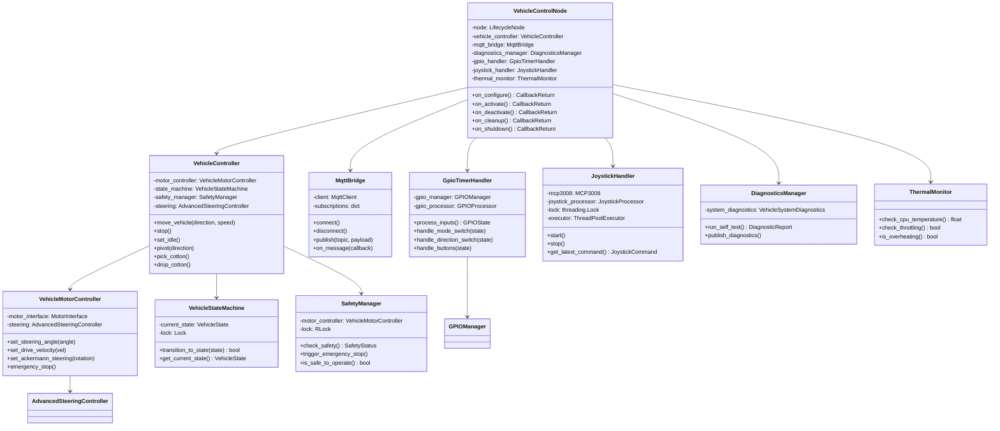
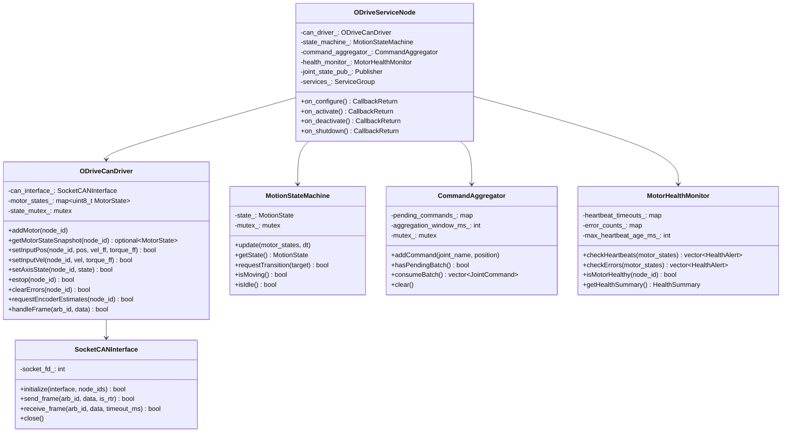

# Vehicle Nodes Refactoring Roadmap

> **Scope:** `vehicle_control_node` (Python), `odrive_service_node` (C++), and demo/utility nodes
> **Date:** 2026-03-11 (Updated 2026-03-14)
> **Status:** In Progress

## Status Summary (Updated 2026-03-14)

| Area | Progress | Notes |
|------|----------|-------|
| vehicle_control_node | 3/14 steps done | Threading locks, deadlock fix, exception cleanup. Error handling hardened (2026-03-14). |
| odrive_service_node | 3/10 steps done | CAN write checks, data race fix, heartbeat timeout |
| Demo/Utility nodes | 1/4 steps done | Dead imports/code cleaned via tech-debt-quick-wins |

---

### Related Documents

- [Technical Debt Analysis](../project-notes/TECHNICAL_DEBT_ANALYSIS_2026-03-10.md) — source of truth for all debt items
- [Cross-Cutting Patterns Migration](./cross_cutting_patterns_migration.md) — lifecycle, callback groups, BT, testing patterns
- [Shared Nodes Roadmap](./shared_nodes_refactoring_roadmap.md) — mg6010_controller, pid_tuning (shared motor layer)
- [Infrastructure Roadmap](./infrastructure_refactoring_roadmap.md) — common_utils, msgs, robot_description
- [Vehicle Node Analysis](../project-notes/VEHICLE_NODE_REFACTORING_ANALYSIS_2026-03-10.md) — deep comparison of vehicle architectures

---

## Table of Contents

1. [vehicle_control_node (Python)](#1-vehicle_control_node-python)
2. [odrive_service_node (C++)](#2-odrive_service_node-c)
3. [Demo / Utility Nodes](#3-demo--utility-nodes)

---

## 1. vehicle_control_node (Python)

### 1.1 Current State

| Attribute | Value |
|---|---|
| **Source file** | `src/vehicle_control/integration/vehicle_control_node.py` |
| **LOC** | 3,754 |
| **Class** | `ROS2VehicleControlNode(Node)` — single god-class |
| **Executor** | `rclpy.executors.SingleThreadedExecutor` with manual `spin_once()` + `time.sleep(0.05)` loop (~20 Hz cap) |
| **Threading** | 3 dedicated background threads: joystick_loop, shutdown_sequence, MQTT paho loop; main ROS executor thread |

#### Responsibilities mixed into one class

| # | Responsibility | Lines (approx.) | Estimated LOC |
|---|---|---|---|
| 1 | ROS2 pub/sub/service/timer wiring | 1729-1971 | ~240 |
| 2 | MQTT persistent client management | 257-497 | ~240 |
| 3 | Hardware init: GPIO, IMU, joystick/MCP3008, motor controller | 565-751 | ~190 |
| 4 | Motor command dispatch (position, velocity, steering, drive) | 1267-1530 | ~260 |
| 5 | High-level vehicle control (move, stop, idle, pivot, cotton ops) | 1546-1728 | ~180 |
| 6 | Joystick polling loop (daemon thread) | 2130-2245 | ~115 |
| 7 | GPIO processing at 10 Hz (mode switches, buttons) | 3070-3483 | ~410 |
| 8 | Thermal / CPU self-monitoring | 2895-2990 | ~95 |
| 9 | Control loop health / timing | 2992-3037 | ~45 |
| 10 | Diagnostics and self-test | 891-1170 | ~280 |
| 11 | Shutdown sequence (`subprocess.Popen("sleep 20 && sudo shutdown")`) | 3367-3483 | ~115 |
| 12 | YAML config loading + parameter handling | 498-564 | ~65 |

#### Dependencies (ROS2 interfaces)

**Subscriptions:**
- `/vehicle/command` (String) — JSON vehicle commands
- `/arm_*/status` (String) — arm status from MQTT bridge
- `/imu/data` (Imu) — IMU sensor data

**Publishers:**
- `/vehicle/status` (String) — JSON vehicle status
- `/vehicle/diagnostics` (String) — diagnostics JSON
- `/joint_commands` (JointCommand) — motor position/velocity commands
- `/motor_enable` (SetAxisState request) — via service client
- Multiple MQTT publish topics via internal client

**Service Clients:**
- `/odrive/set_axis_state` (SetAxisState)
- `/odrive/emergency_stop` (Trigger)

**Timers:**
- 10 Hz control loop
- 10 Hz GPIO processing
- 1 Hz diagnostics
- 1 Hz thermal monitoring
- 5 Hz joint state check

#### Critical tech debt

1. **Data race (~~CRITICAL~~ RESOLVED):** `_drive_movement_in_progress` flag and `motor_status` dict were read/written from the joystick daemon thread and the main executor thread with zero locks. **Fixed in phase-2-critical-fixes (2026-03-11):** added `_mqtt_lock`, `_motor_state_lock` (RLock), and `_control_lock` protecting all cross-thread shared state. See `openspec/specs/vehicle-thread-safety/spec.md`.

2. **Deadlock potential (~~HIGH~~ RESOLVED):** `_call_motor_enable` (line 1456) called `rclpy.spin_until_future_complete(self, future)` from within a callback on a `SingleThreadedExecutor` — this would deadlock because the executor was already spinning. **Fixed in phase-1-critical-fixes (f1685f2c):** replaced `spin_until_future_complete` with `call_async` + polling pattern.

3. **Bare except (~~MEDIUM~~ RESOLVED):** `_load_yaml_config` (line 505) caught all exceptions silently. **Fixed in vehicle-exception-cleanup (76c4741a, 2026-03-12):** all 19 silent exception-swallowing blocks replaced with typed catches + diagnostic logging.

4. **Stale attribute check (~~LOW~~ RESOLVED):** `_vehicle_joint_positions` was checked via `hasattr()` instead of proper initialization. **Fixed in phase-2-critical-fixes (2026-03-11):** init moved inside `_motor_state_lock` block.

5. **Duplicate imports (LOW):** `datetime` (lines 12, 41), `os` (lines 11, 44).

6. **No lifecycle management:** Node does not use `rclcpp_lifecycle` equivalent (`LifecycleNode`). Startup/shutdown ordering is ad-hoc.

7. **MQTT tightly coupled:** ~240 lines of MQTT client management embedded directly in the node class.

> **Blocking-sleeps & error-handling hardening (2026-03-14):**
> The `blocking-sleeps-error-handlers` change audited all sleep calls and error handling paths in vehicle_control and supporting modules.
>
> - **Sleeps:** 30+ production sleeps annotated `BLOCKING_SLEEP_OK` — all are on dedicated background threads (joystick, shutdown, MQTT paho) or main thread, none block the executor. Joystick thread polls `future.done()` with `time.sleep(0.02)` (correct — cannot use `spin_until_future_complete` from non-executor thread). `_call_motor_enable()` already uses correct `call_async` + polling with 5.0s timeout.
> - **Bare excepts fixed:** 3 remaining bare `except:` replaced with `except Exception:` (`gpio_manager.py` cleanup x2, `imu_interface.py` `is_heading_stable` x1).
> - **Motor error propagation:** `@propagate_motor_error` decorator added for motor command error paths.
> - **E-stop retry:** Emergency stop now retries with backoff before giving up.
> - **ConsecutiveFailureTracker:** Integrated from `common_utils` for tracking repeated failures.
> - **Safety check hardening:** `safety_check` exceptions now caught and logged rather than crashing the node.
> - **Tests added:** `test_blocking_sleep_annotations.py`, `test_emergency_stop_retry.py`, `test_propagate_motor_error.py`, `test_consecutive_failure_tracker_integration.py`, `test_future_polling.py`, `test_safety_check_exception.py`, plus `conftest.py` shared fixtures.

#### Confirmed bugs (from analysis revalidation)

8. **`spin_until_future_complete` deadlock (~~CRITICAL~~ RESOLVED):** `vehicle_control_node.py:1456`, `_call_motor_enable` used blocking `rclpy.spin_until_future_complete()` inside service callbacks on a `SingleThreadedExecutor`. Motor enable/disable silently failed after 5s timeout. `stop_vehicle()` depended on this path. The developer fixed the same bug in `_call_drive_stop` (line 837) using `call_async` + polling but missed this call site. **Resolved in phase-1-critical-fixes (f1685f2c) — replaced `spin_until_future_complete` with `call_async` + polling pattern.**

9. **`system_diagnostics.py` broken import (~~HIGH~~ RESOLVED):** Lines 18/26 imported `RobustMotorController` from archived `robust_motor_controller.py` (file no longer exists). Same broken import in `validate_system.py:20` and `debug_diagnostics.py:15`. Any instantiation of `VehicleSystemDiagnostics` would crash with `ImportError`. **Fixed in tech-debt-quick-wins:** dead `RobustMotorController` imports removed, `debug_diagnostics.py` deleted, 7 dead functions removed from `validate_system.py`.

10. **Duplicate motor publisher paths (MEDIUM):** Both `vehicle_control_node.py:785` and `ros2_motor_interface.py:97` create publishers on identical topics (`/{joint}_position_controller/command`, `/{joint}_velocity_controller/command`) for all 6 joints. Two independent publish pathways to the same motors exist simultaneously, risking conflicting commands.

#### Supporting files already extracted

The codebase already has partial decomposition into modules that the god-class **does not use at runtime** (the node reimplements everything internally):

| File | LOC | Status |
|---|---|---|
| `core/safety_manager.py` | 438 | Has its own thread; used only by demo scripts |
| `core/state_machine.py` | 266 | Clean FSM; used only by demo scripts |
| `core/vehicle_controller.py` | 471 | Orchestrator; used only by demo scripts |
| `hardware/motor_controller.py` | 527 | Motor abstraction; used only by demo scripts |
| `hardware/gpio_manager.py` | 458 | GPIO via pigpio; used only by demo scripts |
| `hardware/ros2_motor_interface.py` | 281 | Duplicate publisher creation; stale 6-motor mapping |
| `hardware/advanced_steering.py` | ~300 | Ackermann geometry; used by motor_controller.py |
| `hardware/mcp3008.py` | ~150 | SPI ADC reader for joystick |
| `utils/input_processing.py` | ~200 | Joystick/GPIO input processors |
| `integration/imu_interface.py` | 290 | Clean IMU adapter (disabled by default) |
| `integration/system_diagnostics.py` | 985 | Full diagnostics system; used only by demo scripts |
| `config/constants.py` | 223 | Frozen dataclasses; minor pi precision bug |

**Key insight:** The supporting modules represent a *target* architecture that was never wired into the actual ROS2 node. The node reimplements everything from scratch.

### 1.2 Target Architecture

The god-class should be decomposed into a thin `VehicleControlNode` (ROS2 wiring only) that delegates to existing, already-extracted domain classes.



#### Key design decisions

1. **LifecycleNode adoption:** Use `rclpy` lifecycle node for ordered startup/shutdown. Hardware init in `on_configure()`, ROS wiring in `on_activate()`, graceful teardown in `on_deactivate()`/`on_shutdown()`.

2. **Callback groups:** Use `MutuallyExclusiveCallbackGroup` for the control loop timer and `ReentrantCallbackGroup` for service clients (fixes the `spin_until_future_complete` deadlock).

3. **Thread safety for joystick:** Replace bare daemon thread with a `JoystickHandler` class that uses `threading.Lock` for shared state and a `queue.Queue` for command passing to the main thread.

4. **MQTT extraction:** Move all MQTT logic into `MqttBridge` class (already ~240 lines that map cleanly). The node subscribes to bridge events via callbacks.

5. **Reuse existing modules:** Wire `VehicleController`, `VehicleStateMachine`, `SafetyManager`, `VehicleMotorController`, `GPIOManager` (all already implemented) into the node instead of reimplementing.

6. **`ros2_motor_interface.py` retirement:** Remove duplicate publisher creation. The node publishes `JointCommand` messages directly; `VehicleMotorController` handles motor math.

### 1.3 Migration Path

Each step is a self-contained commit that does not break the running system.

#### Phase 0: Test Safety Net

Write integration tests for the monolith's **external behavior** BEFORE any extraction begins. This is mandatory per project AGENTS.md red-green-refactor policy.

| Attribute | Value |
|---|---|
| **Effort** | 3-5 days |
| **Size** | S-M |
| **Risk** | None (additive only) |

**Tests must cover:**
- Motor enable/disable (service client calls to `/odrive/set_axis_state`)
- Stop vehicle (`stop_vehicle()` and `/odrive/emergency_stop` interaction)
- State transitions (IDLE → ARMED → MANUAL → AUTO mode switches)
- MQTT publish (vehicle status, diagnostics, arm coordination messages)
- Joystick input handling (MCP3008 ADC reads → drive/steering commands)

**Rationale:** The project's AGENTS.md mandates red-green-refactor. No code extraction without a test safety net. See [VEHICLE_NODE_REFACTORING_ANALYSIS](../project-notes/VEHICLE_NODE_REFACTORING_ANALYSIS_2026-03-10.md) §Phase 0.

---

| Step | Description | Risk | Effort | Details |
|---|---|---|---|---|
| **1** | **~~Add threading lock to shared joystick state~~ ✅ Done** | Low | S | Add `threading.Lock` around `_drive_movement_in_progress` and `motor_status` reads/writes. Pure bug fix, no architecture change. Requires regression test. |
| **2** | **~~Fix `spin_until_future_complete` deadlock~~ ✅ Done** | Medium | S | Resolved in phase-1-critical-fixes (f1685f2c) — replaced `spin_until_future_complete` with `call_async` + polling pattern. |
| **3** | **Extract MqttBridge class** | Low | M | Move lines 257-497 into `integration/mqtt_bridge.py`. The node holds a `MqttBridge` instance and passes callbacks. Wire back in via `self._mqtt = MqttBridge(...)`. No functional change. |
| **4** | **Extract ThermalMonitor class** | Low | S | Move lines 2895-2990 into `utils/thermal_monitor.py`. Pure extraction, self-contained. |
| **5** | **Extract JoystickHandler class** | Medium | M | Move lines 2130-2245 into `hardware/joystick_handler.py`. Add `threading.Lock`, replace raw `threading.Thread` with managed handler. The node calls `joystick_handler.get_latest_command()` in the control loop instead of reading shared mutable state. |
| **6** | **Wire existing `VehicleStateMachine` into node** | Medium | M | Replace inline state tracking (scattered across the god-class) with the existing `core/state_machine.py` `VehicleStateMachine`. Requires mapping current ad-hoc state variables to FSM states. |
| **7** | **Wire existing `GPIOManager` into node** | Medium | M | Replace inline GPIO code (lines 3070-3483) with `hardware/gpio_manager.py` `GPIOManager` + `utils/input_processing.py` `GPIOProcessor`. Extract GPIO timer callback into `GpioTimerHandler`. |
| **8** | **Wire existing `SafetyManager` into node** | Medium | M | Connect `core/safety_manager.py` to the state machine. Replace inline safety checks. Safety checks must be in place before motor command paths are rewired in the next step. |
| **9** | **Wire existing `VehicleMotorController` into node** | High | L | Replace inline motor command logic (lines 1267-1530) with `hardware/motor_controller.py` `VehicleMotorController`. This is the riskiest step — motor commands are safety-critical. Requires `SafetyManager` (Step 8) to be wired first and thorough hardware-in-the-loop testing. |
| **10** | **Wire existing `VehicleController` orchestrator** | Medium | L | Replace high-level vehicle control logic (lines 1546-1728) with `core/vehicle_controller.py`. The node's control loop timer calls `vehicle_controller.update()`. |
| **11** | **Wire existing `DiagnosticsManager`** | Low | M | Replace inline diagnostics (lines 891-1170) with `integration/system_diagnostics.py`. |
| **12** | **Convert to LifecycleNode** | High | L | Change base class from `Node` to `LifecycleNode`. Move hardware init to `on_configure()`, ROS setup to `on_activate()`, teardown to `on_shutdown()`. Requires launch file updates. |
| **13** | **Retire `ros2_motor_interface.py`** | Low | S | Remove duplicate publisher class. Update any remaining references. |
| **14** | **Clean up: remove dead code, fix imports** | Low | S | Remove duplicate imports, ~~bare excepts~~ *(3 more fixed in blocking-sleeps-error-handlers, 2026-03-14)*, `hasattr` checks. Fix `constants.py` pi precision. |

#### Risk assessment

- **Steps 1-5:** Low-to-medium risk extractions. Each can be tested independently. Rollback is trivial (revert commit).
- **Steps 6-11:** Medium-to-high risk — replacing control logic with pre-existing modules that haven't been integration-tested with the ROS2 node. **Mitigation:** run each step on hardware with motor disconnect before connecting live motors.
- **Step 8 (SafetyManager):** Wire safety checks before motor commands. Medium risk — safety is critical but the existing module is well-tested in isolation.
- **Step 9 (motor commands):** Highest risk. Motor command dispatch is safety-critical. **Mitigation:** keep old code paths behind a feature flag (config parameter) for the first field test cycle. SafetyManager (Step 8) must be verified working first.
- **Step 12 (LifecycleNode):** High risk due to launch infrastructure changes. **Mitigation:** implement lifecycle transitions but keep a non-lifecycle launch path as fallback.

#### Total estimated effort: ~8-10 weeks (1 developer)

#### CPU performance caveat

> **Do NOT rely on the claimed 97.5%→7.3% CPU improvement.** The CPU burn fix commit's numbers come from a one-time manual `pidstat` measurement with no automated performance regression test. Actual RPi 4B field measurements show **>50% CPU remains** for the vehicle node.
>
> - No automated performance test exists to verify CPU usage after code changes
> - The 31 unit tests from the CPU fix commit verify code structure (correct functions called, correct timer periods) — they do NOT measure actual CPU usage
> - If the refactored Python node still exceeds ~30% CPU on RPi 4B after decomposition, C++ hot paths (GPIO polling, joystick reading, drive controller loop) become a **Phase 2 follow-up** (see [VEHICLE_NODE_REFACTORING_ANALYSIS](../project-notes/VEHICLE_NODE_REFACTORING_ANALYSIS_2026-03-10.md) §13 and Appendix D, Option B)
> - A `py-spy` profiling session on the RPi 4B (~1 hour) should be conducted early to identify whether time is spent in rclpy spin, pigpio IPC, Python GC, or actual callback logic
>
> Reference: [VEHICLE_NODE_REFACTORING_ANALYSIS](../project-notes/VEHICLE_NODE_REFACTORING_ANALYSIS_2026-03-10.md) §13

---

## 2. odrive_service_node (C++)

### 2.1 Current State

| Attribute | Value |
|---|---|
| **Source file** | `src/odrive_control_ros2/src/odrive_service_node.cpp` |
| **LOC** | 1,599 |
| **Class** | `ODriveServiceNode : public rclcpp::Node` — single god-class |
| **Threading** | 1 CAN RX thread (`std::thread`), main ROS executor thread |

#### Responsibilities mixed into one class

| # | Responsibility | Lines (approx.) | Estimated LOC |
|---|---|---|---|
| 1 | CAN RX thread + frame dispatch | 335-389 | ~55 |
| 2 | Encoder RTR request timer (10 Hz) | 392-398 | ~7 |
| 3 | Joint state publishing (10 Hz) | 401-441 | ~40 |
| 4 | Motor state management (heartbeat, encoder, error tracking) | 77-330 | ~250 |
| 5 | Position command handling (aggregation, sync modes) | 634-832 | ~200 |
| 6 | Motion state machine (IDLE -> MOVING -> etc., 20 Hz) | 903-1265 | ~360 |
| 7 | ROS2 services: joint_status, set_axis_state, emergency_stop, drive_stop | 1267-1467 | ~200 |
| 8 | Trajectory update dispatch | 833-900 | ~70 |
| 9 | Command queue (legacy path) | 756-782 | ~30 |

#### Dependencies (ROS2 interfaces)

**Subscriptions:**
- `/joint_commands` (motor_control_msgs/JointCommand) — position/velocity commands

**Publishers:**
- `/joint_states` (sensor_msgs/JointState) — encoder positions + velocities at 10 Hz

**Services (provided):**
- `/odrive/joint_status` (motor_control_msgs/JointStatus)
- `/odrive/set_axis_state` (motor_control_msgs/SetAxisState)
- `/odrive/emergency_stop` (std_srvs/Trigger)
- `/odrive/drive_stop` (std_srvs/Trigger)

**Timers:**
- 50 ms encoder RTR request
- 100 ms joint state publish
- 50 ms motion state machine update

#### Critical tech debt

1. **~~Data race (CRITICAL)~~ ✅ RESOLVED (bad11785):** `request_encoder_estimates()` now holds `state_mutex_` via `std::lock_guard`. Fixed in odrive-data-race-heartbeat-timeout (Mar 14).

2. **Silent CAN failures (~~HIGH~~ RESOLVED):** `send_frame()` return values were discarded at ~13 call sites. CAN write failures were silently ignored. **Fixed in phase-1-critical-fixes (f1685f2c, item 1.8):** all 13 sites now check return values with error logging.

3. **~~No heartbeat timeout (HIGH)~~ ✅ RESOLVED (bad11785):** 1Hz heartbeat staleness check added with 2s timeout. Dead/disconnected motors now detected with RCLCPP_ERROR logging, recovery detected with RCLCPP_WARN. 11 gtests added. Fixed in odrive-data-race-heartbeat-timeout (Mar 14).

4. **Static log counters (LOW):** `static int log_counter` at lines 1051-1052, 1073-1074 — not thread-safe, code smell.

5. **Dead code (MEDIUM):** Legacy command queue path (lines 756-782) is largely redundant with the aggregation + trajectory update path. `TRANSITIONING_TO_CLOSED_LOOP` state handler duplicates logic from `start_motion_internal`.

6. **No tests:** The package has zero unit tests (no `test/` directory).

7. **No lifecycle management:** Uses `rclcpp::Node` instead of `rclcpp_lifecycle::LifecycleNode`.

#### Supporting libraries (already well-factored)

| File | LOC | Quality |
|---|---|---|
| `odrive_can_driver.cpp` / `.hpp` | 291 | **Good** — clean CAN driver abstraction with proper mutex, return value propagation |
| `socketcan_interface.cpp` / `.hpp` | 230 / 86 | **Good** — clean SocketCAN wrapper, proper error returns |
| `odrive_cansimple_protocol.hpp` | 392 | **Good** — inline encode/decode, clean protocol definitions |
| `odrive_can_tool.cpp` | 869 | **Good** — standalone CLI test tool, not a ROS2 node (keep as-is) |

**Key insight:** `ODriveCanDriver` already exists as a clean abstraction layer but the `odrive_service_node` **does not use it**. The node duplicates CAN frame building/parsing inline instead of delegating to the driver.

### 2.2 Target Architecture



#### Key design decisions

1. **Use `ODriveCanDriver`:** The node should delegate all CAN communication to the existing `ODriveCanDriver` class instead of duplicating frame building inline. The driver already has proper mutex guards and return value propagation.

2. **Extract `MotionStateMachine`:** Move the 360-line state machine (lines 903-1265) into its own class. Pure logic, no ROS dependency, easily unit-testable.

3. **Extract `CommandAggregator`:** Move the position command aggregation/batching logic (lines 634-832) into its own class. This isolates the timing-sensitive aggregation window logic.

4. **Add `MotorHealthMonitor`:** New class that checks heartbeat freshness, tracks error counts, and reports motor health. Fixes the "no heartbeat timeout detection" gap.

5. **LifecycleNode adoption:** CAN interface init in `on_configure()`, RX thread start in `on_activate()`, clean shutdown in `on_deactivate()`.

6. **Callback groups:** CAN RX runs in its own `std::thread` (keep as-is — it's already correct). Timer callbacks use `MutuallyExclusiveCallbackGroup`. Service callbacks use a separate `MutuallyExclusiveCallbackGroup`.

7. **Check `send_frame()` returns:** All CAN send calls must check return value. On failure: log warning, increment error counter, and notify `MotorHealthMonitor`.

### 2.3 Migration Path

| Step | Description | Risk | Effort | Details |
|---|---|---|---|---|
| **1** | **~~Fix data race in `request_encoder_estimates`~~ ✅ Done** | Low | S | Resolved in odrive-data-race-heartbeat-timeout (bad11785). `std::lock_guard` added. |
| **2** | **~~Check all `send_frame()` return values~~ ✅ Done** | Low | S | Resolved in phase-1-critical-fixes (f1685f2c, item 1.8) — 13 `send_frame()` call sites checked with error logging. |
| **3** | **~~Add heartbeat timeout detection~~ ✅ Done** | Low | M | Resolved in odrive-data-race-heartbeat-timeout (bad11785). 1Hz wall timer, 2s timeout, transition-based stale/recovery logging. 11 gtests. |
| **4** | **Wire `ODriveCanDriver` into the node** | Medium | L | Replace inline CAN frame building/parsing with calls to `ODriveCanDriver`. The driver already handles all protocols. The node becomes a thin ROS wrapper around the driver. **Largest refactoring step.** |
| **5** | **Extract `MotionStateMachine` class** | Medium | M | Move lines 903-1265 into `src/motion_state_machine.cpp/.hpp`. The node calls `state_machine_.update()` from the 20 Hz timer. |
| **6** | **Extract `CommandAggregator` class** | Medium | M | Move lines 634-832 into `src/command_aggregator.cpp/.hpp`. The node calls `aggregator_.addCommand()` on subscription callback and `aggregator_.consumeBatch()` in the motion update. |
| **7** | **Add `MotorHealthMonitor`** | Low | M | New class in `src/motor_health_monitor.cpp/.hpp`. Consolidates heartbeat timeout, error tracking, and health reporting. |
| **8** | **Remove dead code** | Low | S | Remove legacy command queue path (lines 756-782), duplicate state transition logic, static log counters. |
| **9** | **Convert to LifecycleNode** | Medium | M | Change `rclcpp::Node` to `rclcpp_lifecycle::LifecycleNode`. Move CAN init to `on_configure()`, thread start to `on_activate()`, cleanup to `on_shutdown()`. Update launch files. |
| **10** | **Add unit tests** | Low | L | Write gtest suites for `MotionStateMachine`, `CommandAggregator`, `MotorHealthMonitor`, and `ODriveCanDriver`. Mock CAN interface for driver tests. |

#### Risk assessment

- **Steps 1-3:** Low risk bug fixes and additions. No existing behavior changes.
- **Step 4 (wire driver):** Medium risk — replaces inline CAN protocol handling with the driver abstraction. **Mitigation:** The `ODriveCanDriver` is already tested via `odrive_can_tool`. Add integration test that sends known CAN frames and verifies driver state.
- **Steps 5-6 (extract classes):** Medium risk pure extractions. **Mitigation:** test each extraction by comparing behavior before/after with captured CAN traces.
- **Step 9 (LifecycleNode):** Medium risk due to launch infrastructure. **Mitigation:** keep non-lifecycle launch file as fallback.

#### Total estimated effort: ~4-5 weeks (1 developer)

---

## 3. Demo / Utility Nodes

### 3.1 Current State — Inventory

| File | LOC | Type | Description |
|---|---|---|---|
| `demo.py` | 107 | Demo | GUI/headless simulation launcher; imports from `simulation/` |
| `simple_demo.py` | 175 | Demo | Dependency checker + basic simulation test |
| `demo_complete_functionality.py` | 368 | Demo | Full feature demo with MockMotorInterface; exercises GPIO, steering, test framework |
| `quick_start.py` | 178 | Demo | Quick demo with inline MockMotorInterface |
| `debug_diagnostics.py` | 95 | Debug | One-off debug script for diagnostics health history bug |
| `validate_system.py` | 776 | Validation | Comprehensive 12-test validation suite (circuit breaker, motor, safety, concurrency) |
| `run_validation_tests.sh` | 471 | Validation | Bash test runner with HTML report generation |
| `simulation/` | ~5 files | Simulation | Vehicle physics simulator with optional GUI (tkinter + matplotlib) |
| `tests/test_vehicle_control_unit.py` | 500 | Test | Unit tests for state machine, circuit breaker, steering |
| `tests/test_cpu_thermal_fix.py` | ~100 | Test | Thermal monitoring regression test |

### 3.2 Classification and Recommendations

| File | Recommendation | Rationale |
|---|---|---|
| `demo.py` | **REMOVE** | Thin wrapper over `simulation/run_simulation.py`. Duplicates its CLI. |
| `simple_demo.py` | **REMOVE** | Dependency checker with no unique value. `pip list` does the same. |
| `quick_start.py` | **REMOVE** | Overlaps with `demo_complete_functionality.py` but with less coverage. |
| `demo_complete_functionality.py` | **KEEP (move)** | Useful as a non-ROS integration test. Move to `tests/integration/` and convert to pytest. |
| `debug_diagnostics.py` | ~~**REMOVE**~~ ✅ **REMOVED** | Deleted in tech-debt-quick-wins. One-off debugging script. |
| `validate_system.py` | **KEEP (refactor)** | Valuable validation suite. Refactor into pytest format, move to `tests/validation/`. |
| `run_validation_tests.sh` | **REMOVE** | Bash test runner is fragile and generates HTML reports. Replace with `pytest` + `pytest-html`. |
| `simulation/` | **KEEP (as-is)** | Vehicle physics simulator is useful for development. Not a ROS2 node — no refactoring needed. |
| `tests/test_vehicle_control_unit.py` | **KEEP** | Real unit tests. Already in pytest format. |
| `tests/test_cpu_thermal_fix.py` | **KEEP** | Regression test. Already in pytest format. |

### 3.3 Target Structure

```
src/vehicle_control/
  tests/
    unit/
      test_vehicle_control_unit.py    (existing, move here)
      test_cpu_thermal_fix.py         (existing, move here)
    integration/
      test_complete_functionality.py  (from demo_complete_functionality.py)
    validation/
      test_system_validation.py       (from validate_system.py, pytestified)
  simulation/                         (keep as-is)
```

### 3.4 Migration Path

| Step | Description | Risk | Effort |
|---|---|---|---|
| **1** | **Convert `validate_system.py` to pytest** | Low | M | Rewrite `SystemValidator` class methods as `test_*` functions. Keep the 12 validation scenarios. Move to `tests/validation/`. |
| **2** | **Convert `demo_complete_functionality.py` to pytest** | Low | S | Replace `print()` assertions with `assert`. Move `MockMotorInterface` to `tests/conftest.py`. Move to `tests/integration/`. |
| **3** | **Delete `demo.py`, `simple_demo.py`, `quick_start.py`, ~~`debug_diagnostics.py`~~ *(already deleted)*, `run_validation_tests.sh`** | Low | S | Remove files. Update any references in README.md. `debug_diagnostics.py` already removed via tech-debt-quick-wins; dead `RobustMotorController` imports cleaned and 7 dead functions removed from `validate_system.py`. |
| **4** | **Reorganize test directory** | Low | S | Create `tests/unit/`, `tests/integration/`, `tests/validation/` directories. Move existing tests. Update `pytest.ini` paths. |

#### Total estimated effort: ~1 week (1 developer)

---

## Summary

| Node Group | Current LOC | Target Classes | Effort | Priority |
|---|---|---|---|---|
| `vehicle_control_node` (Python) | 3,754 | 7 classes + thin node | 8-10 weeks | **P0** (safety bugs) |
| `odrive_service_node` (C++) | ~1,660 | 5 classes + thin node | 4-5 weeks | **P1** (steps 4-10 remaining) |
| Demo/utility cleanup | ~2,170 | Test reorganization | 1 week | **P2** |

### ODrive CAN prerequisite

> **ODrive CAN safety fixes: ✅ ALL DONE — silent write failures (1.8), data race fix, heartbeat timeout (2.3). Prerequisites satisfied for vehicle node Steps 6-11.**
>
> ODrive silent CAN failures (Tech Debt 1.8) fixed (f1685f2c). Data race in request_encoder_estimates fixed (bad11785). Heartbeat timeout detection (2.3) implemented (bad11785). All CAN safety prerequisites are now complete.
>
> Reference: [VEHICLE_NODE_REFACTORING_ANALYSIS](../project-notes/VEHICLE_NODE_REFACTORING_ANALYSIS_2026-03-10.md) §17

### Recommended execution order

1. **~~Immediate (this sprint):~~ ✅ Done:** Steps 1-2 of `vehicle_control_node` (threading locks, deadlock fix) and Step 2 of `odrive_service_node` (check `send_frame()` returns) — completed in phase-1-critical-fixes (f1685f2c) and phase-2-critical-fixes. Vehicle exception cleanup (19 blocks) completed in vehicle-exception-cleanup (76c4741a). Error handling hardened in blocking-sleeps-error-handlers (2026-03-14): bare excepts fixed, e-stop retry, motor error propagation decorator, safety check hardening, ConsecutiveFailureTracker integration, 30+ sleep annotations verified non-blocking. Incremental progress on Step 14 (cleanup).
2. **~~ODrive CAN fixes~~ ✅ Done:** All 3 ODrive CAN safety steps complete (send_frame checks, data race fix, heartbeat timeout). Vehicle steps 6-11 are now unblocked.
3. **Next sprint:** Steps 3-5 of `vehicle_control_node` (extract MQTT, thermal, joystick). Step 4 of `odrive_service_node` (wire driver).
4. **Following sprints (after ODrive CAN fixes verified):** Wire existing domain classes into `vehicle_control_node` (steps 6-11). Extract state machine and aggregator from `odrive_service_node` (steps 5-7).
5. **Final phase:** LifecycleNode conversion for both nodes. Demo cleanup. Test suites.
