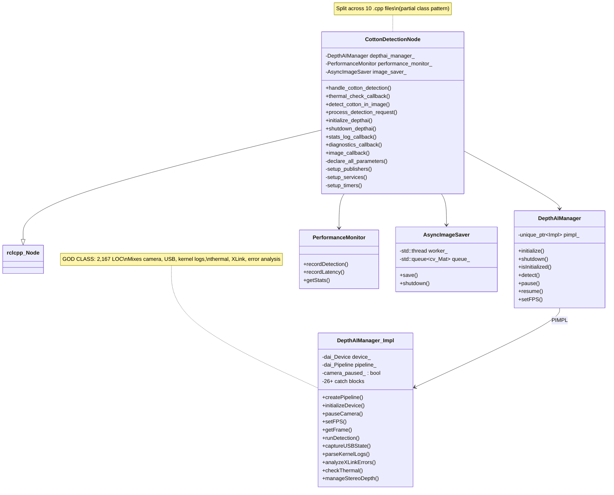
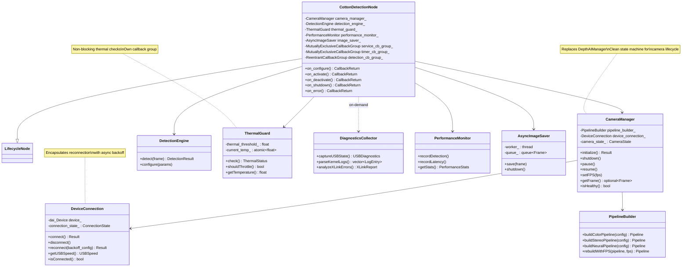
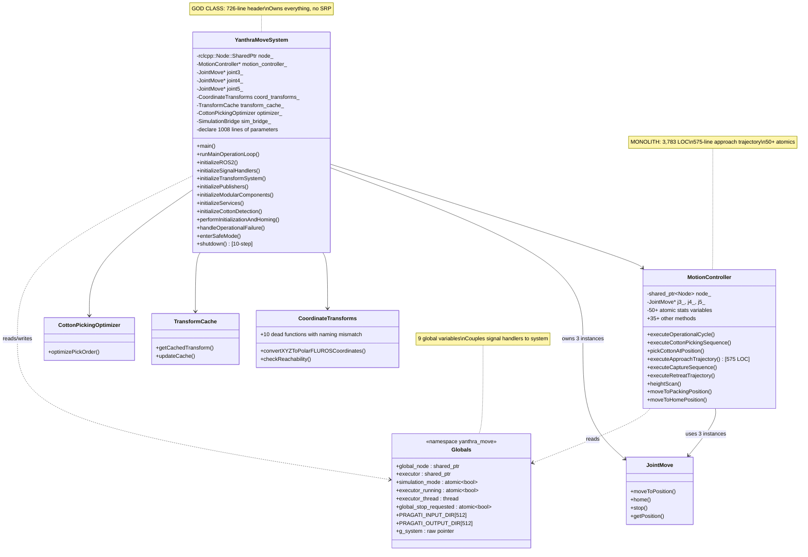
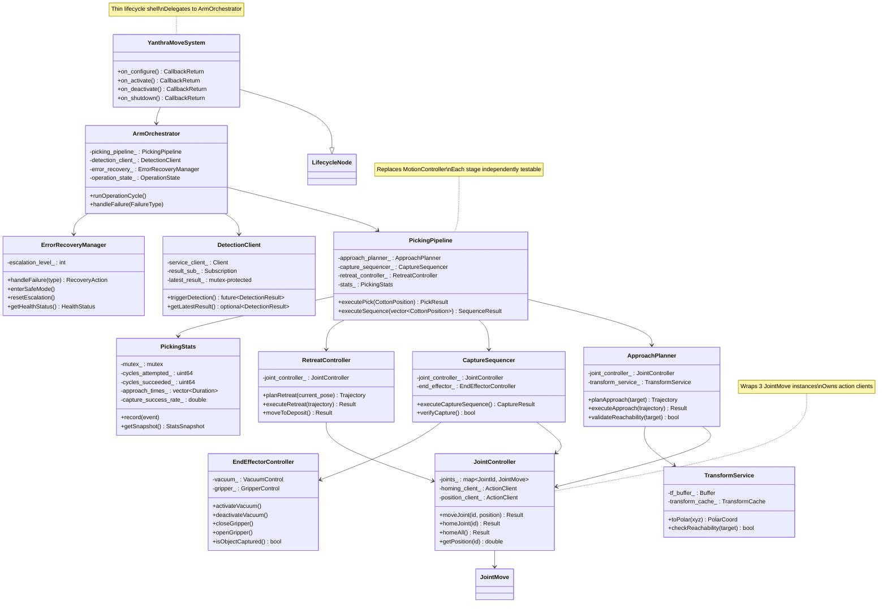
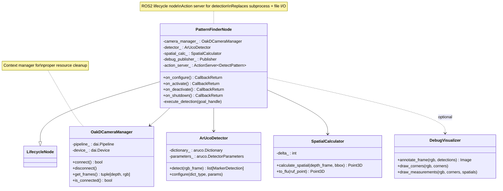
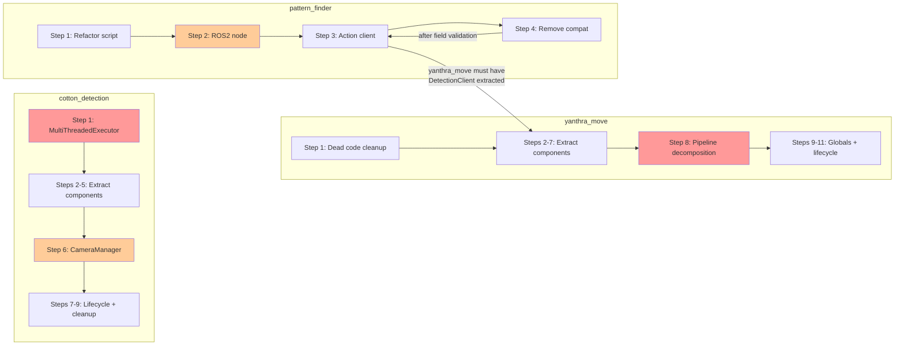

# Arm Node Refactoring Roadmap — 2026-03-10

## Executive Summary

This document provides a node-wise refactoring roadmap for the three ROS2 arm-side
packages on the Pragati cotton-picking robot. Each arm runs on an RPi 4B and hosts
these nodes:

| Package | Language | Total LOC | Key Issue |
|---------|----------|-----------|-----------|
| `cotton_detection_ros2` | C++ | ~8,154 | ~~SingleThreadedExecutor starvation~~ (fixed 2026-03-14: MultiThreadedExecutor(2)), DepthAIManager god-class (2,167 LOC) |
| `yanthra_move` | C++ | ~16,983 | MotionController monolith (3,783 LOC), 9 global variables, YanthraMoveSystem god-class (726-line header) |
| `pattern_finder` | Python | ~819 | Not a ROS2 node at all — standalone subprocess with file I/O |

**Combined:** ~25,956 lines across 3 packages, with significant architectural debt in
threading models, class decomposition, and inter-node communication.

> **Note:** `motor_control_ros2` is not scoped in this roadmap (it's an infrastructure
> package, not an arm-node application), but was touched by the `blocking-sleeps-error-handlers`
> change (2026-03-14): `ros2SafeSleep()` renamed to `blockingThreadSleep()` (48 call sites),
> all sleeps confirmed on dedicated threads (action threads, `step_test_thread_`,
> `joint_homing_thread_`), 11 of 12 catch blocks got missing `RCLCPP_ERROR` logging,
> `watchdog_exempt_` extended to position commands, `ConsecutiveFailureTracker` header-only
> class added to `common_utils`.

**Estimated total effort:** 16–26 weeks (one developer), reducible to 10–16 weeks with
parallel work streams on cotton_detection and yanthra_move.

---

### Related Documents

- [Technical Debt Analysis](./TECHNICAL_DEBT_ANALYSIS_2026-03-10.md) — source of truth for all debt items
- [Cross-Cutting Patterns Migration](../architecture/cross_cutting_patterns_migration.md) — lifecycle, callback groups, BT, testing patterns
- [Infrastructure Roadmap](../architecture/infrastructure_refactoring_roadmap.md) — common_utils, msgs, robot_description

---

## 1. cotton_detection_ros2

### 1.1 Current State

#### Class Structure

The package centers on `CottonDetectionNode` (inherits `rclcpp::Node`, header line 58)
implemented via a "partial class" pattern — one class split across 10 `.cpp` files:

| File | Lines | Responsibility |
|------|-------|---------------|
| `cotton_detection_node.cpp` | 111 | Constructor delegation |
| `cotton_detection_node_init.cpp` | 146 | Constructor body, timer/service setup |
| `cotton_detection_node_services.cpp` | 703 | Service handlers, thermal_check_callback |
| `cotton_detection_node_depthai.cpp` | 458 | DepthAI init, shutdown, reconnect, detection dispatch |
| `cotton_detection_node_detection.cpp` | 286 | `detect_cotton_in_image` orchestration |
| `cotton_detection_node_callbacks.cpp` | 416 | Image callbacks, stats logging, diagnostics |
| `cotton_detection_node_parameters.cpp` | 620 | Parameter declarations and handlers |
| `cotton_detection_node_publishing.cpp` | 169 | Topic publishing helpers |
| `cotton_detection_node_utils.cpp` | 193 | Utility functions |
| `cotton_detection_node_main.cpp` | 76 | `main()`, signal handlers, `rclcpp::spin()` |

Supporting classes:

| Class | Header LOC | Impl LOC | Role |
|-------|-----------|----------|------|
| `DepthAIManager` | 342 | 2,167 | Camera pipeline, USB diagnostics, thermal monitoring, XLink errors — **god-class** |
| `PerformanceMonitor` | 170 | 277 | FPS/latency/detection statistics |
| `AsyncImageSaver` | 121 | 181 | Background thread for debug image saving |

**Total header LOC:** 1,196 (across 8 headers)
**Total implementation LOC:** 5,736 (across 13 source files)

#### ROS2 Interfaces

| Direction | Topic/Service | Type |
|-----------|--------------|------|
| Publishes | `/cotton_detection/results` | `DetectionResult` |
| Publishes | `/cotton_detection/performance` | `PerformanceMetrics` |
| Publishes | `/cotton_detection/debug_image` | `sensor_msgs/Image` |
| Service | `/cotton_detection/detect` | `CottonDetection.srv` (`int32 detect_command` → `int32[] data, bool success, string message`) |

Camera frames originate from the DepthAI SDK (OAK-D Lite on-device pipeline), not from
ROS2 topics.

#### Threading Model

> **Updated 2026-03-14 (`blocking-sleeps-error-handlers` change):** Executor changed from
> `SingleThreadedExecutor` to `MultiThreadedExecutor(2)` with two
> `MutuallyExclusiveCallbackGroup`s: `detection_group_` (services) and `monitoring_group_`
> (timers). This eliminates the single-thread starvation problem described below. The
> blocking sleeps on executor threads (22 sites) have been annotated with
> `BLOCKING_SLEEP_OK` but not yet converted to timer+state-machine — that remains future
> refactoring work. A `camera_error_` atomic bool was added for error state tracking. All
> 11 `catch(...)` blocks now have typed `catch(const std::exception& e)` predecessors.
> Source verification: `test_blocking_sleep_audit.cpp`.

```
main() → MultiThreadedExecutor(2)  [was: rclcpp::spin(node) SingleThreadedExecutor]
    ├── detection_group_ (MutuallyExclusive)
    │       └── handle_cotton_detection       (service, blocks with sleep_for() loops + reconnect backoff)
    ├── monitoring_group_ (MutuallyExclusive)
    │       ├── thermal_check_callback        (timer, blocks with sleep_for(100ms) + initialize_depthai())
    │       ├── stats_log_callback            (timer)
    │       ├── diagnostics_callback          (timer)
    │       └── image_callback                (subscription)

AsyncImageSaver → background std::thread  [separate, correct]
```

**~~Problem~~ (mitigated 2026-03-14):** ~~All callbacks share one thread.~~ With
`MultiThreadedExecutor(2)`, service calls and timers run on separate threads via callback
groups, so a blocking service call no longer starves thermal monitoring. However, the
blocking `sleep_for` patterns (exponential backoff reconnection at `depthai.cpp:200-232`
and `sleep_for` loops at `services.cpp:218-248`) still exist — they are annotated but not
yet converted to async/timer-driven patterns.

#### Tech Debt Items

| # | Issue | Severity | Location |
|---|-------|----------|----------|
| TD-CD-1 | ~~SingleThreadedExecutor starvation~~ | ~~Critical~~ **MITIGATED** | `main.cpp` — now `MultiThreadedExecutor(2)` with `detection_group_` + `monitoring_group_` callback groups _(2026-03-14: `blocking-sleeps-error-handlers`)_ |
| TD-CD-2 | DepthAIManager god-class (2,167 LOC, 26+ catch blocks) | High | `depthai_manager.cpp` entire file. _(2026-03-14: all 11 `catch(...)` blocks now have typed `catch(const std::exception& e)` predecessors)_ |
| TD-CD-3 | `pauseCamera()` state lie — flag only, VPU continues at full FPS | Medium | `depthai_manager.cpp` — `camera_paused_` flag |
| TD-CD-4 | `setFPS()` non-functional without pipeline rebuild | Medium | `services.cpp:668-677` |
| TD-CD-5 | Blocking service handlers | High → **Medium** | `services.cpp:218-248`, `depthai.cpp:200-232` — _(2026-03-14: no longer starves executor due to callback group separation; 22 sleeps annotated `BLOCKING_SLEEP_OK`, not yet converted to timer+state-machine)_ |
| TD-CD-6 | Not a lifecycle node — no managed state transitions | Medium | `header:58` — inherits `rclcpp::Node` |
| TD-CD-7 | Signal handler accesses shared_ptr (not async-signal-safe) | Low | `main.cpp:14-31` |
| TD-CD-8 | `thermal_check_callback` blocks executor with `sleep_for(100ms)` + `initialize_depthai()` | High → **Medium** | `services.cpp:575-701` — _(2026-03-14: now on `monitoring_group_`, separate from services; sleep annotated but not yet converted)_ |

#### Current-State Class Diagram



### 1.2 Target Architecture

#### Design Principles

1. **Lifecycle node** — `CottonDetectionNode` becomes `rclcpp_lifecycle::LifecycleNode`
   with proper `on_configure`/`on_activate`/`on_deactivate`/`on_shutdown` transitions
2. **MultiThreadedExecutor** — separate callback groups for services, timers, and
   detection to eliminate starvation
3. **DepthAIManager decomposition** — break the 2,167-line god-class into focused components
4. **Async service handling** — service callbacks dispatch work to background threads
   rather than blocking the executor
5. **Real camera pause** — pipeline rebuild on pause/resume instead of flag-only approach

#### Target-State Class Diagram



#### Key Changes from Current State

| Current | Target | Rationale |
|---------|--------|-----------|
| `rclcpp::Node` | `LifecycleNode` | Managed state transitions, proper startup/shutdown |
| `rclcpp::spin()` (single-threaded) | `MultiThreadedExecutor` with 3 callback groups | Eliminate executor starvation |
| `DepthAIManager::Impl` (2,167 LOC) | `CameraManager` + `PipelineBuilder` + `DeviceConnection` + `ThermalGuard` + `DiagnosticsCollector` | Single Responsibility, testability |
| Blocking service handlers | Async dispatch with `std::async` or callback group isolation | Non-blocking executor |
| `pauseCamera()` flag | `CameraManager::pause()` → pipeline teardown + `resume()` → rebuild | Real pause, saves VPU power |
| `setFPS()` no-op | `PipelineBuilder::rebuildWithFPS()` | Actually changes FPS |
| 10-file partial class | Focused files per component | Each class in its own file pair |

### 1.3 Migration Path

Each step is independently deployable with no breaking changes to the ROS2 interface.

#### Step 1: Switch to MultiThreadedExecutor with Callback Groups — PARTIALLY DONE

**Status:** Executor migration completed (2026-03-14, `blocking-sleeps-error-handlers`
change). Uses `MultiThreadedExecutor(2)` with 2 `MutuallyExclusiveCallbackGroup`s:
`detection_group_` (services) and `monitoring_group_` (timers). NOTE: the original plan
called for 3 callback groups (including a Reentrant `detection_cb_group_`); the actual
implementation uses 2. The starvation problem (TD-CD-1) is resolved.

**Remaining work:**
- 22 blocking sleeps on executor threads are annotated `BLOCKING_SLEEP_OK` but not yet
  converted to timer+state-machine patterns (future refactoring)
- The 3rd callback group (`detection_cb_group_` Reentrant) was not created — evaluate if
  needed during DepthAIManager decomposition (Steps 2–6)

**What was done (2026-03-14):**
- `main.cpp`: Switched to `MultiThreadedExecutor(2)`
- Created `detection_group_` (MutuallyExclusive) and `monitoring_group_` (MutuallyExclusive)
- All 11 `catch(...)` blocks got typed `catch(const std::exception& e)` predecessors
- `camera_error_` atomic bool added for error state tracking
- 22 `BLOCKING_SLEEP_OK` annotations added
- Test: `test_blocking_sleep_audit.cpp` (source verification)

**Risk:** Medium — executor threading changes can expose latent race conditions in shared
state accessed by `CottonDetectionNode` members.

**Effort:** M (3–5 days) — **actual: ~1 day for executor + annotations**

---

#### Step 2: Extract ThermalGuard from DepthAIManager

**What changes:**
- New files: `thermal_guard.hpp`, `thermal_guard.cpp`
- Move thermal checking logic from `depthai_manager.cpp` Impl and `services.cpp:575-701`
  into standalone `ThermalGuard` class
- Remove `sleep_for(100ms)` stabilization wait — use non-blocking state check instead
- `CottonDetectionNode` owns `ThermalGuard` directly, assigns it to `timer_cb_group_`
- `DepthAIManager::Impl` loses thermal-related methods and state

**Tests:** Unit test `ThermalGuard` with mocked temperature source. Test threshold
behavior and throttle flag independently of camera state.

**Risk:** Low — thermal logic is already somewhat isolated in the service callback,
extraction is mechanical.

**Effort:** S (1–2 days)

---

#### Step 3: Extract DiagnosticsCollector from DepthAIManager

**What changes:**
- New files: `diagnostics_collector.hpp`, `diagnostics_collector.cpp`
- Move USB state capture, kernel log parsing (`dmesg`), XLink error analysis from
  `depthai_manager.cpp` Impl
- `DiagnosticsCollector` becomes a stateless utility, called on-demand (not a callback)
- Reduces `DepthAIManager::Impl` by ~400-500 lines

**Tests:** Unit test each diagnostic function with sample input strings (mock dmesg
output, mock USB state). No hardware dependency.

**Risk:** Low — diagnostic functions are pure analysis, no side effects.

**Effort:** S (1–2 days)

---

#### Step 4: Extract PipelineBuilder from DepthAIManager

**What changes:**
- New files: `pipeline_builder.hpp`, `pipeline_builder.cpp`
- Move all `dai::Pipeline` construction logic (color camera, stereo depth, neural
  network node creation and linking) from `depthai_manager.cpp` Impl
- `PipelineBuilder` is a stateless factory — takes config, returns `dai::Pipeline`
- Enable real `setFPS()` by rebuilding pipeline with new config
- Enable real `pauseCamera()` by tearing down pipeline on pause and rebuilding on resume

**Tests:** Unit test pipeline construction with mock config. Integration test
`setFPS()` actually changes output frame rate (requires device or simulation).

**Risk:** Medium — pipeline construction is interleaved with device initialization in
current code. Separating them requires careful ordering.

**Effort:** M (3–5 days)

---

#### Step 5: Extract DeviceConnection from DepthAIManager

**What changes:**
- New files: `device_connection.hpp`, `device_connection.cpp`
- Move device discovery, connection, USB speed detection, reconnection with exponential
  backoff from `depthai_manager.cpp` Impl and `depthai.cpp:200-232`
- `DeviceConnection` encapsulates the `dai::Device` lifecycle and reconnection strategy
- Reconnection becomes async (returns a future) rather than blocking the caller

**Tests:** Unit test reconnection backoff timing with mock device. Test USB speed
detection. Integration test connection lifecycle.

**Risk:** Medium — device connection is the core of camera operation. Must maintain
exact existing behavior during extraction.

**Effort:** M (3–5 days)

---

#### Step 6: Compose CameraManager from extracted components

**What changes:**
- New files: `camera_manager.hpp`, `camera_manager.cpp`
- `CameraManager` composes `PipelineBuilder` + `DeviceConnection`
- Clean state machine: `Disconnected → Connecting → Connected → Paused → Connected → ...`
- Replace `DepthAIManager` usage in `CottonDetectionNode` with `CameraManager`
- Delete `depthai_manager.hpp`, `depthai_manager.cpp` (2,509 combined lines)

**Tests:** State machine unit tests (all transitions). Integration test full
camera lifecycle. Regression test existing `test_simulation_mode.cpp`.

**Risk:** High — replaces the core camera management. Must have comprehensive
integration tests before this step.

**Effort:** L (1–2 weeks)

---

#### Step 7: Convert to Lifecycle Node

**What changes:**
- `CottonDetectionNode` inherits `rclcpp_lifecycle::LifecycleNode` instead of `rclcpp::Node`
- Implement `on_configure`: create `CameraManager`, `DetectionEngine`, declare parameters
- Implement `on_activate`: connect camera, start timers, advertise services
- Implement `on_deactivate`: pause camera, stop timers, unadvertise services
- Implement `on_shutdown`: full cleanup
- Update launch file to use lifecycle node manager
- Update `main.cpp` to use lifecycle executor pattern

**Tests:** Test all state transitions. Test that deactivate→activate recovers cleanly.
Test error state handling.

**Risk:** Medium — lifecycle nodes change how the node is managed externally. Launch
files and any code that creates/destroys the node must be updated.

**Effort:** L (1–2 weeks)

---

#### Step 8: Fix signal handler safety — RESOLVED

**Status:** Already fixed. The `main.cpp` now uses `pragati::install_signal_handlers()` +
`pragati::shutdown_requested()` from `common_utils/signal_handler.hpp`, which sets an
atomic flag only (async-signal-safe). No `g_node_weak` or `g_shutdown_requested` globals
exist. Resolved as part of the `common_utils` signal handler extraction.

**Original problem (no longer applies):**
- `main.cpp:14-31`: Replace global `g_node_weak` shared_ptr access in signal handler
  with async-signal-safe pattern (set atomic flag only, handle in main loop or executor)
- Remove `g_shutdown_requested` global — use lifecycle node shutdown transition instead

**Tests:** Signal handling is difficult to unit test. Add integration test that sends
SIGINT and verifies graceful shutdown completes within timeout.

**Risk:** Low — signal handling change is isolated to `main.cpp`.

**Effort:** S (1–2 days)

---

#### Step 9: Consolidate partial-class file split

**Status: DONE** — completed via `cotton-file-consolidation` change (Mar 13, 2026).

**What was done:**
- Reorganized the 10-file "partial class" pattern into per-component files:
  - `detection_engine.cpp/.hpp` — detection orchestration, DepthAI inference, caching, image save/draw (from `_detection.cpp`, `_depthai.cpp`, `_utils.cpp`)
  - `service_handler.cpp/.hpp` — ROS2 service request processing, calibration, camera control (from `_services.cpp`)
  - `cotton_detection_node.cpp` — node constructor/destructor, subscriber callbacks, publishing, diagnostics, thermal management (consolidated from `_callbacks.cpp` and `_publishing.cpp`)
  - `cotton_detection_node_init.cpp` — interface initialization, component wiring (kept separate)
  - `cotton_detection_node_parameters.cpp` — parameter declaration/loading (kept separate, ~630 lines)
  - `cotton_detection_node_main.cpp` — entry point (kept separate)
- Deleted 6 files: `_detection.cpp`, `_depthai.cpp`, `_utils.cpp`, `_services.cpp`, `_callbacks.cpp`, `_publishing.cpp`
- Updated `CMakeLists.txt` — 7 source files (down from 10)
- No logic changes — all method bodies moved verbatim

**Tests:** Build passes. Existing simulation and executor safety tests pass.

**Effort:** M (as estimated)

---

### cotton_detection_ros2 Summary

| Step | Description | Risk | Effort | Cumulative |
|------|-------------|------|--------|------------|
| 1 | ~~MultiThreadedExecutor + callback groups~~ | Medium | M | M | **PARTIALLY DONE** (2026-03-14) — executor migrated, 22 sleeps annotated not converted |
| 2 | Extract ThermalGuard | Low | S | M+S |
| 3 | Extract DiagnosticsCollector | Low | S | M+2S |
| 4 | Extract PipelineBuilder | Medium | M | 2M+2S |
| 5 | Extract DeviceConnection | Medium | M | 3M+2S |
| 6 | Compose CameraManager, delete DepthAIManager | High | L | 3M+2S+L |
| 7 | Convert to Lifecycle Node | Medium | L | 3M+2S+2L |
| 8 | ~~Fix signal handler safety~~ | Low | S | — | **DONE** — resolved by `common_utils::signal_handler` extraction (uses atomic flag, no `g_node_weak` or `g_shutdown_requested`) |
| 9 | ~~Consolidate file split~~ | Low | M | 4M+3S+2L | **DONE** — 10-file partial-class pattern reduced to 4 node files + 2 extracted classes (`DetectionEngine`, `ServiceHandler`) via `cotton-file-consolidation` change |

**Total: ~8–13 weeks** (4M + 3S + 2L = 4×4 + 3×1.5 + 2×7.5 ≈ 35.5 dev-days)

---

## 2. yanthra_move

### 2.1 Current State

#### Class Structure

The package has two god-classes — `YanthraMoveSystem` (system orchestrator) and
`MotionController` (picking pipeline) — plus several supporting classes:

**YanthraMoveSystem** — 726-line header, split across 7 `.cpp` files:

| File | Lines | Responsibility |
|------|-------|---------------|
| `yanthra_move_system_core.cpp` | 1,135 | Constructor, destructor, all init methods (ROS2, signals, transforms, publishers, modular components), 10-step shutdown, safety watchdog, stats logging, signal handlers, `main()` |
| `yanthra_move_system_parameters.cpp` | 1,008 | Parameter declarations and dynamic reconfigure |
| `yanthra_move_system_operation.cpp` | 765 | `runMainOperationLoop()`, cotton detection integration, position provider callbacks |
| `yanthra_move_system_error_recovery.cpp` | 509 | Error recovery escalation ladder, safe mode, health check, component reset, degraded mode |
| `yanthra_move_system_services.cpp` | 422 | Service/action client init, homing sequence (J5→J3→J4), idle service, arm status |
| `yanthra_move_system_hardware.cpp` | 151 | GPIO/hardware initialization |
| `CMakeLists.txt` | 512 | Build system (clean, modern CMake) |

**MotionController** — 600-line header, 3,783-line implementation:

| Method Group | Approx Lines | Responsibility |
|-------------|-------------|---------------|
| Constructor + initialize | ~65 | Takes Node, 3 JointMove ptrs, TF buffer |
| `executeOperationalCycle` | ~50 | Top-level cycle dispatch |
| `executeCottonPickingSequence` | ~290 | Multi-position picking loop |
| `pickCottonAtPosition` | ~245 | Single-position pick orchestration |
| `executeApproachTrajectory` | ~575 | Joint command sequencing to reach cotton |
| `executeCaptureSequence` | ~200 (est.) | Vacuum on, gripper close, verify capture |
| `executeRetreatTrajectory` | ~300 (est.) | Retreat to safe position, deposit |
| Height scan, L3 parking, move recording, helpers | ~2,058 | Various utility and support methods |

**Supporting classes:**

| Class | Header LOC | Impl LOC | Role |
|-------|-----------|----------|------|
| `JointMove` | 136 (.h) | 381 | Motor command abstraction per joint (legacy `.h` header) |
| `CoordinateTransforms` | 165 | 236 | Mostly dead code — 10/12 functions unused, naming mismatch bug |
| `TransformCache` | 182 | 205 | TF2 caching layer |
| `CottonPickingOptimizer` | 95 | 248 | Picking order optimization |
| `SimulationBridge` | — | 236 | Simulation mode bridge |
| `YanthraUtilities` | 110 | 257 | ~~`ros2SafeSleep`~~ → `blockingThreadSleep` _(renamed 2026-03-14)_, `startExecutorThread`, etc. |

**Legacy headers (pre-ROS2):** `yanthra_io.h` (221), `yanthra_move.h` (150), `joint_move.h` (136)

#### ROS2 Interfaces

| Direction | Topic/Service | Type |
|-----------|--------------|------|
| Publishes | `/joint_states` | `sensor_msgs/JointState` |
| Publishes | `/arm_status` | Arm status topics |
| Subscribes | `/cotton_detection/results` | `DetectionResult` |
| Subscribes | `/joint_states` | `sensor_msgs/JointState` (MotionController) |
| Service server | `/yanthra_move/current_arm_status` | `ArmStatus.srv` |
| Action client | `/joint_homing` | Joint homing action |
| Action client | `/joint_position_command` | Joint position command action |
| Service client | `cotton_detection/detect` | `CottonDetection.srv` |

#### Threading Model

> **Verified 2026-03-14 (`blocking-sleeps-error-handlers` change):** Two-thread model
> confirmed correct — all 61 sleeps (43 `blockingThreadSleep` + 18 raw `sleep_for`) are on
> the dedicated main operation thread, not executor callbacks. `ros2SafeSleep()` renamed to
> `blockingThreadSleep()` across all call sites. Parameter declaration rethrow handlers
> verified correct (7 use `throw;` at startup, 1 runtime uses `result.successful = false`).
> `ConsecutiveFailureTracker` (from `common_utils`) available for use.

```
main() → YanthraMoveSystem constructor
    ├── executor_thread (background) → executor->spin()
    │       ├── /cotton_detection/results subscription callback
    │       ├── /joint_states subscription callback (MotionController)
    │       ├── action client callbacks (/joint_homing, /joint_position_command)
    │       ├── service server callback (/yanthra_move/current_arm_status)
    │       └── timer callbacks (safety watchdog, stats logging)
    │
    └── main thread → runMainOperationLoop()
            ├── START_SWITCH polling (sleep_for(10ms) loop)
            ├── Detection trigger (mutex + condition_variable sync)
            ├── MotionController::executeOperationalCycle()
            │       ├── executeCottonPickingSequence()
            │       ├── pickCottonAtPosition()
            │       ├── executeApproachTrajectory()
            │       ├── executeCaptureSequence()
            │       └── executeRetreatTrajectory()
            └── Error recovery dispatch

Signal handlers: signal_handler (SIGINT/SIGTERM), crash_signal_handler (SIGSEGV/SIGABRT)
    └── crash handler does fork+exec("pigs") for GPIO emergency stop
```

**9 global variables:**

| Variable | Type | Location |
|----------|------|----------|
| `global_node` | `shared_ptr<Node>` | `core.cpp:203` (namespace) |
| `executor` | `shared_ptr<Executor>` | `core.cpp:204` (namespace) |
| `simulation_mode` | `atomic<bool>` | `core.cpp:205` (namespace) |
| `executor_running` | `atomic<bool>` | `core.cpp:206` (namespace) |
| `executor_thread` | `std::thread` | `core.cpp:208` (namespace) |
| `global_stop_requested` | `atomic<bool>` | `core.cpp:212` (extern) |
| `PRAGATI_INPUT_DIR[512]` | `char[]` | `core.cpp:213` (extern) |
| `PRAGATI_OUTPUT_DIR[512]` | `char[]` | `core.cpp:214` (extern) |
| `g_system` | `YanthraMoveSystem*` | `core.cpp:1022` (raw pointer) |

#### Tech Debt Items

| # | Issue | Severity | Location |
|---|-------|----------|----------|
| TD-YM-1 | `motion_controller.cpp` is 3,783 lines, untestable monolith | Critical | Entire file |
| TD-YM-2 | 9 global variables for cross-component coupling | High | `core.cpp:203-214, 1022` |
| TD-YM-3 | `YanthraMoveSystem` god-class (726-line header) | High | `yanthra_move_system.hpp` |
| TD-YM-4 | `coordinate_transforms` naming mismatch: header declares `_origin_to_` but .cpp implements `_link_to_` | Medium | `coordinate_transforms.hpp:114,125` vs `coordinate_transforms.cpp:150,167` |
| TD-YM-5 | 10/12 coordinate transform functions are dead code | Medium | `coordinate_transforms.cpp` — only `convertXYZToPolarFLUROSCoordinates` and `checkReachability` used. _📋 OpenSpec: `tech-debt-quick-wins`_ |
| TD-YM-6 | 50+ atomic member variables in MotionController for cross-thread stats | Medium | `motion_controller.hpp` |
| TD-YM-7 | Blocking `sleep_for` patterns in main loop and detection wait | Medium | `operation.cpp` — 10ms/50ms/10ms sleeps. _(2026-03-14: all 61 sleeps — 43 `blockingThreadSleep` + 18 raw — confirmed on dedicated main operation thread, not executor callbacks. All annotated `BLOCKING_SLEEP_OK`. `ros2SafeSleep()` renamed to `blockingThreadSleep()`. 4 catch-all blocks without typed predecessors fixed in `yanthra_move_system_hardware.cpp` and `yanthra_utilities.cpp`. Parameter fallback handlers improved with failure counters + JSON structured logging. Tests: `test_sleep_annotations.cpp`, `test_executor_dispatch_latency.cpp`)_ |
| TD-YM-8 | Legacy `.h` headers (`yanthra_io.h`, `yanthra_move.h`, `joint_move.h`) | Low | Include directory |
| TD-YM-9 | Dead code — 50 lines of commented-out keyboard stubs, hardware control stubs that only log, `createTimestampedLogFile` stub | Low | `core.cpp:59-198` |
| TD-YM-10 | Signal handlers not async-signal-safe; crash handler does `fork+exec pigs` | Medium | `core.cpp` signal handlers |
| TD-YM-11 | Duplicate `retryWithBackoff` template in core.cpp and error_recovery.cpp | Low | ODR violation risk |
| TD-YM-12 | Not a lifecycle node | Medium | `yanthra_move_system.hpp` — plain `rclcpp::Node` |

#### Current-State Class Diagram



### 2.2 Target Architecture

#### Design Principles

1. **Decompose MotionController** into focused pipeline stages (ApproachPlanner,
   CaptureSequencer, RetreatController) that can be unit-tested independently
2. **Decompose YanthraMoveSystem** into an orchestrator that delegates to specialized managers
3. **Eliminate global variables** — use dependency injection and proper ownership
4. **Lifecycle node** — managed state transitions for predictable startup/shutdown
5. **Clean up dead code** — remove all 10 dead coordinate transform functions + 8 legacy
   declarations in `yanthra_move.h`, naming mismatch, commented-out stubs.
   _📋 OpenSpec: `tech-debt-quick-wins` — also deletes dead `end_effector_runtime_` member._
6. **Stats consolidation** — replace 50+ atomics with a `PickingStats` struct protected by mutex

#### Target-State Class Diagram



#### Key Changes from Current State

| Current | Target | Rationale |
|---------|--------|-----------|
| `MotionController` (3,783 LOC) | `PickingPipeline` + `ApproachPlanner` + `CaptureSequencer` + `RetreatController` | Each stage testable in isolation |
| `YanthraMoveSystem` (726-line header, 7 files) | Thin `LifecycleNode` shell + `ArmOrchestrator` | SRP — node manages lifecycle, orchestrator manages operation |
| 9 global variables | Dependency injection, ownership in `YanthraMoveSystem` | Testability, no hidden coupling |
| 50+ atomic stats in MotionController | `PickingStats` struct with mutex | Cleaner, consolidated stats |
| `CoordinateTransforms` (10 dead functions, naming bug) | `TransformService` (2 live functions only) | Remove dead code, fix naming |
| Signal handlers with `fork+exec pigs` | Lifecycle shutdown + GPIO cleanup in `on_shutdown` | Deterministic cleanup path |
| Blocking sleep polling in main loop | Timer-driven state machine or event-based triggers | Responsive, non-blocking |
| Legacy `.h` headers | Modernize to `.hpp` or wrap in adapters | Consistency |

### 2.3 Migration Path

#### Step 1: Delete dead code and fix coordinate_transforms — _📋 OpenSpec: `tech-debt-quick-wins`_

**What changes:**
- `coordinate_transforms.cpp`: Delete all 10 unused functions. Keep only
  `convertXYZToPolarFLUROSCoordinates` and `checkReachability`.
- `coordinate_transforms.hpp`: Delete declarations for removed functions. Fix any
  remaining naming mismatches (`_origin_` vs `_link_`).
- `core.cpp:59-198`: Delete commented-out keyboard stubs (50 lines), hardware control
  stubs that only log (56 lines), `createTimestampedLogFile` stub (28 lines).
- Deduplicate `retryWithBackoff` template — keep one copy in a shared header.

**Tests:** Verify build succeeds. Run existing gtest suite (6 suites).
Add a unit test for `convertXYZToPolarFLUROSCoordinates` and `checkReachability`
to establish baseline coverage on the surviving functions.

**Risk:** Low — removing dead code and stubs. Naming mismatch fix requires confirming
no dynamic/template-based calls exist (already confirmed — 10/12 functions are dead).

**Effort:** S (1–2 days)

---

#### Step 2: Consolidate PickingStats from 50+ atomics

**What changes:**
- New files: `core/picking_stats.hpp`, `core/picking_stats.cpp`
- `PickingStats` struct with mutex-protected members, `record()` and `getSnapshot()` methods
- Replace all 50+ `atomic<>` stats members in `motion_controller.hpp` with single
  `PickingStats stats_` member
- Update all stats recording sites in `motion_controller.cpp` to use `stats_.record(event)`
- Update stats logging in `core.cpp` to use `stats_.getSnapshot()`

**Tests:** Unit test `PickingStats` thread safety with concurrent `record()` and
`getSnapshot()` calls.

**Risk:** Medium — touching many sites in `motion_controller.cpp`. Mechanical but
high surface area.

**Effort:** M (3–5 days)

---

#### Step 3: Extract JointController from MotionController and YanthraMoveSystem

**What changes:**
- New files: `core/joint_controller.hpp`, `core/joint_controller.cpp`
- `JointController` wraps the 3 `JointMove` instances with a unified interface:
  `moveJoint(id, position)`, `homeJoint(id)`, `homeAll()`, `getPosition(id)`
- Move action client management (`/joint_homing`, `/joint_position_command`) from
  `yanthra_move_system_services.cpp` into `JointController`
- Move homing sequence (J5→J3→J4) from `services.cpp:performInitializationAndHoming()`
  into `JointController::homeAll()`
- `MotionController` and `YanthraMoveSystem` receive `JointController*` instead of
  3 raw `JointMove*` pointers

**Tests:** Unit test `JointController` with mock `JointMove` instances. Test homing
sequence ordering. Test `moveJoint` error propagation.

**Risk:** Medium — changes constructor signatures for `MotionController`. Must update
all call sites.

**Effort:** M (3–5 days)

---

#### Step 4: Extract EndEffectorController

**What changes:**
- New files: `core/end_effector_controller.hpp`, `core/end_effector_controller.cpp`
- Move vacuum pump control, gripper control, and capture verification logic from
  `MotionController::executeCaptureSequence()` and related helpers
- Clean interface: `activateVacuum()`, `closeGripper()`, `isObjectCaptured()`
- `MotionController` delegates end-effector operations to `EndEffectorController`

**Tests:** Unit test with mocked GPIO. Test capture verification logic independently.

**Risk:** Low — end-effector logic is relatively isolated within MotionController.

**Effort:** S (1–2 days)

---

#### Step 5: Extract TransformService

**What changes:**
- Rename `coordinate_transforms.cpp/hpp` → `transform_service.cpp/hpp` (or keep and wrap)
- `TransformService` composes the 2 surviving coordinate functions + `TransformCache`
- `MotionController` and `ApproachPlanner` (later) use `TransformService` interface
- Clean API: `toPolar(xyz)`, `checkReachability(target)`

**Tests:** Unit test with mock TF buffer. Test polar conversion accuracy. Test
reachability boundary conditions.

**Risk:** Low — wrapping existing working code in a cleaner interface.

**Effort:** S (1–2 days)

---

#### Step 6: Extract DetectionClient from YanthraMoveSystem

**What changes:**
- New files: `detection_client.hpp`, `detection_client.cpp`
- Move cotton detection integration from `yanthra_move_system_operation.cpp`:
  - Subscription to `/cotton_detection/results`
  - Service client for `cotton_detection/detect`
  - `getCottonPositionProvider()` lambda
  - `getDetectionTriggerCallback()` lambda
  - `getLatestCottonPositions()`, `getLatestDetectionWithStalenessCheck()`
  - mutex + condition_variable synchronization
- `DetectionClient` provides: `triggerDetection() → future<Result>`,
  `getLatestResult() → optional<Result>`
- `YanthraMoveSystem` and `ArmOrchestrator` (later) use `DetectionClient` interface

**Tests:** Unit test with mock service client. Test staleness check logic. Test
concurrent trigger + result access.

**Risk:** Medium — detection synchronization (mutex + CV) is subtle. Must preserve
exact thread-safety semantics.

**Effort:** M (3–5 days)

---

#### Step 7: Extract ErrorRecoveryManager

**What changes:**
- Already mostly isolated in `yanthra_move_system_error_recovery.cpp` (509 lines)
- New files: `error_recovery_manager.hpp`, `error_recovery_manager.cpp`
- Move from partial-class pattern to standalone class with injected dependencies
- Remove dependency on `YanthraMoveSystem` internals — pass in callbacks or interfaces
  for "attempt homing", "enter safe mode", "set stop flag"
- Remove duplicate `retryWithBackoff` (already done in Step 1)

**Tests:** Unit test escalation ladder: log → retry → safe mode. Test health check.
Test degraded mode entry/exit conditions.

**Risk:** Low — error recovery logic is already well-contained in one file.

**Effort:** M (3–5 days)

---

#### Step 8: Decompose MotionController into Pipeline Stages

**What changes:**
This is the largest and most impactful step. Split `motion_controller.cpp` (3,783 lines)
into three pipeline stage classes:

- **`ApproachPlanner`** (~800 lines):
  - `planApproach(target) → Trajectory`
  - `executeApproach(trajectory) → Result`
  - Absorbs `executeApproachTrajectory()` (575 LOC) + joint limit checking + reachability
  - Uses `JointController` and `TransformService`

- **`CaptureSequencer`** (~400 lines):
  - `executeCaptureSequence() → CaptureResult`
  - `verifyCapture() → bool`
  - Absorbs `executeCaptureSequence()` (~200 LOC) + capture verification
  - Uses `JointController` and `EndEffectorController`

- **`RetreatController`** (~500 lines):
  - `planRetreat(current_pose) → Trajectory`
  - `executeRetreat(trajectory) → Result`
  - `moveToDeposit() → Result`
  - Absorbs `executeRetreatTrajectory()` (~300 LOC) + deposit/packing positions

- **`PickingPipeline`** (~300 lines, replaces MotionController):
  - Composes `ApproachPlanner` + `CaptureSequencer` + `RetreatController`
  - `executePick(position) → PickResult`
  - `executeSequence(positions) → SequenceResult`
  - Absorbs `executeCottonPickingSequence()` (290 LOC) and `pickCottonAtPosition()` (245 LOC)

Remaining MotionController methods (height scan, L3 parking, move recording, home
position, packing position) either move into the relevant stage class or into a
`MotionUtilities` helper.

**Tests:** This is the critical step for testability:
- Unit test `ApproachPlanner` with mock `JointController` — verify trajectory generation
  for known positions, boundary conditions (out-of-reach targets)
- Unit test `CaptureSequencer` with mock `EndEffectorController` — verify capture
  sequence ordering, failure handling
- Unit test `RetreatController` with mock `JointController` — verify retreat trajectory
- Integration test `PickingPipeline` with all three stages — verify full pick cycle

**Risk:** High — this is the most complex refactoring, touching the core picking logic.
Must have comprehensive integration tests BEFORE starting (testing the existing
`MotionController` behavior) and verify they still pass after decomposition.

**Effort:** XL (2–4 weeks)

---

#### Step 9: Eliminate Global Variables

**What changes:**
- `global_node`: Pass as constructor parameter to components that need it, or access
  via `YanthraMoveSystem` (which IS the node after lifecycle conversion)
- `executor` + `executor_running` + `executor_thread`: Encapsulate in `YanthraMoveSystem`
  as private members
- `simulation_mode`: Pass as constructor parameter or use ROS2 parameter
- `global_stop_requested`: Replace with lifecycle node state + `rclcpp::ok()` checks
- `PRAGATI_INPUT_DIR[512]` / `PRAGATI_OUTPUT_DIR[512]`: Replace with ROS2 parameters
  or `std::string` members
- `g_system` (raw pointer at `core.cpp:1022`): Remove — signal handlers use only
  async-signal-safe operations (set atomic flag), cleanup happens in lifecycle `on_shutdown`

**Tests:** Verify all existing tests pass. Add test that node can be constructed
without any global state initialized.

**Risk:** Medium — global variable removal touches many files but each change is
mechanical.

**Effort:** L (1–2 weeks)

---

#### Step 10: Create ArmOrchestrator and Convert to Lifecycle Node

**What changes:**
- New files: `arm_orchestrator.hpp`, `arm_orchestrator.cpp`
- `ArmOrchestrator` composes `PickingPipeline`, `DetectionClient`, `ErrorRecoveryManager`
- Absorbs `runMainOperationLoop()` from `yanthra_move_system_operation.cpp`
- Replace blocking `sleep_for(10ms)` START_SWITCH polling with timer-driven state machine
- `YanthraMoveSystem` becomes a thin `LifecycleNode` shell:
  - `on_configure`: Create all components (JointController, PickingPipeline, etc.)
  - `on_activate`: Start `ArmOrchestrator`, connect detection client
  - `on_deactivate`: Stop orchestrator, enter safe position
  - `on_shutdown`: Full cleanup (replaces 10-step shutdown sequence)
- Update launch files to use lifecycle node manager
- Update signal handlers to only set atomic flag (cleanup via lifecycle)

**Tests:** Test lifecycle transitions. Test that deactivate enters safe position.
Test that shutdown completes cleanly. Integration test full startup→pick→shutdown cycle.

**Risk:** High — fundamental restructuring of the node lifecycle. Must be done AFTER
all component extraction steps.

**Effort:** XL (2–4 weeks)

---

#### Step 11: Modernize Legacy Headers

**What changes:**
- Rename `joint_move.h` → `joint_move.hpp` with include guard update
- Rename `yanthra_io.h` → `yanthra_io.hpp` (or delete if unused after refactoring)
- Rename `yanthra_move.h` → `yanthra_move.hpp` (or delete if unused after refactoring)
- Update all `#include` directives
- Audit each legacy header for dead declarations

**Tests:** Build verification. Run existing tests.

**Risk:** Low — mechanical rename with grep-and-replace.

**Effort:** S (1–2 days)

---

### yanthra_move Summary

| Step | Description | Risk | Effort | Cumulative |
|------|-------------|------|--------|------------|
| 1 | Delete dead code, fix coordinate_transforms | Low | S | S | _📋 OpenSpec: `tech-debt-quick-wins`_ |
| 2 | Consolidate PickingStats | Medium | M | S+M |
| 3 | Extract JointController | Medium | M | S+2M |
| 4 | Extract EndEffectorController | Low | S | 2S+2M |
| 5 | Extract TransformService | Low | S | 3S+2M |
| 6 | Extract DetectionClient | Medium | M | 3S+3M |
| 7 | Extract ErrorRecoveryManager | Low | M | 3S+4M |
| 8 | Decompose MotionController into Pipeline Stages | High | XL | 3S+4M+XL |
| 9 | Eliminate Global Variables | Medium | L | 3S+4M+L+XL |
| 10 | ArmOrchestrator + Lifecycle Node | High | XL | 3S+4M+L+2XL |
| 11 | Modernize Legacy Headers | Low | S | 4S+4M+L+2XL |

**Total: ~14–24 weeks** (4S + 4M + L + 2XL = 4×1.5 + 4×4 + 7.5 + 2×15 ≈ 60.5 dev-days)

---

## 3. pattern_finder

### 3.1 Current State

#### Structure

The entire package is a **single Python script** (`scripts/aruco_detect_oakd.py`, 671 lines)
that is **not a ROS2 node**. It runs as a subprocess spawned by `yanthra_move` and
communicates via file I/O and exit codes.

| File | Lines | Role |
|------|-------|------|
| `scripts/aruco_detect_oakd.py` | 671 | ArUco marker detection with OAK-D |
| `CMakeLists.txt` | 107 | Build system (Python install only) |
| `package.xml` | 41 | Package metadata |

#### Code Organization (aruco_detect_oakd.py)

| Element | Lines | Role |
|---------|-------|------|
| `HostSpatialsCalc` class | 43–131 | 3D spatial coordinate calculation from depth + RGB |
| `create_oakd_pipeline()` | 134–199 | DepthAI pipeline creation (mono stereo + RGB) |
| `detect_aruco_marker()` | 202–519 | Main detection loop — `while True` with timeout, ArUco detection, 3D coordinate computation, **~250 lines of debug visualization mixed in** |
| `write_centroid_file()` | 522–590 | RUF→FLU coordinate transform and file I/O output |
| `main()` | 593–671 | argparse, pipeline creation, dispatch |

#### Communication Protocol

```
yanthra_move (C++)
    │
    ├── subprocess.Popen("python3 aruco_detect_oakd.py --timeout 30 ...")
    │
    └── reads centroid.txt file for result
            └── exit code: 0=success, 2=timeout, 3=camera error

No ROS2 topics, services, or actions.
```

#### Tech Debt Items

| # | Issue | Severity | Location |
|---|-------|----------|----------|
| TD-PF-1 | Not a ROS2 node — subprocess + file I/O is fragile, no observability | Critical | Architecture |
| TD-PF-2 | Bare `except:` catches all exceptions including KeyboardInterrupt | Medium | Line 301 |
| TD-PF-3 | No camera resource cleanup — device never explicitly closed | Medium | Entire file — no `device.close()` |
| TD-PF-4 | `self.DELTA = 5` hardcoded override in `_check_input` ignores `setDeltaRoi()` | Low | Line 75 |
| TD-PF-5 | ~250 lines of debug visualization mixed into detection function | Medium | Lines 354–511 |
| TD-PF-6 | No type hints on any function | Low | Entire file |
| TD-PF-7 | `--compat_mode` writes to hardcoded `/home/ubuntu/.ros/centroid.txt` | Low | `write_centroid_file()` |
| TD-PF-8 | 12 ArUco dictionary options but no validation of invalid combinations | Low | `main()` argparse |

### 3.2 Target Architecture

Convert from standalone subprocess to a proper ROS2 Python node with an **action server**
interface. The action server is preferred over a service because ArUco detection takes
5–7 seconds, and an action provides feedback (progress) and cancellation support.

#### Target-State Class Diagram



#### New ROS2 Interface

```
# action/DetectPattern.action
# Goal
string dictionary_type    # e.g. "DICT_4X4_50"
int32 marker_id           # target marker ID (-1 for any)
float32 timeout_seconds   # detection timeout
bool enable_debug_images  # publish annotated images
---
# Result
bool success
geometry_msgs/Point position  # FLU coordinates
float32 confidence
string error_message
---
# Feedback
float32 elapsed_seconds
int32 frames_processed
string status             # "searching", "validating", "complete"
```

#### Key Changes

| Current | Target | Rationale |
|---------|--------|-----------|
| Standalone subprocess | `rclcpp_lifecycle` Python node | Observability, lifecycle management, ROS2 integration |
| File I/O (`centroid.txt`) | Action server result | Type-safe, no file system dependency |
| Exit codes (0/2/3) | Action result `success` field + `error_message` | Richer error reporting |
| No cleanup | Context manager for `dai.Device` | Reliable resource cleanup |
| Debug viz mixed in detection (250 LOC) | Separate `DebugVisualizer` class | SRP, optional |
| Bare `except:` | Specific exception handling | Correct error propagation |
| No type hints | Full type annotations | Code quality, mypy support |
| Hardcoded delta override | Configurable ROS2 parameter | Proper configuration |

#### Backward Compatibility

During migration, maintain the subprocess interface alongside the ROS2 interface:
- `yanthra_move` can be updated to use the action client in a follow-up step
- The script continues to work standalone for testing/debugging
- Once `yanthra_move` is updated, the subprocess code path can be removed

### 3.3 Migration Path

#### Step 1: Refactor existing script — separate concerns

**What changes:**
- Extract `DebugVisualizer` class from `detect_aruco_marker()` — move the ~250 lines
  of visualization code (lines 354–511) into `debug_visualizer.py`
- Extract `ArUcoDetector` class — encapsulate dictionary selection, detection parameters,
  and `aruco.detectMarkers()` call
- Extract `SpatialCalculator` class — refactor `HostSpatialsCalc` with proper `delta`
  handling (fix hardcoded override at line 75)
- Extract `OakDCameraManager` class — wrap pipeline creation and device lifecycle
  with `__enter__`/`__exit__` for context manager support
- Fix bare `except:` at line 301 → `except Exception as e:`
- Add type hints to all functions and classes
- Add `device.close()` in a `finally` block
- Keep `main()` entry point working for subprocess compatibility

**Tests:** Add pytest suite:
- Test `ArUcoDetector` with sample images (can use OpenCV-generated test markers)
- Test `SpatialCalculator` coordinate conversion (RUF→FLU) with known values
- Test `OakDCameraManager.__exit__` calls `device.close()`
- Test `DebugVisualizer` produces annotated images

**Risk:** Low — restructuring within one file (or splitting into a small package),
no external interface changes.

**Effort:** M (3–5 days)

---

#### Step 2: Create ROS2 Python node with action server

**What changes:**
- New file: `pattern_finder/pattern_finder/pattern_finder_node.py`
- `PatternFinderNode(LifecycleNode)`:
  - `on_configure`: Create `OakDCameraManager`, `ArUcoDetector`, `SpatialCalculator`
  - `on_activate`: Connect camera, create action server
  - `on_deactivate`: Disconnect camera
  - Action server `execute_detection` callback:
    - Uses refactored classes from Step 1
    - Publishes feedback during detection loop
    - Returns FLU coordinates on success
  - Debug image publisher (optional, toggled by goal parameter)
- New file: `pattern_finder/action/DetectPattern.action`
- Update `CMakeLists.txt` for action generation and node installation
- Update `package.xml` with `rclpy`, `rclpy_action`, lifecycle dependencies
- Launch file: `launch/pattern_finder.launch.py`

**Tests:**
- Integration test: launch node, send goal, verify result
- Test lifecycle transitions (configure → activate → deactivate → shutdown)
- Test timeout behavior
- Test cancellation support

**Risk:** Medium — first ROS2 node creation for this package. Action server design
must match `yanthra_move`'s expected interface.

**Effort:** L (1–2 weeks)

---

#### Step 3: Update yanthra_move to use action client

**What changes:**
- In `yanthra_move`, replace subprocess call to `aruco_detect_oakd.py` with
  ROS2 action client call to `/pattern_finder/detect_pattern`
- `DetectionClient` (from yanthra_move Step 6) or a new `PatternFinderClient`
  wraps the action client
- Keep subprocess fallback behind a `use_ros2_pattern_finder` parameter (default: true)
  for rollback safety
- Remove file I/O dependency (`centroid.txt` reading)

**Tests:**
- Integration test: launch both nodes, trigger detection from yanthra_move, verify
  coordinates received via action
- Test fallback to subprocess when action server unavailable
- Test timeout handling when pattern_finder node is slow

**Risk:** Medium — changes inter-node communication protocol. Must be coordinated
with yanthra_move refactoring timeline.

**Effort:** M (3–5 days)

---

#### Step 4: Remove subprocess compatibility code

**What changes:**
- Remove `main()` argparse entry point from `aruco_detect_oakd.py`
- Remove `write_centroid_file()` function
- Remove `--compat_mode` flag and hardcoded path
- Remove subprocess fallback from `yanthra_move`
- Remove `centroid.txt` reading code from `yanthra_move`
- Update `CMakeLists.txt` — no longer install as standalone script

**Tests:** Verify action-only communication works end-to-end. Remove subprocess-related tests.

**Risk:** Low — only after Steps 2 and 3 are proven stable in field testing.

**Effort:** S (1–2 days)

---

### pattern_finder Summary

| Step | Description | Risk | Effort | Cumulative |
|------|-------------|------|--------|------------|
| 1 | Refactor script — separate concerns, fix bugs, add types | Low | M | M |
| 2 | Create ROS2 lifecycle node with action server | Medium | L | M+L |
| 3 | Update yanthra_move to use action client | Medium | M | 2M+L |
| 4 | Remove subprocess compatibility | Low | S | 2M+S+L |

**Total: ~4–6 weeks** (2M + S + L = 2×4 + 1.5 + 7.5 ≈ 17 dev-days)

---

## 4. Cross-Cutting Concerns

### 4.1 Executor Model Migration Pattern

All three arm nodes should follow the same executor migration pattern:

1. **Identify blocking callbacks** — any callback that does `sleep_for()`, synchronous
   I/O, or long computation
2. **Create callback groups** — MutuallyExclusive for critical sections (services),
   Reentrant for independent work (stats logging, diagnostics)
3. **Switch to MultiThreadedExecutor** — thread count = 2 on RPi 4B (4 cores but thermal
   constrained, 2 threads balances concurrency vs overhead)
4. **Make blocking callbacks async** — use `std::async` or dispatch to worker threads
   for long operations (reconnection, pipeline rebuild)
5. **Add thread-safety annotations** — document which members are protected by which
   callback group or mutex

**Template for main.cpp:**
```cpp
auto node = std::make_shared<MyLifecycleNode>(options);
rclcpp::executors::MultiThreadedExecutor executor;
executor.add_node(node->get_node_base_interface());
executor.spin();
```

### 4.2 Lifecycle Node Adoption Pattern

All three nodes should become `LifecycleNode` (C++) or `LifecycleNode` (Python):

| Transition | Responsibility |
|-----------|---------------|
| `on_configure` | Create components, declare parameters, set up TF |
| `on_activate` | Connect hardware (camera, motors), start timers, advertise services |
| `on_deactivate` | Disconnect hardware, stop timers, unadvertise services |
| `on_shutdown` | Full cleanup, release all resources |
| `on_error` | Attempt recovery or transition to finalized |

**Benefits for field operation:**
- Remote reconfiguration without restarting the node
- Graceful deactivation when thermal limits are hit
- Coordinated multi-node startup via lifecycle manager
- Observable state (query node state via ROS2 CLI or dashboard)

**Launch file pattern:**
```python
lifecycle_node = LifecycleNode(
    package='cotton_detection_ros2',
    executable='cotton_detection_node',
    name='cotton_detection',
    output='screen',
)
configure_event = EmitEvent(
    event=ChangeState(
        lifecycle_node_matcher=matches_action(lifecycle_node),
        transition_id=Transition.TRANSITION_CONFIGURE,
    )
)
activate_event = EmitEvent(
    event=ChangeState(
        lifecycle_node_matcher=matches_action(lifecycle_node),
        transition_id=Transition.TRANSITION_ACTIVATE,
    )
)
```

### 4.3 Error Handling Standardization

Current state: Each node has its own error handling pattern — cotton_detection uses
26+ catch blocks, yanthra_move uses an escalation ladder, pattern_finder uses bare
`except:`.

> **Progress update (2026-03-14, `blocking-sleeps-error-handlers`):**
> - **cotton_detection_ros2:** All 11 `catch(...)` blocks now have typed
>   `catch(const std::exception& e)` predecessors. `camera_error_` atomic bool added.
> - **yanthra_move:** 4 catch-all blocks without typed predecessors fixed in
>   `yanthra_move_system_hardware.cpp` and `yanthra_utilities.cpp`. Parameter fallback
>   handlers improved with failure counters + JSON structured logging.
> - **motor_control_ros2:** All catch blocks already had typed catches; 11 of 12 were
>   missing `RCLCPP_ERROR` logging — added. `watchdog_exempt_` extended to position
>   commands (`mg6010_controller_node.cpp` + `action_server_manager.cpp`).
>   `mg6010_controller.cpp` destructor catch-all verified correct (no change needed).
>   `ConsecutiveFailureTracker` header-only class added to `common_utils`.

**Target pattern:** Result types + structured error reporting

```cpp
// Shared result type (in a common package or header)
template<typename T>
struct Result {
    bool success;
    T value;            // only valid if success == true
    std::string error;  // human-readable error message
    ErrorCode code;     // machine-readable error code
};

enum class ErrorCode {
    OK = 0,
    CAMERA_DISCONNECTED,
    CAMERA_THERMAL_THROTTLE,
    MOTOR_TIMEOUT,
    MOTOR_LIMIT_EXCEEDED,
    DETECTION_TIMEOUT,
    DETECTION_NO_TARGET,
    TRANSFORM_FAILED,
    HARDWARE_FAULT,
    // ...
};
```

**Error escalation (shared across nodes):**

```
Level 0: Log warning, retry operation
Level 1: Reset component (reconnect camera, re-home motor)
Level 2: Enter degraded mode (reduce FPS, disable optional features)
Level 3: Enter safe mode (stop motion, park arm)
Level 4: Request human intervention (publish alert to dashboard)
```

### 4.4 Structured Logging

Current state: Mix of `RCLCPP_INFO`, `RCLCPP_WARN`, `RCLCPP_ERROR` with inconsistent
format strings and no structured fields.

**Target:** JSON-structured logging for field instrumentation (already mentioned in
project coding conventions):

```cpp
// Structured log macro (wraps rclcpp logging with JSON payload)
PRAGATI_LOG_INFO(logger, "pick_complete",
    "target_id", target.id,
    "approach_time_ms", approach_duration.count(),
    "capture_success", capture_result.success,
    "retreat_time_ms", retreat_duration.count()
);
```

This enables:
- Field log analysis without regex parsing
- Dashboard real-time metrics from log streams
- Automated anomaly detection

### 4.5 Testing Strategy for Refactored Code

| Layer | Framework | What to Test |
|-------|-----------|-------------|
| Unit (C++) | gtest + gmock | Individual classes with mocked dependencies (JointController with mock JointMove, ApproachPlanner with mock JointController, etc.) |
| Unit (Python) | pytest | ArUcoDetector with test images, SpatialCalculator with known values |
| Integration (C++) | launch_testing | Multi-node communication (yanthra_move ↔ cotton_detection, yanthra_move ↔ pattern_finder) |
| Integration (Python) | launch_testing + pytest | PatternFinderNode lifecycle + action server |
| System | launch_testing | Full arm pipeline: detection → approach → capture → retreat |

**Test doubles strategy:**
- **Mock JointMove** — returns success/failure, records commanded positions
- **Mock DepthAI device** — returns pre-recorded frames for detection testing
- **Simulation bridge** — already exists, use for integration tests
- **Mock GPIO** — for end-effector and hardware tests without physical hardware

**Coverage targets:**
- Extracted classes: >80% line coverage
- Pipeline stages: >70% branch coverage
- Error recovery: 100% escalation path coverage

---

## 5. Prioritized Execution Order

### Recommended Sequence

```
Phase 1: Quick Wins (Weeks 1-2)
├── cotton_detection Step 1: MultiThreadedExecutor     [M, Critical fix] — PARTIALLY DONE (2026-03-14)
├── yanthra_move Step 1: Delete dead code              [S, Easy win]
└── pattern_finder Step 1: Refactor script             [M, Foundation]

Note (2026-03-14): The `blocking-sleeps-error-handlers` change addressed cross-cutting
concerns (blocking sleep annotations, catch-all error handler fixes) across
cotton_detection_ros2, yanthra_move, and motor_control_ros2. This was prerequisite work
that de-risks Phase 1 Step 1 (executor migration) and Phase 2+ refactoring.
See per-package tech debt items and migration steps above for details.

Phase 2: Component Extraction (Weeks 3-8)
├── cotton_detection Steps 2-5: Extract from DepthAI   [2S+2M, Parallel track]
├── yanthra_move Steps 2-7: Extract components         [2S+4M, Parallel track]
└── pattern_finder Step 2: Create ROS2 node            [L, Parallel track]

Phase 3: Core Restructuring (Weeks 9-14)
├── cotton_detection Step 6: CameraManager composition [L, High risk]
├── yanthra_move Step 8: Pipeline decomposition        [XL, Highest risk]
└── pattern_finder Step 3: Action client in yanthra    [M, Depends on PF-2]

Phase 4: Lifecycle & Cleanup (Weeks 15-18)
├── cotton_detection Steps 7-9: Lifecycle + cleanup    [M+L+S]
├── yanthra_move Steps 9-11: Globals + lifecycle       [S+L+XL]
└── pattern_finder Step 4: Remove subprocess compat    [S]
```

### Dependencies Between Nodes



**Critical path:** yanthra_move Steps 1→8 (dead code → pipeline decomposition) is the
longest chain and highest risk. Start early.

**Parallel tracks:** cotton_detection and yanthra_move component extraction (Phase 2) can
proceed in parallel with different developers. pattern_finder is independent until Step 3
(action client integration with yanthra_move).

### Total Effort Estimate

| Package | Effort | Dev-Days |
|---------|--------|----------|
| cotton_detection_ros2 | 4M + 3S + 2L | ~35.5 |
| yanthra_move | 4S + 4M + L + 2XL | ~60.5 |
| pattern_finder | 2M + S + L | ~17.0 |
| **Total** | | **~113 dev-days (23 weeks)** |

With two developers working in parallel on cotton_detection and yanthra_move:
**~16 weeks wall-clock time.**

### Risk Mitigation

1. **Comprehensive integration tests BEFORE Phase 3** — the core restructuring steps
   (CameraManager composition, Pipeline decomposition) must have baseline tests that
   verify existing behavior
2. **Feature flags for new components** — use ROS2 parameters to toggle between old and
   new code paths during transition
3. **Field test after each phase** — do not accumulate untested refactoring. Each phase
   boundary is a natural field-test checkpoint
4. **Keep subprocess fallback for pattern_finder** — until action server is field-proven

---

## Appendix A: File Inventory

### A.1 cotton_detection_ros2

**Package root:** `src/cotton_detection_ros2/`

| Category | File | Lines |
|----------|------|-------|
| **Source** | `src/depthai_manager.cpp` | 2,167 |
| | `src/cotton_detection_node_services.cpp` | 703 |
| | `src/cotton_detection_node_parameters.cpp` | 620 |
| | `src/cotton_detection_node_depthai.cpp` | 458 |
| | `src/cotton_detection_node_callbacks.cpp` | 416 |
| | `src/cotton_detection_node_detection.cpp` | 286 |
| | `src/performance_monitor.cpp` | 277 |
| | `src/cotton_detection_node_utils.cpp` | 193 |
| | `src/async_image_saver.cpp` | 181 |
| | `src/cotton_detection_node_publishing.cpp` | 169 |
| | `src/cotton_detection_node_init.cpp` | 146 |
| | `src/cotton_detection_node.cpp` | 111 |
| | `src/cotton_detection_node_main.cpp` | 76 |
| **Headers** | `include/.../cotton_detection_node.hpp` | 360 |
| | `include/.../depthai_manager.hpp` | 342 |
| | `include/.../performance_monitor.hpp` | 170 |
| | `include/.../async_image_saver.hpp` | 121 |
| | `include/.../camera_diagnostics.hpp` | 85 |
| | `include/.../detection_types.hpp` | 64 |
| | `include/.../camera_config.hpp` | 36 |
| | `include/.../logging_types.hpp` | 18 |
| **Interfaces** | `srv/CottonDetection.srv` | 6 |
| | `msg/CottonPosition.msg` | 3 |
| | `msg/DetectionResult.msg` | 4 |
| | `msg/PerformanceMetrics.msg` | 44 |
| **Build** | `CMakeLists.txt` | 332 |
| **Launch** | `launch/cotton_detection_cpp.launch.py` | 197 |
| **Test** | `test/test_simulation_mode.cpp` | 569 |
| | **Total** | **~8,154** |

### A.2 yanthra_move

**Package root:** `src/yanthra_move/`

| Category | File | Lines |
|----------|------|-------|
| **Source** | `src/core/motion_controller.cpp` | 3,783 |
| | `src/yanthra_move_system_core.cpp` | 1,135 |
| | `src/yanthra_move_system_parameters.cpp` | 1,008 |
| | `src/yanthra_move_system_operation.cpp` | 765 |
| | `src/yanthra_move_system_error_recovery.cpp` | 509 |
| | `src/yanthra_move_system_services.cpp` | 422 |
| | `src/joint_move.cpp` | 381 |
| | `src/yanthra_utilities.cpp` | 257 |
| | `src/core/cotton_picking_optimizer.cpp` | 248 |
| | `src/coordinate_transforms.cpp` | 236 |
| | `src/simulation_bridge.cpp` | 236 |
| | `src/transform_cache.cpp` | 205 |
| | `src/yanthra_move_system_hardware.cpp` | 151 |
| **Headers** | `include/.../yanthra_move_system.hpp` | 726 |
| | `include/.../core/motion_controller.hpp` | 600 |
| | `include/.../motor_controller_integration.hpp` | 206 |
| | `include/.../transform_cache.hpp` | 182 |
| | `include/.../coordinate_transforms.hpp` | 165 |
| | `include/.../yanthra_move.h` | 150 |
| | `include/.../joint_move.h` | 136 |
| | `include/.../param_utils.hpp` | 115 |
| | `include/.../yanthra_utilities.hpp` | 110 |
| | `include/.../cotton_picking_optimizer.hpp` | 95 |
| | `include/.../error_recovery_types.hpp` | 59 |
| | `include/.../core/multi_position_config.hpp` | 55 |
| | `include/.../core/joint_config_types.hpp` | 46 |
| | `include/.../core/cotton_detection.hpp` | 37 |
| | `include/.../yanthra_io.h` | 221 |
| **Build** | `CMakeLists.txt` | 512 |
| **Interfaces** | `srv/ArmStatus.srv` | 5 |
| **Config** | `config/production.yaml` | 291 |
| | `config/simulation.yaml` | 157 |
| **Tests** | 6 test files | ~3,779 |
| | **Total** | **~16,983** |

### A.3 pattern_finder

**Package root:** `src/pattern_finder/`

| Category | File | Lines |
|----------|------|-------|
| **Source** | `scripts/aruco_detect_oakd.py` | 671 |
| **Build** | `CMakeLists.txt` | 107 |
| **Package** | `package.xml` | 41 |
| | **Total** | **~819** |

### A.4 Grand Total

| Package | Lines |
|---------|-------|
| cotton_detection_ros2 | ~8,154 |
| yanthra_move | ~16,983 |
| pattern_finder | ~819 |
| **Grand Total** | **~25,956** |
